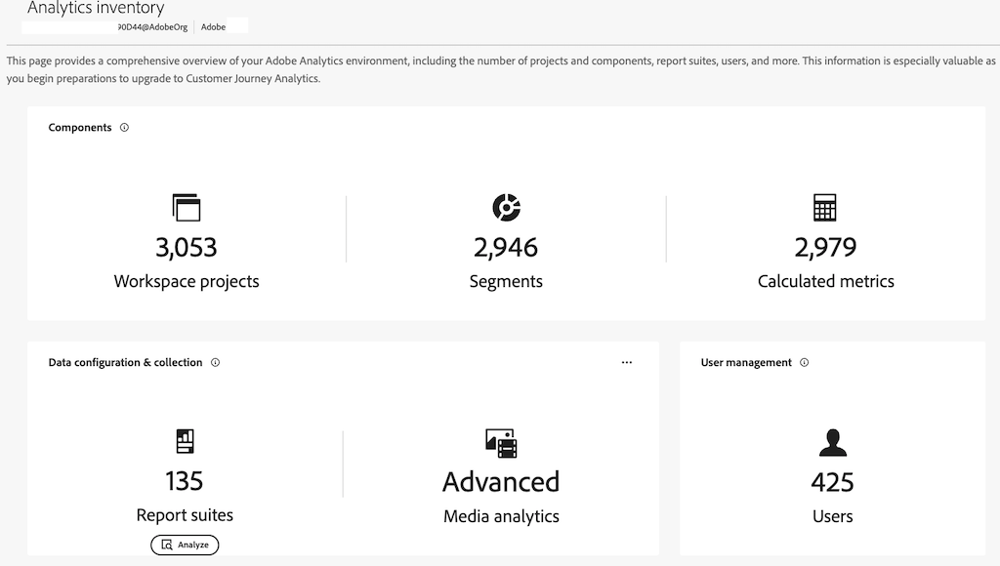

# 分析库存 {#analytics-inventory}

<!-- markdownlint-disable MD034 -->

>[!CONTEXTUALHELP]
>id="analytics-inventory"
>title="分析库存"
>abstract="此页面提供 Adobe Analytics 环境的全面概述，包括项目和组件的数量、报告包、用户等。在您开始准备升级到 Customer Journey Analytics 时，此信息尤为宝贵。"

<!-- markdownlint-enable MD034 -->

Analytics清单提供了Adobe Analytics环境的全面概述，包括项目和组件数量、报表包数量、用户数量等。 在您开始准备升级到 Customer Journey Analytics 时，此信息尤为宝贵。

此应用程序旨在帮助您回答以下问题：

* 对于您的组织，哪些资产（例如报表包、区段、用户、工作区项目、数据馈送等）需要升级，哪些资产可以留下？

* 确定需要迁移的资源后：

   * 是否应该在此升级之前进行一些资产清理？

   * 您是否应该在此过程中进行一些资产合并？

   * 您的资产应采用什么升级顺序？

   * 您应该首先升级哪组报表包？ 最后一个？

## 权限

在[Adobe Admin Console](https://experienceleague.adobe.com/en/docs/analytics/admin/admin-console/admin-roles-in-analytics)中具有Adobe Analytics产品管理员权限的用户可以使用Analytics清单。

## 访问Analytics库存

1. 在&#x200B;**[!UICONTROL 管理员]**&#x200B;菜单中单击&#x200B;**[!UICONTROL Analytics清单]**。 或转到&#x200B;**[!UICONTROL 所有管理员]** > **[!UICONTROL Analytics清单]**。

1. 主屏幕显示您的Adobe Analytics环境的完整清单：

   

   具体而言，此屏幕会显示

   * 此组织下所有用户中活动的Analysis Workspace和移动记分卡项目总数。
   * 此组织下所有用户中活动的区段和计算量度总数。
   * 已定义的基本报表包总数（不包括虚拟报表包）。
   * 如果Media Analytics功能处于活动状态，并且如果处于活动状态，那么处于何种模式。
   * 在该组织下定义的用户总数。

## 组件 {#components}

<!-- markdownlint-disable MD034 -->

>[!CONTEXTUALHELP]
>id="analytics-inventory-components"
>title="组件"
>abstract="此部分显示 Adobe Analytics 环境中存在的项目、区段和计算量度的数量。项目和组件可以迁移到 Customer Journey Analytics。"

<!-- markdownlint-enable MD034 -->

在此初始版本中，您可以查看Workspace项目、区段和计算量度的汇总库存数量。 后续版本将允许您分析这些组件。

## 数据配置和收集 {#data-config}

<!-- markdownlint-disable MD034 -->

>[!CONTEXTUALHELP]
>id="analytics-inventory-data-config"
>title="数据配置和收集"
>abstract="此部分显示 Adobe Analytics 环境中报告包的数量，以及您对流媒体的访问权限。 "

<!-- markdownlint-enable MD034 -->

### 报表包

报表包视图可显示某个组织下定义的所有报表包。 它可让您回答以下问题：

* 哪些报表包在过去90天内收到的点击次数最多？
* 哪些报表包在过去90天内未收到任何点击？
* 哪些报表包定义的维度数量最多？
* 哪些报表包定义的量度数量最多？

这些问题的答案将为您提供一个很好的想法，即哪些报告包是最佳的迁移候选包。

1. 要分析报表包，请导航到&#x200B;**[!UICONTROL 数据配置和收集]** > **[!UICONTROL 报表包]**，然后单击&#x200B;**[!UICONTROL 分析]**。

   

   | 元素 | 描述 |
   | --- | --- |
   | 名称 | 报表包的名称 |
   | ID | 报表包ID (rsid)。 指定一个唯一 ID，其中仅可包含字母数字字符。此 ID 一经创建，即无法更改。Adobe 会设置所需的 ID 前缀，该前缀也无法更改。 |
   | 发生次数（最近 90 天） | 此报表包在过去90天内接收了多少次点击？ |
   | 量度 | 此报告包中定义了多少个量度？ |
   | 维度 | 此报表包中定义了多少个维度？ |
   | Analytics for Target (A4T) 已启用 | 是否已为[Analytics for Target](https://experienceleague.adobe.com/en/docs/target/using/integrate/a4t/a4t)启用此报表包？ |
   | 已启用营销渠道 | 是否已为[营销渠道](https://experienceleague.adobe.com/en/docs/analytics/components/marketing-channels/c-getting-started-mchannel)启用此报表包？ |
   | Source Connector已启用 | [正在开发]是否已为Adobe Experience Platform中的[用于报表包数据的Adobe Analytics Source Connector](https://experienceleague.adobe.com/en/docs/experience-platform/sources/connectors/adobe-applications/analytics)启用此报表包？ 换句话说，能否使用Analytics Source Connector将此报表包迁移到Customer Journey Analytics？ |
   | 日程表类型 | 有关详细信息，请参阅[自定义日历](https://experienceleague.adobe.com/en/docs/analytics/admin/admin-tools/manage-report-suites/edit-report-suite/report-suite-general/custom-calendar#) |

1. 请注意……

### 导出到 CSV

1. 要将报表包列表导出到.csv文件，请单击&#x200B;**[!UICONTROL 导出到CSV]**。

1. .csv文件将显示在“下载”文件夹中。

1. 在设备上使用电子表格应用程序打开并保存它。

## 用户管理 {#user-management}

<!-- markdownlint-disable MD034 -->

>[!CONTEXTUALHELP]
>id="analytics-inventory-user-management"
>title="用户管理"
>abstract="此部分显示 Adobe Analytics 环境中用户的数量。"

<!-- markdownlint-enable MD034 -->

用户管理将在Analytics清单的更高版本中提供。