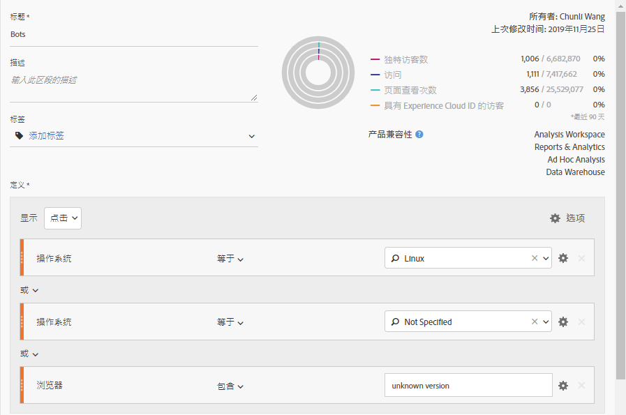
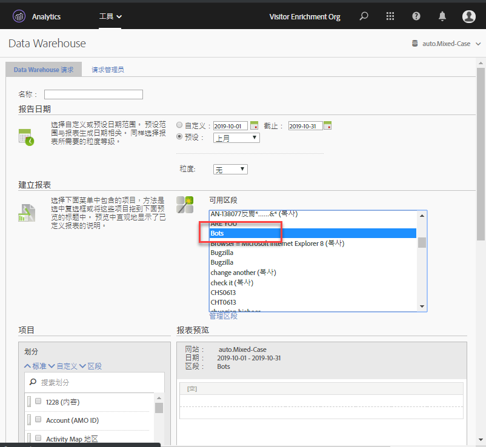
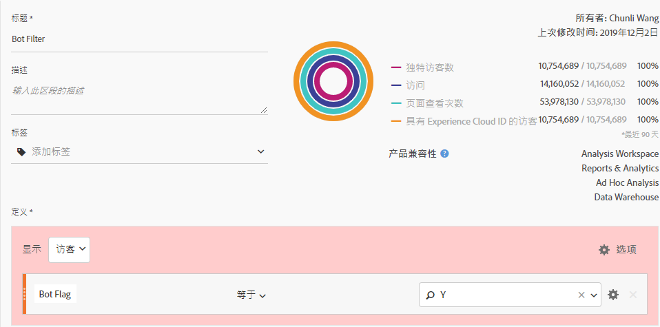
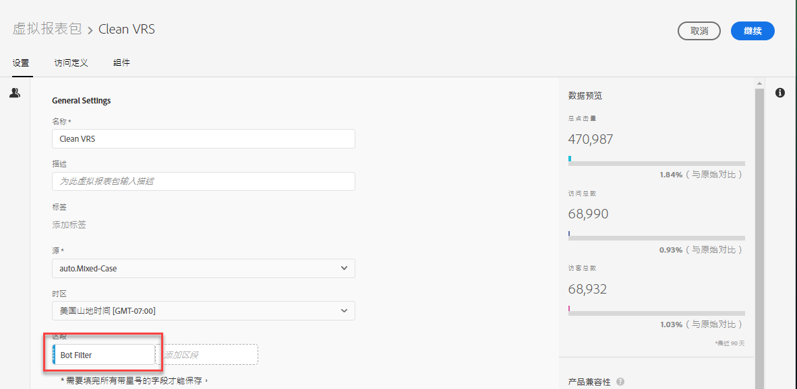

# 在Adobe Analytics中删除机器人

在Adobe Analytics中，您有多个用于从报告中删除机器人流量的选项：

## 使用机器人规则

Adobe Analytics中的默认机器人过滤方法是 [创建基于IAB机器人列表的机器人规则](/help/admin/admin/bot-removal/bot-rules.md) 。此列表每月更新并编译其列表，包括CDN和主要Internet属性。它包含数以千计的已知机器人程序，其中包括您的所有收藏夹：Google、Bing、Mozilla等此列表涵盖了有关机器人过滤的大多数使用案例和需求。

## 使用 `hitGovernor` 实施插件

使用 [s. hitOffer实施插件，](https://docs.adobe.com/content/help/en/analytics/implementation/javascript-implementation/plugins/hitgovernor.html)通过发送数十或数百点点击量删除像机器人一样的访客。

## 使用Adobe工具的组合

此外，由于机器人程序快速发展，Adobe还提供了一些其他强大功能，这些功能在定期正确组合时有助于删除这些数据质量敌人。这些功能包括：Experience Cloud ID服务、细分、数据仓库、客户属性和虚拟报告套件。以下概述了如何利用这些工具。

### 步骤1：将访客的Experience Cloud ID传递给新声明的ID

首先，您需要在 [Audiences核心服务中创建一个新的声明ID](https://docs.adobe.com/content/help/en/core-services/interface/audiences/audience-library.html)。您需要将访客的Experience Cloud ID传递到这个新声明的ID中，Adobe [Experience Platform Launch](https://docs.adobe.com/content/help/en/launch/using/implement/solutions/idservice-save.html)可以快速、轻松地完成该ID。让我们为声明的ID使用名称“EID”。

屏幕截图

以下是如何通过数据元素捕获此ID。请确保正确将您的Adobe eCorg ID填充到数据元素中。

```return Visitor.getInstance("REPLACE_WITH_YOUR_ECORG_ID@AdobeOrg").getExperienceCloudVisitorID();```

设置此数据元素后，按照 [以下说明](https://docs.adobe.com/content/help/en/launch/using/implement/solutions/idservice-save.html) 将声明的ID传递到Launch中的EID工具。

### 步骤2：使用分段识别机器人

现在，您将访客的EID传递给已声明的ID，您可以在 [Analysis Workspace](https://docs.adobe.com/content/help/en/analytics/analyze/analysis-workspace/components/t-freeform-project-segment.html) 中使用细分来标识像机器人一样的访客。机器人通常由其行为定义：单次访问访问、不寻常的用户代理、未知的设备/浏览器信息、引介、新访客、不同寻常的登陆页面等。使用工作区挖掘和细分的强大功能来标识已经规避IAB过滤的机器人程序和报表套件机器人规则。例如，下面是您可以使用的区段的屏幕截图：



### 步骤3：通过“数据仓库”从区段导出所有电子ID

现在，您已经使用细分识别机器人机器人，下一步是利用数据仓库提取与此区段关联的所有Experience Cloud ID。这就是如何设置 [数据仓库](https://docs.adobe.com/content/help/en/analytics/export/data-warehouse/data-warehouse.html) 请求的方法：



请记住使用Experience Cloud访客ID作为维度并应用“机器人”区段。

### 第步：将此列表作为客户属性传递给Adobe

数据仓库报告到达后，您将有一个需要从历史数据筛选的电子ID列表。将这些ECID复制并粘贴到空白的. CSV文件中，只含两列、EID和机器人标记：


确保第一个列标题与以上新声明的ID相匹配。使用此CSV文件作为客户属性导入文件，然后将您的报表套件订阅给客户属性，如 [博客文章](https://theblog.adobe.com/link-digital-behavior-customers)中所述。

### 第步：创建利用新客户属性的细分

对数据集进行处理并集成到Analysis Workspace中后，再创建一个利用新的“机器人标记”客户属性维度的细分：



### 步骤6：将此区段用作虚拟报告套件过滤器

最后，您应该创建一个 [利用此区段的虚拟报告包](/help/components/vrs/vrs-about.md) ，以筛选所标识的机器人程序：



新分段的虚拟报告包现在将生成一组非常清晰的数据，并完全删除识别的机器人程序。

### 第步：定期重复步骤2、和4

至少在定期安排分析之前设置月度提醒以识别和过滤新机器人。

