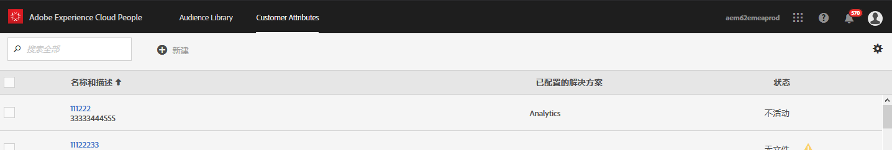

# 在Adobe Analytics中删除机器人

在Adobe Analytics中，您可以使用多个选项从报告中删除机器人流量：

## 使用机器人规则

Analytics **** Admin **[!UICONTROL &gt;]** Report Settings &gt; **[!UICONTROL &gt;]** Report Settings &gt; General Edit &gt; GeneralBot Rules &gt; Bot Rules(Analytics Admin **[!UICONTROL &gt; Report Settings]**********&gt; Edit GeneralBot Rules:

| 规则类型 | 描述 |
|--- |--- |
| 标准IAB机器人规则 | 选择 **[!UICONTROL “启用IAB机器人过滤规则]** ”将使用 [IAB](https://www.iab.com/) （国际广告局）国际蜘蛛程序和机器人程序列表来删除机器人流量。 大多数客户至少选择此选项。 |
| 自定义机器人规则 | 您可以根据用户代理、IP地址或IP范围定义和添加自定义机器人规则。 |

有关详细信息，请参阅 [机器人规则概述](/help/admin/admin/bot-removal/bot-rules.md)。

## 使用 `hitGovernor` 实施插件

使用 [s.hitGovernor实施插件](https://docs.adobe.com/content/help/en/analytics/implementation/javascript-implementation/plugins/hitgovernor.html)，删除行为与机器人程序相似的访客，这意味着这些访客每分钟发送数十次或数百次点击。

## 结合使用Adobe工具

此外，由于机器人程序正在快速变形，Adobe提供了其他几个强大的功能，这些功能在正确和定期地组合在一起后，有助于消除这些数据质量的敌人。 这些功能包括：Experience Cloud ID服务、细分、数据仓库、客户属性和虚拟报表包。 以下是如何利用这些工具的概述。

### 第1步：将访客的Experience Cloud ID传递到新声明的ID

首先，您需要在People Core service中创建一个新的声明 [ID](https://docs.adobe.com/content/help/en/core-services/interface/audiences/audience-library.html)。 您需要将访客的Experience Cloud ID传递到此新声明的ID中，这可以通过 [Adobe Experience Platform Launch快速轻松地实现](https://docs.adobe.com/content/help/en/launch/using/implement/solutions/idservice-save.html)。 让我们将名称“ECID”用于声明的ID。



以下是如何通过数据元素捕获此ID。 请确保将您的Experience Cloud组织ID正确填充到数据元素中。

```return Visitor.getInstance("REPLACE_WITH_YOUR_ECORG_ID@AdobeOrg").getExperienceCloudVisitorID();```

设置此数据元素后，请按照 [以下说明](https://docs.adobe.com/content/help/en/launch/using/implement/solutions/idservice-save.html) ，将声明的ID传递到启动项中的ECID工具。

### 第2步：使用细分识别机器人程序

现在，您的访客的ECID已被传递到声明的ID中，您可以在Analysis Workspace中使 [](https://docs.adobe.com/content/help/en/analytics/analyze/analysis-workspace/components/t-freeform-project-segment.html) 用分段来识别行为与机器人程序类似的访客。 机器人程序通常由其行为定义：单次访问访问、异常用户代理、未知的设备／浏览器信息、无引介、新访客、异常登录页面等。 使用Workspace下拉和细分的强大功能，识别已避开IAB过滤的机器人程序和您的报表包机器人规则。 例如，以下是您可以使用的区段的屏幕截图：


### 第3步：通过数 [!DNL Experience Cloud IDs] 据仓库从区段导出所有内容

既然您已使用区段识别了机器人程序，下一步就是利用数据仓库提取与此区段关联的所有Experience Cloud ID。 这是您设置Data Warehouse请求 [的方式](https://docs.adobe.com/content/help/en/analytics/export/data-warehouse/data-warehouse.html) :


请记住使用Experience Cloud访客ID作为维度并应用“机器人程序”区段。

### 第4步：将此列表作为客户属性传回Adobe

数据仓库报表到达后，您会得到一个需要从历史数据中筛选的ECID列表。 将这些ECID复制并粘贴到一个空白的。CSV文件中，其中只包含两列：ECID和机器人标志。

* **ECID**:确保此列标题与您为上述新声明的ID提供的名称相匹配。
* **机器人标志**:将其添加为客户属性架构维。

使用此。CSV文件作为客户属性导入文件，然后按照此博客文章中所述，订阅您的报表包到客户 [属性](https://theblog.adobe.com/link-digital-behavior-customers)。


### 第5步：创建利用新客户属性的细分

在您的数据集已处理并集成到Analysis Workspace中后，再创建一个区段，以利用新的“机器人标志”客户属性维和 [!UICONTROL Exclude容器] :


### 第6步：使用此区段作为虚拟报告包过滤器

最后，您应该创建一个虚 [拟报告套件](/help/components/vrs/vrs-about.md) ，它利用此区段过滤掉已识别的机器人程序：


这个新细分的虚拟报告套件现在将生成一组明显更简洁的数据，并且已识别的机器人程序会被完全删除。

### 第7步：定期重复步骤2、3和4

至少每月设置提醒，以识别和筛选新的机器人程序（可能是在定期安排分析之前）。
