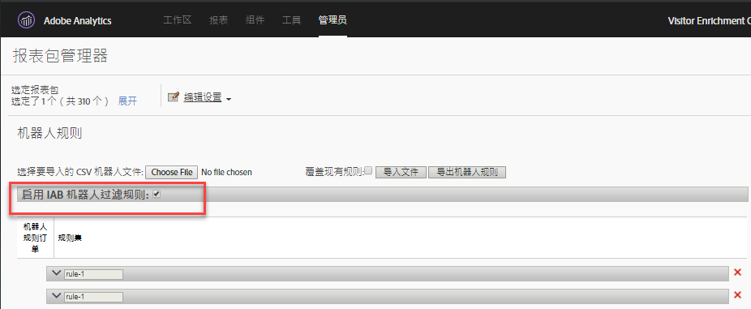

# 机器人规则概述

机器人规则允许您从由已知蜘蛛程序和机器人生成的报表套件中删除流量。删除机器人程序流量可为您网站上的用户活动提供更准确的测量。

定义了机器人规则之后，将按照定义的规则对所有传入流量进行比较。报表包中将不会收集与任何这些规则匹配的流量，并且流量量度中也不会包含这些流量。

To update or upload bot rules, navigate to **[!UICONTROL Analytics]** &gt; **[!UICONTROL Admin]** &gt; **[!UICONTROL Report Suites]**. Select the correct Report Suite, and then go to **[!UICONTROL Edit Settings]** &gt; **[!UICONTROL General]** &gt; **[!UICONTROL Bot Rules]**.

删除机器人程序流量通常会减少流量和转化量度。许多客户发现删除机器人程序流量会导致转化比率增加以及其他可用性量度值增加。在删除机器人程序流量之前，请与利益关系人进行交流以确保做出此更改后他们会对关键性能指标做出必要的调整。如有可能，我们建议您首先从小型报表包中删除机器人程序流量以评估潜在的影响。

机器人程序流量数据存储在单独的库中，以便在机器人和机器人页面报表中显示。有两种可用于实现机器人筛选的选项：

| 规则类型 | 描述 |
|--- |--- |
| 标准IAB机器人规则 | 选择 [!UICONTROL “启用IAB机器人过滤规则] ”可使用 [IAB的](https://www.iab.com) (国际广告局)“国际蜘蛛电脑和机器人列表”删除机器人程序流量。大多数客户最少选择此选项。 |
| 自定义机器人规则 | 您可以根据用户代理、IP地址或IP范围定义和添加自定义机器人规则。 |

## 标准IAB机器人规则

选中 [!UICONTROL “启用IAB机器人过滤规则] ”复选框可开启标准IAB机器人规则。此选择将删除IAB(国际广告局)国际蜘蛛和机器人列表中的机器人程序以删除机器人程序流量。IAB每月更新此列表。



Adobe 无法向客户提供详细的 IAB 机器人程序列表，但是您可以使用“机器人报表”来查看访问您网站的机器人程序的列表。要将机器人提交到IAB列表，请访问 [IAB](https://www.iab.com)。

## 自定义机器人规则

>[!Nte]
>用户界面允许手动定义 500 个规则。在达到此限制后，必须通过“导入文件”和“导出机器人规则”选项对规则进行批量管理。

使用自定义机器人规则，您可以根据定义的条件过滤流量。

可使用以下条件类型定义自定义机器人规则：

* 用户代理
* IP 地址
* IP 范围

单个规则可定义多个条件。多个条件可使用“OR”进行匹配。例如，如果您提供“用户代理”和“IP 地址”的值，则满足任一条件时，该流量将被视为机器人程序流量。

### 用户代理

用户代理条件会检查用户代理值以确定它是以指定的字符串&#x200B;**[!UICONTROL 开头]**&#x200B;还是&#x200B;**包含]指定的字符串。[!UICONTROL **&#x200B;如果选择&#x200B;**[!UICONTROL 包含]，则在用户代理中出现该字符串时将会匹配子字符串。**

**[!UICONTROL 不包含]列表中可包含可选值，以定义用户代理进行成功匹配不得包含的值。**&#x200B;通过在每行包含一个值，可指定多个值。如果用户代理满足在匹配字符串中指定的标准，但同时包含“不包含”列表中的字符串，则可将其视为匹配。

**[!UICONTROL 包含]字段限制为 100 个字符。**“不包含”列表限制为 255 个字符，在减去每个新行中的一个分隔符（分隔符数等于字符串的数量减 1。如果您指定 4 个&#x200B;*不包含*&#x200B;字符串，则需要 3 个分隔符）。所有字符串匹配区分大小写。

### IP 地址（包含通配符匹配）

使用通配符 (*) 在同一代码块中匹配一个或多个 IP 地址。提供您要匹配的 IP 地址的数值。使用通配符 * 替代您要匹配的任何值。下表包含 IP 地址匹配字符串的示例：

```
10.10.10.1
10.10.10.*
```

### IP 地址范围

提供 IP 地址的起始和终止范围来进行匹配。使用通配符 * 替代您要匹配的任何值。

### 定义自定义机器人规则

1. Go to **[!UICONTROL Analytics]** &gt; **[!UICONTROL Admin]**, select one or more report suites and click **[!UICONTROL General]** &gt; **[!UICONTROL Bot Rules]**.
1. Click **[!UICONTROL Add Rule]** and define one or more match conditions.
1. 单击&#x200B;**[!UICONTROL 保存]**。此更改应在 30 分钟内生效。

## 上载机器人规则

若要批量导入机器人规则，您可以上载定义规则的 CSV 文件。

按显示的顺序创建具有以下列的CSV文件：

| 栏目 1 | 栏目 2 | 栏目 3 | 栏目 4 | 栏目 5 |
|--- |--- |---|---|---|
| 机器人名称 | 起始 IP | 终止 IP | Agent Match Rule<br>(contains or starts with)</br> | 代理排除(<br>255个字符限制)</br> |

您可以定义三种类型的机器人规则：

* 用户代理包含或开头
* 单个 IP 地址或通配符匹配
* IP 范围匹配

导入文件中的每行都可以包含唯一一个下列机器人定义：

* **用户代理包含或开头**：提供单个用户代理字符串与“代理包含”列中的内容进行匹配。通过在“代理匹配规则”字段中置入&#x200B;*包含*&#x200B;或&#x200B;*开头*，指定您想要执行的匹配类型。An optional value can be included in the Agent Exclude column that defines one or more pipe-delimited ( `|` ) strings that the Agent does not contain. 字符串匹配区分大小写。“起始 IP”和“终止 IP”列都必须为空。

* **单个IP地址或通配符匹配**：要匹配单个IP地址( `10.10.10.1`)或通配符IP地址( `10.10.*.*`)，请在IP开始和IP结束列中放置相同的值。“匹配规则”、“代理包含”和“代理排除”都必须为空。

* **IP 范围匹配**：使用“起始 IP”和“终止 IP”列来定义 IP 地址的范围。Wildcards can be used to match IP ranges, for example `10.10.10.*` to `10.10.20.*`. “匹配规则”、“代理包含”和“代理排除”都必须为空。

### 使用 OR 组合多个规则

若要使用通过 OR 连接的规则组合（例如，用户代理或 IP 地址）与机器人进行匹配，请在机器人名称字段中为所有要组合的规则提供相同的名称。不支持 AND 匹配。

### 使用上载文件覆盖所有规则

选中&#x200B;**[!UICONTROL 覆盖现有规则]复选框会删除所有现有规则，并会使用上载文件中定义的规则替换现有规则。**

### 导出规则

**[!UICONTROL 导出上传的机器人文件]按钮可以 CSV 格式导出 UI 中定义的所有规则。**


## Impact of bot rules on data collection {#section_F01A3130E7A04A9993371CF26F6586F2}

机器人规则可应用到所有分析数据。机器人规则删除的数据仅在“机器人”和“机器人页面”报表中可见。

VISTA rules are applied after Bot Rules (see [Processing Order](../../../admin/admin/c-processing-rules/c-processing-rules-configuration/processing-rule-order.md#concept_8A6BBEA7F50C40C8A8D8755D4F579B1E)).

**高点击访问处理：**&#x200B;如果一次访问中出现 100 次以上的点击，则报表会确定访问时间（以秒为单位）是否小于或等于访问的点击次数。在这种情况下，由于长时间集中访问的处理成本原因，报表会重新开始一个新访问。高点击访问通常是由机器人攻击造成的，因此不视为正常的访客浏览。

>[!NOTE]
>
>标记为 *`bots`*[服务器调用](https://docs.adobe.com/content/help/en/analytics/admin/server-call-usage/overage-overview.html)的点击。

## Impact of IP Obfuscation on bot filtering {#section_92E60B95BE8940D983F28C79E0CD6B12}

IAB 机器人列表完全基于用户代理，因此基于该列表的过滤不受 IP 模糊设置影响。对于非 IAB 机器人过滤（自定义规则），IP 可能为过滤标准的一部分。如果过滤机器人使用 IP，则在启用该设置的情况下，机器人过滤发生于最后八位字节已被删除之后，但又在其他 IP 模糊处理选项之前，例如删除整个 IP 或将它替换为某些唯一 ID。

如果启用了 IP 模糊处理，则在 IP 地址被模糊处理之前会发生 IP 排除，这样客户就无需在启用 IP 模糊处理时更改任何内容。

如果删除了最后八位字节，则该操作是在 IP 过滤之前完成的。这样，最后八位字节将被替换为 0，并且应当更新 IP 排除规则以匹配末尾为 0 的 IP 地址。匹配 * 应当匹配 0。
