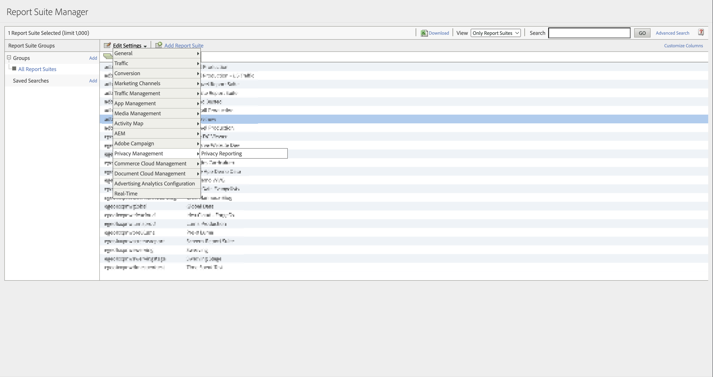

# 隐私报告

通过隐私报告，您可以启用 [同意管理选择加入](/help/components/dimensions/cm-opt-in.md)， [同意管理选择退出](/help/components/dimensions/cm-opt-out.md) 和 [广告平台同意](/help/components//dimensions/ad-consent.md) 用于报表的维度。

>[!NOTE]
>
>我们添加了新的广告平台同意标记。 如果您希望此新变量生效，则需要重新启用数据隐私报表。

访问此页面：

1. 登录到 Adobe Analytics，然后导航到“**[!UICONTROL 管理员]**”>“**[!UICONTROL 报告包]**”。
1. 选择一个或多个所需的报告包，然后选择&#x200B;**[!UICONTROL 编辑设置]**>**[!UICONTROL 隐私管理]**>**[!UICONTROL 隐私报告]**。

   

1. 单击 **[!UICONTROL 启用数据隐私报表]**.

   >[!NOTE]
   >
   >启用后，这些变量将无法关闭。

   

1. 启用后，将出现一则确认消息。 维度可见于报告。

   
