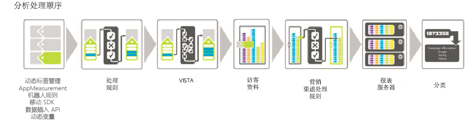

# 处理顺序

若要高效地使用处理规则，了解在数据收集期间何时应用处理规则非常重要。

下表列出了在应用处理规则前后通常可用的数据：

## 应用处理规则之前

| 维度 | 描述 |
|--- |--- |
| 动态变量查找 | 通过从 HTTP 标题或其他变量中提取信息，将动态填充变量。For example, `s.eVar5="D=c1"` will put the value of prop1 into eVar5. |
| AppMeasurement | AppMeasurement 中使用的函数和插件将在浏览器或客户端应用程序中执行。 |
| Dynamic Tag Management | Dynamic Tag Management 中定义的规则根据定义执行。 |
| 机器人规则 | [机器人规则](../../../../admin/admin/bot-removal/bot-rules.md)允许您从报表包中删除已知蜘蛛程序和机器人程序生成的流量。 |

## 应用处理规则之后

| 维度 | 描述 |
|--- |--- |
| 由 VISTA 添加的数据 | 处理规则先于 VISTA 应用。 |
| 访问页面编号 | 作为一般规则，处理规则仅了解当前点击中包含的数据。访问页面编号将在应用处理规则之后编译。 |
| 如果未设置页面名称，将添加简洁 URL 作为页面名称 | 在应用处理规则和 VISTA 之后，如果未设置页面名称，将添加简洁 URL 作为页面名称。由于这在应用处理规则之后发生，因此我们建议添加一个条件来检查页面名称是否为空。If you run the  Site Content &gt;  Pages Report and you see  https:// values for page names, it is likely the page name is blank and the URL is being used.  您可以设置一个条件来测试空页面名称，或者通过测试了解页面名称或页面 URL 是否包含特定的值。然后可以根据需要设置页面名称。 |
| 营销渠道处理规则 | 您可以使用处理规则来准备由[营销渠道处理规则](https://marketing.adobe.com/resources/help/en_US/mchannel/c_rules.html)处理的数据。 |
| 地域查找 | 这包括“访客所在州”和“访客 ZIP/邮政编码”值。 |
| eVars 持久性 | 在规则处理过程中，上次点击中包含的 eVar 不会持久用于每个点击。只有在当前正在处理的点击上设置的 eVar 可用。 |

## 使用 VISTA 复制点击量时如何应用处理规则 {#section_576EE8C240A24CBA979BD614E8D5338D}

如果您配置了 VISTA 规则来将点击量复制到其他报表包中，则点击量将通过在其他报表包中定义的任何处理规则发送。

如果您在初始报表包中定义了处理规则，根据工程技术服务对 VISTA 规则的配置方式，可能会或者不会应用这些规则。若要确定是否应用了这些规则，您可以询问实施专家 VISTA 规则是将“pre”值还是“post”值复制到了其他报表包中。如果复制的是“pre”值，则不会应用初始报表包中定义的处理规则。如果复制的是“post”值，则会在复制点击量前应用处理规则。
