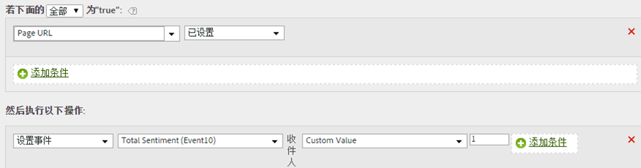

# 使用上下文数据变量设置事件

处理规则可以触发基于上下文数据变量的事件。

在 AppMeasurement 中可按以下格式指定上下文数据变量：

```
 s.contextData['search_term']
```

[!UICONTROL 上下文变量]列表包含在之前 30 天发送到报表包中的所有变量。If you know the context data variable name but have not sent it into the current report suite, you can add a value by typing the variable name and clicking **[!UICONTROL Add variable name context data]**:


The following rule definition expands on the [Copy a Context Data Variable to an eVar](../../../../admin/admin/c-processing-rules/processing-rules-examples/processing-rules-copy-context-data.md#concept_43AA4980A2D847D6A3BEC50BCC0780E7) rule to also set an event on every hit that contains a specific context data variable:

| 规则集 | 数值 |
|---|---|
| 条件 | 设置了“搜索词”上下文数据时 |
| 操作 | 设置事件“搜索” |

例如：



请参阅实施帮助中的[上下文数据变量](https://marketing.adobe.com/resources/help/en_US/sc/implement/index.html?f=context_data_variables)。
