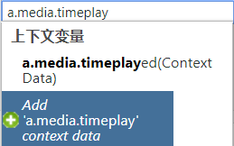
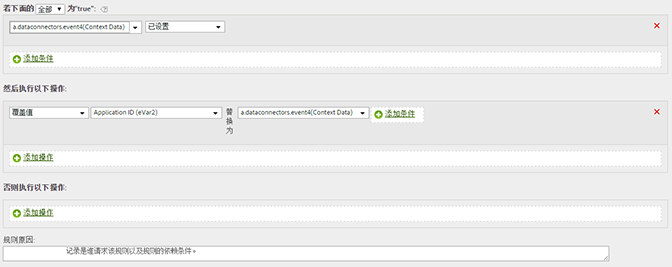

# 将上下文数据变量复制到 eVar

处理规则用于将上下文数据变量的值迁移到 prop 和 eVar。

在 AppMeasurement 中可按以下格式指定上下文数据变量：

```
 s.contextData['search_term']
```

[!UICONTROL 上下文变量]列表包含在之前 30 天发送到报表包中的所有变量。If you know the context data variable name but have not sent it into the current report suite, you can add a value by typing the variable name and clicking **[!UICONTROL Add variable name context data]**:



以下规则定义可在每次点击时填充包含特定的上下文数据变量的 eVar：

| 规则集 | 数值 |
|---|---|
| 条件 | 设置了“搜索词”上下文数据时 |
| 操作 | 将 eVar3 的值覆盖为“搜索词” |

例如：



请参阅实施帮助中的[上下文数据变量](https://marketing.adobe.com/resources/help/en_US/sc/implement/context_data_variables.html)。
