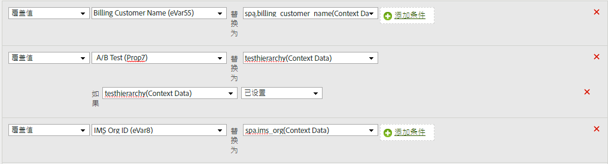

# 将上下文数据变量复制到 eVar

处理规则用于将值从上下文数据变量移动到prop和eVar。 如果没有处理规则，上下文数据变量将毫无意义，并且不会在Analytics中填充任何报表。

[!UICONTROL 上下文变量]列表包含在之前 30 天发送到报表包中的所有变量。If you know the context data variable name but have not sent it into the current report suite, you can add a value by typing the variable name and clicking **[!UICONTROL Add variable name context data]**:

以下示例将上下文 `search_term` 数据变量放入其值中 `eVar3`:

当只有几个eVar需要填充时，上述示例非常有效。 如果您的组织有数百个上下文数据变量，每个变量都需要自己的eVar，则可以使用条件语句。 数十个条件语句可以适合单个处理规则，使您的组织能够填充报表包中的所有eVar，而不会遇到150个规则的处理规则限制。

以下示例使用上 `prop7` 下文数据变量填充 `testhierarchy`，但仅在设置 `testhierarchy` 时填充：

有关实施上下文数据变量的详细信息，请参 [阅《实施用户指南》中的](/help/implement/js-implementation/c-variables/context-data-variables.md) “上下文数据变量”。
