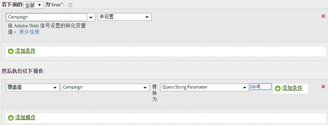

# 从查询字符串参数中填充系列活动ID

您可以使用查询字符串参数填充变量。

在大多数情况下，您使用插件从查询字符串填充变量。如果发生拼写错误或类似问题妨碍了填充值，则可以使用处理规则填充变量。

在覆盖之前，应始终检查值是否为空或包含所需的值。

| 规则集 | 数值 |
|---|---|
| 条件 | 促销活动未设置 |
| 操作 | 将促销活动的值覆盖为查询字符串参数 cpid |

例如：

