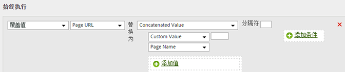

# 通过连接类别和页面名称添加子类别

您可以使用关联选项通过组合其他值来填充值。

<table id="table_FF761C2011CD456B9A466C054A54FC30"> 
 <thead> 
  <tr> 
   <th colname="col1" class="entry"> 规则集 </th> 
   <th colname="col2" class="entry"> 数值 </th> 
  </tr> 
 </thead>
 <tbody> 
  <tr> 
   <td colname="col1"> 条件 </td> 
   <td colname="col2"> 无（始终执行） </td> 
  </tr> 
  <tr> 
   <td colname="col1"> 操作 </td> 
   <td colname="col2">将子类别的值覆盖为关联值 
类别 
 
页面名称 
 </td> 
  </tr> 
 </tbody> 
</table>

例如：

