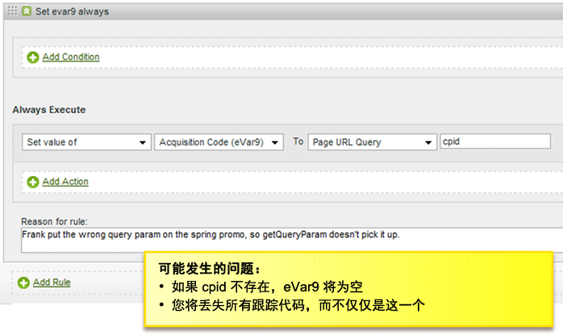
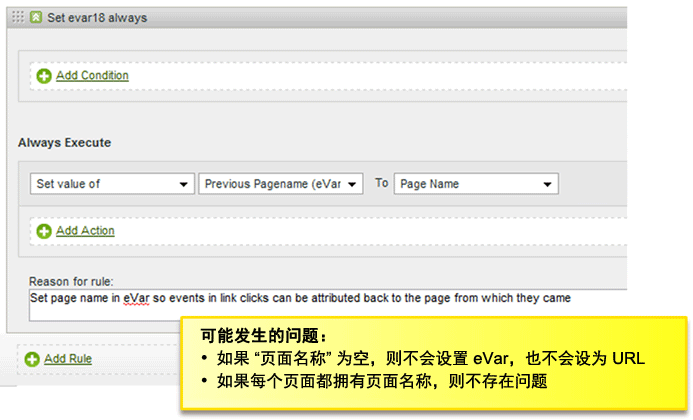
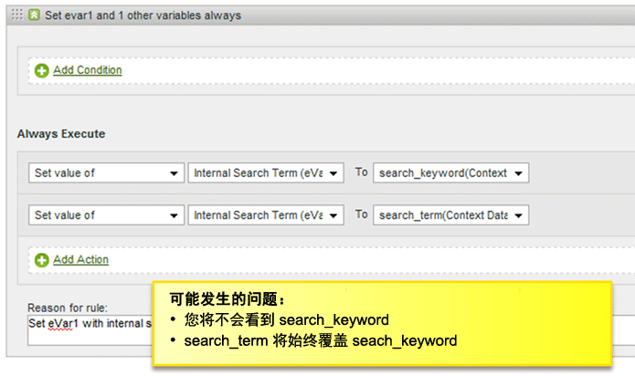
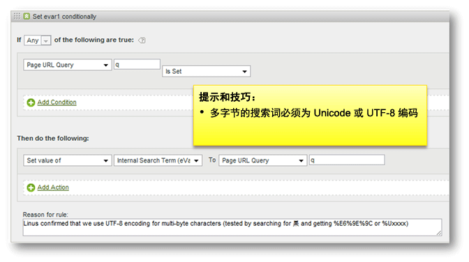
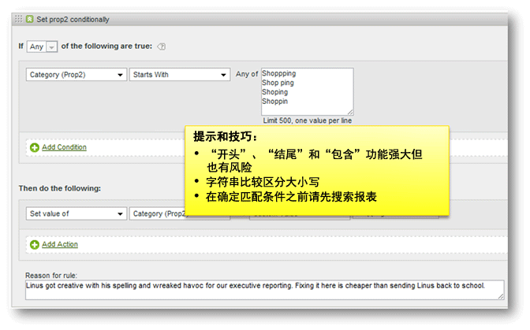

# 处理规则的提示和技巧

此部分包含测试处理规则的指南和要避免的常见错误列表。

## 测试处理规则 {#section_F092D2FECDE24082AE9FC6F8BE87F29F}

此部分介绍的内容有助于在将处理规则部署到生产环境之前，对处理规则进行测试。

**测试读取搜索词的规则**

有关基于搜索的任何标准，比如 prop1 包含“news”时，请转到 prop 1 报表并搜索“news”，查看是否存在您不希望出现的任何匹配。

**测试读取变量的规则**

Create a blank HTML page on your desktop, include the s_code from your site, and set the `s.account` variable to a dev report suite. 如果您的规则基于反向链接、反向链接域等，请从实时反向链接报表中取出一些示例 URL，并用这些值中的任一值设置 `s.referrer` 变量和加载页面。同样，如果规则基于页面 URL 值，则可以设置 `s.pageURL`。相同的流程可用于任何变量。

**使用开发报表包**

我们建议您在开发报表包中配置处理规则，以确保它们正常工作。如有可能，我们建议您在广泛部署前先将规则复制到小型生产报表包中。

## 检查空值 {#section_EE84A5525E26415787930723B0CAAE0F}

创建规则时，请考虑出现空值的情况。如果您未添加检查空值的条件，则可能会无意中使用空值覆盖变量。

考虑处理顺序十分重要。在以下示例中，如果页面名称不存在，则显示“上一页面名称”自定义eVar将设置为URL。 但是，在应用处理规则后，URL 将被置于页面名称中，因此，在这种情况下，如果未在页面上设置页面名称，则“页面名称”将为空。

## 避免覆盖值 {#section_49FCCA31E31A433EA2EF5EAF91443DAF}

在以下示例中，网站上使用两个上下文数据变量捕获搜索词：search_keyword 和 search_term。但是，根据配置，即使 search_term 为空，search_keyword 值也总是被覆盖。

填充内部搜索词之前，应重新配置此规则以测试每个上下文数据变量的值，或者，存在同时保留两个值的使用案例时，可将这两个值进行关联。

## 将搜索词编码为 UTF-8 或 Unicode {#section_3BBBE1FB8FEA48589362452DE51DB575}

从查询字符串提取的搜索词必须使用正确的编码格式，否则将无法按处理规则匹配这些搜索词。

## 开头、包含和结尾 {#section_80CE853244FC435B844A09EA51868D8D}

选择正确的匹配条件以查找正确匹配的最严格条件。您可以在创建规则前在报表中搜索值，以确保不会出现意外匹配。例如，在启用此规则前，应搜索 Prop2 报表以查找匹配此条件的所有位置。

