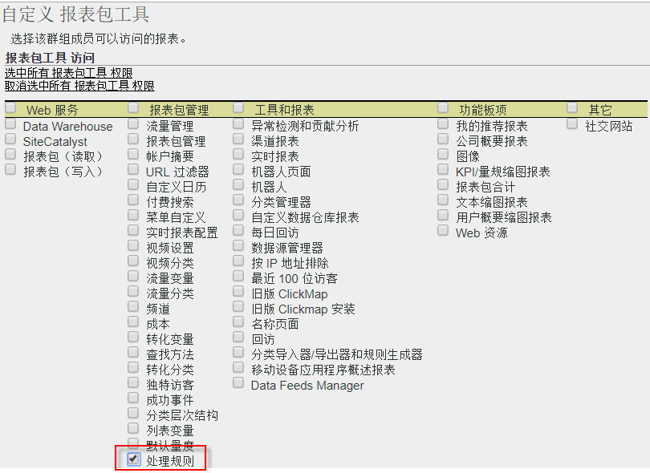
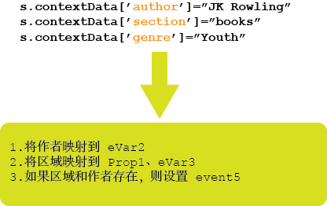

# 处理规则概述

处理规则简化了数据收集，并在数据被发送到报表时对内容进行管理。处理规则提供一个界面，可帮助简化 IT 团队和 Web 开发人员的交互，从而能够：

* 在产品概述页面设置事件
* 使用查询字符串参数填充促销活动
* 在一个 prop 中关联类别和页面名称，从而更方便地进行报告
* 将一个 eVar 复制到 prop 以查看路径
* 清除拼写错误的网站区域
* 将内部搜索词或促销活动 ID 从查询字符串提取到 eVar

>[!VIDEO](https://tv.adobe.com/embed/1181/16506/)

*观看来自 Adobe 峰会的处理规则概述和培训，以了解为何要使用处理规则的理由。*

## 获得使用处理规则的授权 {#section_8A4846688050453784DAE4D89355169A}

在 2017 年 4 月 20 日之前，所有用户（包括管理员）都必须通过测验，然后才能获得 Adobe 客户关怀赋予的使用处理规则的授权。

当前，管理员&#x200B;**默认**&#x200B;拥有使用处理规则的权限。不再需要进行测验。管理员还可以通过管理工具界面将这些权限授予非管理员用户。以下是具体操作方法：

1. 如果您还没有这么做，[请创建一个群组](../../../admin/user-management2/c-user-groups/groups.md)，其中只包含那些应当有权使用处理规则的非管理员。
1. [将非管理员添加到该组](../../../admin/user-management2/c-user-management/t-add-user-to-group.md)。
1. Then go to **[!UICONTROL Analytics]** &gt; **[!UICONTROL Admin]** &gt; **[!UICONTROL User Management]** &gt; **[!UICONTROL Groups]** &gt; **[!UICONTROL[group name]]** &gt; **[!UICONTROL Edit]** &gt; **[!UICONTROL Report Access]** &gt; **[!UICONTROL Report Suite Tools]** &gt; **[!UICONTROL Customize]** &gt; **[!UICONTROL Report Suite Management]**.
1. Check the box next to [!UICONTROL Processing Rules] and click **[!UICONTROL OK]**.

>[!IMPORTANT]
>
>因为处理规则会永久性地影响Analytics数据，因此我们强烈建议处理规则管理员接收Adobe Analytics中的认证培训，并熟悉报告套件(标准网站、移动站点、移动应用、数据插入API等)的所有数据源。了解有关在各种平台内填充的上下文数据变量和标准变量的知识，将有助于防止数据被意外删除或更改。

## 使用上下文数据简化数据收集 {#section_09EEA03612D24C15839631AA9E9668D8}

上下文数据变量是一种只可用于处理规则的新型变量。为了使用上下文数据变量，将通过您的实施发送键/值数据对，并且处理规则用于捕获标准 Analytics 变量中的这些值。这样编程人员就不必确切了解哪个 prop 和/或 eVar 应包含哪个值。

请参阅实施帮助中的[上下文数据变量](https://marketing.adobe.com/resources/help/en_US/sc/implement/index.html?f=context_data_variables)。

## 使用处理规则转换点击数据和触发事件 {#section_8284E72E999244E091CD7FB1A22342B6}

处理规则可以监视传入值以转换常见拼写错误并基于报告数据设置事件。可以将 Prop 复制到 eVar，也可以关联报表的值以及设置事件。

## 在报表中使用上下文数据变量 {#section_BD098BC503024A0B8703596628071134}

在您的实施中定义上下文数据变量后，必须将这些变量复制到 eVar 等变量中，才能在报表中使用。

有关详细信息，请访问[此处和](../../../admin/admin/c-processing-rules/processing-rules-examples/processing-rules-copy-context-data.md#concept_43AA4980A2D847D6A3BEC50BCC0780E7)[此处](../../../admin/admin/c-processing-rules/processing-rules-examples/processing-rules-copy-context-data-event.md#concept_359B4E165ED442938A8EB6A55A725682)。
