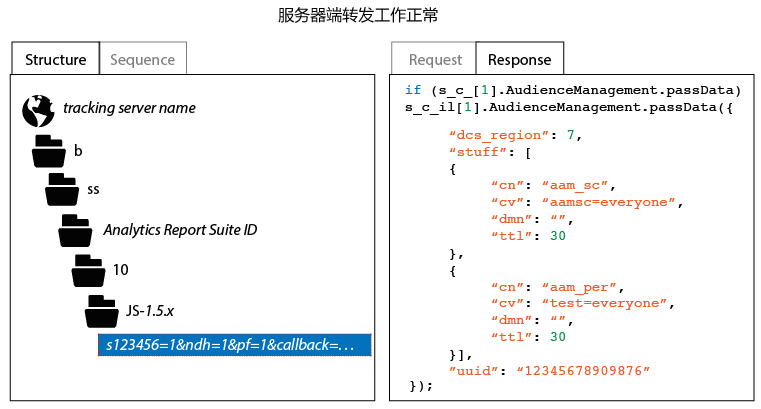

# 如何验证服务器端转发实施

要验证是否已正确启用服务器端转发，您将需要检查来自 Analytics 跟踪请求的 HTTP 响应。此操作可以使用浏览器的开发人员工具或使用 Charles Web Debugger 之类的代理工具来完成。以下说明介绍了必须存在哪些指示器才能确保已正确启用服务器端转发。

要检查服务器端转发的状态，请执行以下操作：

1. 加载包含更新的 AppMeasurement 代码的测试页面。
1. 在浏览器的调试工具中或使用您的代理软件，检查来自 Analytics 跟踪请求的 HTTP 响应（您可以通过选择任何包含“b/ss”的路径来轻松对其过滤）。
1. 检查 HTTP 响应。如果响应包含 Audience Manager 数据（如下所示），则表示服务器端转发工作正常。

>[!CAUTION]
>
>If the response contains the key value pair `"status":"SUCCESS"` or a 2 x 2 image, then server-side forwarding * is not* configured correctly. 请确保Identity Service已正确部署，您已部署App Measurement模块，适用的报告套件已映射到正确的IMS Org，并且在Analytics管理控制台中已启用服务器端转发。

>[!MORE_LIKE_THIS]
>
>* [Charles Web Debugger](https://www.charlesproxy.com/)

