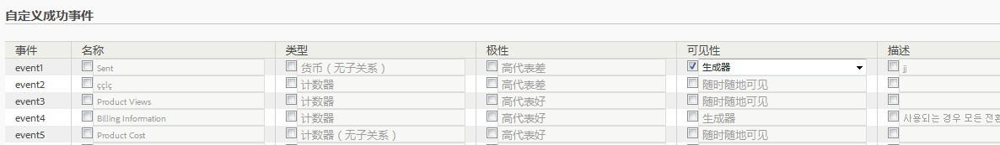

# 配置成功事件

描述如何配置成功事件的步骤。

1. Click **[!UICONTROL Analytics]** &gt; **[!UICONTROL Admin]** &gt; **[!UICONTROL Report Suites]**.
1. 选择一个报表包。
1. Click **[!UICONTROL Edit Settings]** &gt; **[!UICONTROL Conversion]** &gt; **[!UICONTROL Success Events]**.

   

1.  在&#x200B;**名称**&#x200B;列中，选中每个项目旁边的复选框以启用编辑，然后指定所需的名称。
1.  在&#x200B;**类型**&#x200B;列中，选中每个项目旁边的复选框以启用下拉列表，然后选择所需的类型。

   >[!NOTE]
   >
   >Before you change an event type, see [Change event type](../../../admin/admin/c-success-events/event-type.md#concept_2A6FCC19E7FC429DBDFA65BC640BD448).

   有关这些元素的信息，请参阅[成功事件页面 - 描述](../../../admin/admin/c-success-events/success-event.md#section_681ECEC981694CABBDBF00E18165B447)。

1. In the **[!UICONTROL Polarity]** column, specify whether an upward trend for this metric is good or bad.
1. **[!UICONTROL 在“可见性]** ”列中，您可以在Menu、Metric Selectors、Calculated Metrics Builder和Segment Builder中隐藏标准(内置)指标、自定义事件和内置活动。

   这项设置不影响相关量度或事件的数据收集，而只会影响该量度或事件在用户界面中的可见性。[更多...](../../../admin/admin/metric-visibility.md#concept_A85EB68D27534C4581AF1DCF5702DDE5) 1. 提供描述。
1. 选择是否始终记录该事件。
1. Enable or disable [participation metrics](/help/components/c-variables/c-metrics/metrics-participation.md).

   >[!NOTE]
   >
   >最多可为100个自定义事件启用参与。除此之外，您还可以在[计算量度](https://marketing.adobe.com/resources/help/en_US/analytics/calcmetrics/participation_metric.html)生成器中创建参与率量度。

1. 单击&#x200B;**[!UICONTROL 保存]**。

