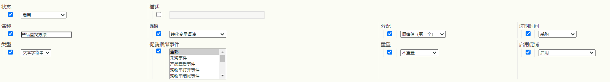

# 促销eVar和产品查找方法

本文档介绍推销eVar背后的概念，这些eVar处理和分配数据的方式与标准eVar不同。 它还说明推销eVar与产品查找方法有何关联。

虽然大多数零售网站都有多种查找产品的方法，但Adobe认为以下是每个零售客户都应在Adobe Analytics中跟踪的基本产品查找方法：

* 内部搜索关键词
* 内部促销活动跟踪代码
* 促销/浏览类别
* 交叉销售链接

在本文档中，让我们将一些eVar映射到解决方案，如下所示：

* eVar2:内部搜索关键词
* eVar3:内部促销活动跟踪代码
* eVar4:促销/浏览类别
* eVar5:交叉销售链接

我们可以使用附加eVar来衡量所有产品查找方法之间的相互关系。 除了上述查找方法之外，在比较中，eVar还包括其他查找方法，例如从外部网站到产品详细信息页面的链接。

* eVar1:产品查找方法

将这些变量配置为推销eVar，而不是将其中任何变量配置为标准eVar。 通过使用推销eVar，您可以将任何成功的活动分配给eVar在&#x200B;*per-product*&#x200B;级别捕获的值，而不是在&#x200B;*per-visit/per-order*&#x200B;级别捕获的值。 本文档阐明了整个过程中的每产品分配与每订单分配之间的差异。

为了演示如何设置这些变量，以下示例展示了访客决定使用内部关键词搜索“沙片”在网站上查找产品。 在关键字搜索结果页面上，您必须至少以两个eVar捕获数据：

* `eVar2` 等于搜索中使用的关键词（“沙片”）
* `eVar1` 等于使用的产品查找方法（“内部关键词搜索”）。

当您将这两个变量设置为等于这些特定值时，您知道访客正在使用“沙片”的内部关键词搜索词来查找产品。 同时，您知道访客没有使用其他产品查找方法来查找产品（例如，访客没有在执行关键词搜索的同时浏览产品类别）。 为确保按产品进行适当的分配，这些未使用的方法不应因查找通过内部关键词搜索找到的产品而获得点数。 因此，您必须在代码（如AppMeasurement、AEP Web SDK等）中插入逻辑，以便自动将与这些其他查找方法关联的eVar设置为等于“非查找方法”值。

例如，当用户使用关键词“沙片”搜索产品时，Analytics代码的逻辑应在内部关键词搜索结果页面上将变量设置为等于以下内容：

* eVar2=&quot;沙漠&quot;:关键词“沙片”用于内部关键词搜索
* eVar1=&quot;内部关键词搜索&quot;:使用了“内部关键词搜索”查找方法
* eVar3=&quot;非内部营销活动&quot;:内部营销活动未用于访问搜索结果页面
* eVar4=&quot;non-browse&quot;:未在搜索结果页面上访问浏览类别
* eVar5=&quot;非交叉销售&quot;:未在“搜索结果”页面上单击交叉销售链接

## 促销eVar设置

在继续使用“沙片”示例之前，以下是可用于推销eVar的不同设置。  以下屏幕截图来自报表包管理器。 访问该变量的方法是：转到Analytics >管理员>报表包>编辑设置>转化>转化变量>新增>启用促销。

下表各节包含有关这些设置的更多详细信息。

| 设置 | 描述 |
|--- | --- |
| 名称 | 变量要与之关联的名称或报表维度。 如果`eVar1`用于捕获产品查找方法，则`eVar1`的“名称”字段应设置为“产品查找方法”。 |
| 促销 | 用于捕获促销eVar值的语法类型 |
| 分配 | 帮助确定在发生成功事件时应接收点数的促销eVar值。 |
| 过期时间 | 确定现有产品和促销eVar绑定何时不再有效。 |
| 类型 | 促销eVar中收集的数据类型 |
| 促销捆绑事件 | 确定产品何时应绑定到促销eVar值的事件 |
| 重置 | 触发器，将重置该时间点eVar的所有后端数据 |
| 启用促销 | 需要设置为“已启用”以将eVar从标准eVar转换为促销eVar的标记 |

### 促销

此选项不适用于常规eVar。 通过[!UICONTROL 促销]设置，您可以选择[!UICONTROL 转化变量语法]或[!UICONTROL 产品语法]作为捕获促销eVar值的方法。

**[!UICONTROL 转化变]** 量语法表示您在其自身的变量中设置eVar值。例如，使用转化变量语法时，“内部关键词搜索”的`eVar1`值在页面代码（或AppMeasurement代码、AEP Web SDK代码等）中按如下方式设置：

`s.eVar1="internal keyword search";`

但是，使用&#x200B;**[!UICONTROL 产品语法]**&#x200B;时，eVar仅在Adobe Analytics产品变量中设置。 Analytics产品变量可分为每个产品的六个不同部分：

`s.products="[category];[productID];[quantity];[revenue];[events];[eVars]"`

*  Category是一项已弃用的功能，不再建议将其作为跟踪产品类别性能的可行选项。仅存在该分号就说明了为什么在大多数产品变量实施中，变量值的productID部分之前只有一个分号。
*  量度和  收入在跟踪产品购买时很有用。
*  事件可用于记录自定义增量事件值或货币事件值，这些事件值不会计为收入（例如送货、折扣等）

配置为使用产品语法的推销eVar在产品变量的最后部分内进行设置。 例如，假定访客使用内部关键词搜索来查找产品ID“12345”。 此示例中基于产品语法的eVar1设置方式如下所示：

`s.products=";12345;;;;eVar1=internal keyword search";`

请注意，对于产品变量的数量、收入和事件部分，我们仍使用分号分隔的占位符。  如果没有这些占位符，内部关键词搜索的`eVar1`设置将被完全忽略。

### 分配

促销eVar的“分配”一词用法不正确，尤其是对于使用转化变量语法的促销eVar而言。 所有使用标准语法的eVar都可以有其自己的单独分配设置，但具有转化变量语法的推销eVar只使用“最近（上次）”的分配设置，而不考虑报表包管理器中显示的分配设置。

要了解此设置的功能，您需要了解eVar分配与促销eVar绑定之间的差异。  对于推销eVar，“促销eVar绑定”可被视为此“分配”设置的更合适名称。
每当从图像请求收集任何具有标准语法的eVar时，Adobe Analytics处理服务器会将数据插入另一个数据库列（称为post_evar列）以及常规eVar列。  由于eVar将是永久性的（即，它们在大多数情况下会在当前点击之外的某个时间点过期），因此服务器随后会在每个后续图像请求中设置此post_evar列，并将其设置为等于传递到其相应eVar的最后一个值。 对于标准（即非促销）eVar，当发生成功事件时，Adobe Analytics会使用post_evar列而不是常规eVar列来确定应为该事件给予点数的eVar值。
对于标准（即非促销）eVar，“分配”设置确定在特定时间段内收集的第一个或最后一个eVar值是否将插入到post_evar列中。 如果标准eVar的分配设置等于“原始值（第一个）”，则从访客收集的第一个eVar值将插入到所有后续图像请求的post_evar列中。  此操作将继续适用于从此访客的浏览器发送的所有将来请求，直到其“过期时间”设置中的eVar过期。\
如果标准eVar的“分配”设置等于“最近（上一个）”，则从访客收集的最新eVar值将填充到所有后续图像请求的post_evar列中。 “最近（上次）”分配意味着，每当在任何图像请求中将其对应eVar设置为新值时，post_evar值都将发生更改。  “原始值（第一个）”分配意味着post_evar列不会在各次点击之间发生更改，即使其相应eVar在将来的图像请求中可能设置为不同的值也是如此。
如前所述，所有具有转化变量语法的推销eVar仅具有“最近（上次）”分配(根据标准eVar定义)。  因此，我需要解释“分配”设置对促销eVar的实际含义。  如前所示，此设置无法确定在访客继续使用网站时，会将哪些值插入post_evar列中。  而是，促销eVar的“分配”设置可确定哪些eVar值绑定到产品以及这些产品的分配方式

