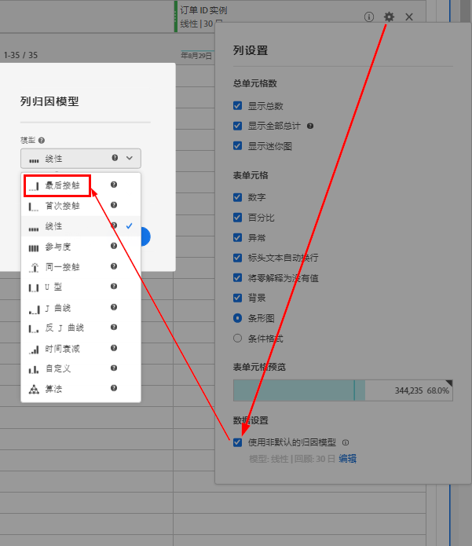

# 促销eVar和产品查找方法

本非常详细的文档介绍了推销eVar背后的概念，这些eVar处理和分配数据的方式与标准eVar不同。 它还说明推销eVar与产品查找方法有何关联。

## 概述

借助促销 eVar，您可以将任何成功的活动分配给 eVar 在&#x200B;*按产品*&#x200B;级别（而非&#x200B;*按访问/按订单*&#x200B;级别）捕获的值。

虽然大多数零售网站都有多种查找产品的方法，但 Adobe 认为每个零售客户都应在 Adobe Analytics 中跟踪的基本产品查找方法如下：

* 内部搜索关键词
* 内部营销活动跟踪代码
* 促销/浏览类别
* 交叉销售链接

出于本文档的目的，我们将一些 eVar 映射到解决方案，如下所示：

* eVar2：内部搜索关键词
* eVar3：内部营销活动跟踪代码
* eVar4：促销/浏览类别
* eVar5：交叉销售链接

我们可以使用额外的 eVar 来衡量所有产品查找方法相互之间的表现。除了上述查找方法之外，在比较中，eVar还包括其他查找方法，例如从外部网站到产品详细信息页面的链接。

* eVar1：产品查找方法

将这些变量配置为推销eVar，而不是将其中任何变量配置为标准eVar。

为了演示如何设置这些变量，以下示例展示了访客决定使用内部关键词搜索“沙片”在网站上查找产品。 在关键字搜索结果页面上，您必须至少以两个eVar捕获数据：

* `eVar2` 等于搜索中使用的关键词（“沙片”）
* `eVar1` 等于使用的产品查找方法（“内部关键词搜索”）。

当您将这两个变量设置为等于这些特定值时，您知道访客正在使用“沙片”的内部关键词搜索词来查找产品。 同时，您知道访客没有使用其他产品查找方法来查找产品（例如，访客没有在执行关键词搜索的同时浏览产品类别）。 为确保按产品进行适当的分配，这些未使用的方法不应因查找通过内部关键词搜索找到的产品而获得点数。 因此，您必须在代码（如AppMeasurement、AEP Web SDK等）中插入逻辑，以便自动将与这些其他查找方法关联的eVar设置为等于“非查找方法”值。

例如，当用户使用关键词“沙片”搜索产品时，Analytics代码的逻辑应在内部关键词搜索结果页面上将变量设置为等于以下内容：

* eVar2=&quot;沙漠&quot;:关键词“沙片”用于内部关键词搜索
* eVar1=&quot;内部关键词搜索&quot;:使用了“内部关键词搜索”查找方法
* eVar3=&quot;非内部营销活动&quot;:内部营销活动未用于访问搜索结果页面
* eVar4=&quot;non-browse&quot;:未在搜索结果页面上访问浏览类别
* eVar5=&quot;非交叉销售&quot;:未在“搜索结果”页面上单击交叉销售链接

## 促销eVar设置

以下是可用于促销eVar的不同设置。 以下屏幕截图来自报表包管理器。 通过以下路径访问该变量： [!UICONTROL Analytics] > [!UICONTROL 管理员] > [!UICONTROL 报表包] > [!UICONTROL 编辑设置] > [!UICONTROL 转化] > [!UICONTROL 转化变量] > [!UICONTROL 添加新的] [!UICONTROL 启用促销A15/>。]


请在下表的各节中查找有关这些设置的详细信息。

| 设置 | 描述 |
|--- | --- |
| 名称 | 变量要与之关联的名称或报表维度。 如果`eVar1`用于捕获产品查找方法，则`eVar1`的“名称”字段应设置为“产品查找方法”。 |
| 促销 | 用于捕获促销eVar值的语法类型 |
| 分配 | 帮助确定在发生成功事件时应接收点数的促销eVar值。 |
| 过期时间 | 确定现有产品和促销eVar绑定何时不再有效。 |
| 类型 | 促销eVar中收集的数据类型 |
| 促销捆绑事件 | 确定产品何时应绑定到促销eVar值的事件 |
| 重置 | 触发器，将重置该时间点eVar的所有后端数据 |
| 启用促销 | 需要设置为“已启用”以将eVar从标准eVar转换为促销eVar的标记 |

### 启用促销

当“启用促销”设置设为“已启用”时，报表包管理器中会显示如下所述的所有设置。 将“启用促销”设置设为“已禁用”时，只有标准eVar设置可用。

### 促销

此选项不适用于标准eVar。 通过[!UICONTROL 促销]设置，您可以选择[!UICONTROL 转化变量语法]或[!UICONTROL 产品语法]作为捕获促销eVar值的方法。

**[!UICONTROL 转化变]** 量语法表示您在其自身的变量中设置eVar值。例如，使用转化变量语法时，“内部关键词搜索”的`eVar1`值在页面代码（或AppMeasurement代码、AEP Web SDK代码等）中按如下方式设置：

`s.eVar1="internal keyword search";`

但是，使用&#x200B;**[!UICONTROL 产品语法]**&#x200B;时，eVar仅在Adobe Analytics产品变量中设置。 Analytics产品变量可分为每个产品的六个不同部分：

`s.products="[category];[productID];[quantity];[revenue];[events];[eVars]"`

*  Category是一项已弃用的功能，不再建议将其作为跟踪产品类别性能的可行选项。仅存在该分号就说明了为什么在大多数产品变量实施中，变量值的productID部分之前只有一个分号。
*  量度和  收入在跟踪产品购买时很有用。
*  事件可用于记录自定义增量事件值或货币事件值，这些事件值不会计为收入（例如送货、折扣等）

配置为使用产品语法的推销eVar在产品变量的最后部分内进行设置。 例如，假定访客使用内部关键词搜索来查找产品ID“12345”。 此示例中基于产品语法的eVar1设置方式如下所示：

`s.products=";12345;;;;eVar1=internal keyword search";`

请注意，对于产品变量的数量、收入和事件部分，我们仍使用分号分隔的占位符。  如果没有这些占位符，内部关键词搜索的`eVar1`设置将被完全忽略。

### 分配

促销eVar的“分配”术语具有误导性，尤其是对于使用转化变量语法的促销eVar。 所有标准eVar都可以有其自己的单独分配设置。 但是，具有转化变量语法的促销eVar只使用“最近（上一个）”分配设置，而不考虑报表包管理器中的分配设置。

了解此设置的功能意味着了解eVar分配与促销eVar绑定之间的差异。 对于推销eVar，“促销eVar绑定”是此“分配”设置的更合适名称。

**标准eVar分配设置**

每当从图像请求中收集任何具有标准语法的eVar时，Adobe Analytics处理服务器都会将数据插入另一个数据库列，称为`post_evar`列。 由于eVar是永久性的 — 它们在大多数情况下会在超出当前点击量的某个时间点过期，因此服务器随后会在每个后续图像请求中设置此`post_evar`列。 它被设置为等于传递到其相应eVar的最后一个值。 对于标准eVar，当发生成功事件时，Adobe Analytics会使用`post_evar`列而不是常规eVar列来确定应为该事件分配的eVar值。

对于标准eVar，“分配”设置确定在特定时间段内收集的第一个或最后一个eVar值是否将插入`post_evar`列。 如果标准eVar的分配设置等于“原始值（第一个）”，则从访客收集的第一个eVar值会插入到所有后续图像请求的`post_evar`列中。 在eVar根据其“过期时间”设置过期之前，所有将来从此访客的浏览器发送的请求都将继续执行此操作。

如果标准eVar的“分配”设置等于“最近（上一个）”，则从访客收集的最新eVar值会填充到所有后续图像请求的`post_evar`列中。 “最近（上次）”分配意味着每次将`post_evar`值对应的eVar设置为任意图像请求中的新值时，该值都会发生更改。 “原始值（第一个）”分配意味着，即使在将来的图像请求中，其对应的eVar可能会设置为不同的值，`post_evar`列在点击之间不会发生更改。

**促销eVar分配（绑定）设置**

如前所述，所有具有转化变量语法的推销eVar仅具有“最近（上次）”分配。 因此，推销eVar的分配设置无法确定当访客继续使用网站时，哪些值会插入post_evar列中。 相反，此设置可确定哪些eVar值绑定到产品，以及此类产品如何将成功事件分配回它们绑定的eVar值。

将促销eVar的“分配（即绑定）”设置设置为等于“原始值（第一个值）”时，会发生以下情况：任何与post_evar列一起设置的产品，以及之前未绑定到post_evar列相应的“预处理”eVar的产品，都将绑定到post_evar列中包含的值。  在eVar值和产品之间的这种绑定，根据报表包设置中的“过期时间”设置，在eVar过期之前，它永远不会发生更改。

每当图像请求符合以其他方式将已绑定的产品绑定到最近设置的eVar值的标准时，“原始值（第一个）”设置都会强制Adobe Analytics数据收集服务器忽略任何此类进一步尝试。 如果促销eVar的分配（捆绑）设置等于“最近（最后）”，则会出现相反的情况。 每当图像请求满足将产品与促销eVar绑定的标准时，产品就会将其自身绑定到（并重新绑定）传递到eVar中的最新值，或`post_evar`列中（始终）包含的值。

如前所述，推销eVar允许您按每个产品而不是按每次访问/每次订单将成功事件分配给eVar值。 因此，每当捆绑的产品具有与其关联的成功事件（如购物车加货或购买）时，成功事件都会将其信用分配给该产品当时绑定的产品和促销eVar值。

### 过期时间

促销eVar的过期设置允许您选择

* 产品/eVar绑定应过期，以及

* 在将eVar传递到图像请求后，不应再自动填充post_evar列。

当记录成功事件或某段时间过后，eVar可能会过期。 Adobe Analytics每次只允许设置一个过期时间，每个eVar。

对于“产品查找方法”，设置促销eVar过期时间的最佳实践应是将其设置为等于

* 网站自动将产品从购物车中删除之前产品在网站购物车中停留的时间（例如14天、30天等）
* 或购买事件发生时。

通过任一设置，访客购买的任何产品都会将订单/单位/收入信用分配给当时绑定到的促销eVar值。

### 类型

eVar类型设置确定要插入到eVar中的数据类型。 在大多数情况下，此值应等于“Text”。 很少对促销eVar使用“计数器”。 但是，“计数器”可用于按产品将成功分配给计数器eVar值。  使用“计数器”类型讨论解决方案不在本文档的范围之内。

### 促销捆绑事件

“促销捆绑事件”设置允许您指定产品绑定到促销eVar值的条件。 这些条件仅限于触发特定成功事件或eVar。 触发流量变量（例如prop）对促销绑定没有影响。

请注意，促销捆绑事件设置可以通过多个事件将产品与eVar值绑定。 示例：

* 通过产品查看事件
* 通过购物车添加事件
* 通过购买事件

默认情况下，当任何其他事件/eVar（推销或标准）包含在与产品相同的图像请求中时，设置会将产品绑定到推销eVar值。

### 重置

“重置”设置允许您立即使Adobe Analytics后端数据库中当前具有`post_evar`值的所有访客的所有eVar值“过期”。 它还会消除所有当前产品/eVar绑定。

>[!IMPORTANT]
>Adobe不建议使用重置设置，除非您完全打算从重置开始时起，让eVar从一组“干净”的数据开始。

## 您应该使用哪些设置？

在众多可用的组合中，你可能会想：哪些设置是最佳实践？

如果要将“内部关键词搜索”绑定到产品ID 12345，则将按如下方式设置产品变量：

`s.products=";12345;;;;eVar1=internal keyword search";`

与productID 12345同时捕获的任何成功事件（购物车加货、购买）将计入产品ID 12345和“内部关键词搜索”的eVar1值。 不同的eVar1值接收与产品ID 12345关联的成功事件信用的唯一方式是：如果eVar1稍后在产品变量中设置为不同的值(与产品ID 12345一起)。

例如：

```
s.products=";12345;;;;eVar1=internal campaign";
```

此变量设置会将产品ID 12345的绑定从“内部关键词搜索”的eVar1值更改为“内部促销活动”的eVar1值。 此外，当eVar配置为使用产品语法和“最近（最后）”的分配（绑定）设置时，也会发生此重新绑定更改。 如果将“分配（绑定）”设置改为“原始值（第一个）”，则将eVar1设置为等于“内部促销活动”以及产品ID 12345时，不会将产品ID 12345重新绑定到“内部促销活动”的eVar1值。 相反，绑定将保留原始绑定的值“内部关键词搜索”。


### 使用产品语法的挑战

如果没有仔细的规划，使用产品语法可能会产生一些问题。 让我们以使用多个eVar来跟踪网站上的产品查找方法为例。 在此，必须同时设置每个单独的产品查找方法eVar，以便提供特定的查找方法eVar点数（而另一个查找方法eVar没有点数）。 产品语法可在此类情况下使用，但生成的要部署的代码会比较复杂。

如果我们使用原始的“沙片”示例并对其进行调整以使用产品语法（假定访客找到的产品ID为“sandal123”，且关键词术语为“sandals”），则必须按如下方式设置结果产品变量：

`s.products=";sandal123;;;;eVar2=sandals|eVar1=internal search|eVar3=non-internal campaign|eVar4=non-browse|eVar5=non-cross-sell";`

尽管此示例中产品变量的语法较长，但它会将看到的每个eVar值绑定到“sandal123”的产品ID。 从那时起，与“sandal123”产品同时捕获的任何成功事件（例如购物车加货、购买）将计入上次绑定到产品的eVar值。  此代码示例显示在上述eVar绑定到“sandal123”产品后，是否购买了“sandal123”产品（价格为$79.95）的1个单位：

```
s.products=";sandal123;1;79.95";
s.events="purchase";
```

以下值将全部包含1个订单、1个单位和$79.95的收入，并且这些收入都归于它们：

* eVar2的“沙漠”值
* eVar1的“内部关键词搜索”值
* eVar3的“非内部营销活动”值
* eVar4的“non-browse”值
* eVar5的“非交叉销售”值

这是正确的归因，这不是问题。 相反，此方法的主要难题是确定如何以及何时设置产品查找方法eVar。

在大多数情况下，使用产品语法时，必须在产品详细信息页面上设置产品查找方法eVar，而不是在实际使用查找方法的页面上设置（例如，在关键字搜索结果页面、浏览页面、内部促销活动登录页面等）。 在访客与某个产品进行某种程度的交互之前，有理由假定该产品尚未真正“找到”。 因此，不应在查找方法页面上设置这些eVar（使用产品语法），因为（通常）在此类页面上显示多个产品。 我们希望将查找方法值仅绑定到访客已交互的产品。

此外，在查看查找方法页面时，访客可能能够单击链接以将他们引入单个产品详细信息页面，或直接从查找方法页面将单个产品添加到购物车。 使用我们的“沙漠”搜索关键词示例，如果访客直接从关键词搜索结果页面将“sandal123”产品添加到购物车，则用于捕获购物车添加的代码（通过“添加到购物车”按钮的onClick事件等） 必须在购物车添加发生时动态生成，或直接通过页面代码或标签管理系统“硬编码”。  无论如何，在此类情况下触发的代码将如下所示：

```
s.linkTrackVars="products,events";
s.linkTrackEvents=s.events="scAdd";
s.products=";sandal123;;;;eVar2=sandals|eVar1=internal keyword search|eVar3=non-internal campaign|eVar4=non-browse|eVar5=non-cross-sell";
s.tl(true,"o","Cart Add")
```

此代码可将上面显示的eVar值正确绑定到“sandal123”产品。 但是，为了在发生点击事件时正确设置这些值，开发人员必须：

* 向搜索结果页面添加服务器端逻辑，以确定必须插入到产品查找方法eVar中的值，以及
* 组合上面显示的整个产品变量，且没有语法错误。

此外，如果访客通过单击指向其产品详细信息页面的链接来决定“查找”产品，开发人员必须：

* 将产品查找方法详细信息（如上所示）从查找方法页面传递到产品详细信息页面，以及
* 从刚刚从上一页传递的项目中重新创建相同的产品变量值。

### 其中产品语法很有用

产品语法在

* 具有相同产品ID的多个产品会同时进行交互，并且
* 要绑定到此类产品的eVar在每个产品ID中必须具有不同的值。

例如，许多服装产品具有“子SKU”，可指定尺寸、颜色、样式以及任何其他属性。 这些属性将单个子产品与属于同一父产品的其他产品分开。 假设您决定购买一件中蓝色的T恤和一件大红色T恤。 假设两件衬衫的父产品ID都为“tshirt123”，并且`eVar10`已配置为捕获子SKU。 在购买确认页面上设置的变量将设置如下：

```
s.events='purchase';
s.products=';tshirt123;1;20;;eVar10=tshirt123-m-blue,;tshirt123;1;20;;eVar10=tshirt123-l-red"
```

在这种情况下，`eVar10`(childSKU)值“tshirt123-m-blue”和“tshirt123-l-red”都会因购买各自的产品ID“tshirt123”实例而获得点数。

### “最新”分配方面的挑战

使用“最近（最后）”的“分配（绑定）”设置，您可能会遇到其他问题。 在许多Web浏览体验中，访客会“重新查找”他们已查看和/或添加到购物车的产品。 这通常通过后续访问或在他们决定完成购买之前发生。 假设在访问网站期间，访客通过“沙漠”的关键字搜索找到“sandal123”产品。 他们会立即从关键词搜索结果页面将其添加到购物车。 捕获购物车添加的代码将按如下方式设置：

```
s.linkTrackVars="products,events";
s.linkTrackEvents=s.events="scAdd";
s.products=";sandal123;;;;eVar2=sandals|eVar1=internal keyword search|eVar3=non-internal campaign|eVar4=non-browse|eVar5=non-cross
```

因此，此图像请求中显示的每个eVar值都会绑定到“sandal123”产品。

现在，假设访客在此次访问中未购买产品，但三天后返回网站，并且“sandals123”产品仍在购物车中。 访客在购买产品之前想要了解产品的更多信息。 但是，访客浏览网站时，并没有使用关键词搜索来查找产品。 在“重新查找”产品之前，他们最终进入“女士>鞋>凉鞋”促销浏览部分。 当它们最终“重新查找”“sandal123”产品的产品详细信息页面时，变量将按如下方式设置（在页面加载时）：

```
s.events="prodView";
s.products=";sandal123;;;;eVar4=womens > shoes > sandals|eVar1=browse|eVar3=non-internal campaign|eVar2=non-search|eVar5=non-cross-sell";
```

如果分配（绑定）设置为“最近（最后）”，则“sandal123”产品会重新绑定到与其最初绑定的eVar值完全不同的数据值。 此外，如果访客随后完成购买“sandal123”，则所有购买点数都将分配给这些新绑定的eVar值，而不是最初绑定的值！

这里的问题是：哪些eVar值应获得该购买的点数”？ 请记住，访客最初通过内部关键词搜索找到了“sandal123”产品。 然后，他们直接从搜索结果页面将其添加到购物车。 因此，“内部关键词搜索”的eVar1值(和“沙片”的eVar2值)应获得该购买的点数。 但是，“分配（绑定）”设置被设置为“最近（最后）”。 因此，“browse”的eVar1值(和“womens > shoes > sandals”的eVar4值)将获得购买点数。 原因是在访客完成购买之前，它们是绑定到“sandal123”的最后一个值。

解决此问题的一个方法是，将促销eVar的分配（绑定）设置从“最近（最后）”更改为“原始值（第一个）”。 这样，在购买时，绑定到“sandal123”产品的原始eVar值将获得点数，而不考虑访客“重新查找”产品的次数。

如果访客将产品添加到购物车，但从不购买，则eVar过期会允许将新的查找方法值绑定到产品。 eVar过期时间应等于网站允许产品在自动删除之前停留在购物车中的时间。

### 使用转化变量语法

让我们回到“产品语法”与“转化变量语法”问题。 Adobe发现了一种更简便的方法，用于收集产品查找方法推销eVar，并将其值绑定到访客找到的产品：使用转化变量语法可减少客户端开发人员负责的实施工作。 它仍提供与产品语法方法相同或更好的信息。 开发人员只需按照他们获得的部署说明进行操作，其余的代码即可放置到Adobe AppMeasurement/AEP Web SDK文件中。

例如，让我们查看用于跟踪内部关键词搜索性能的推荐解决方案。 它表示在关键词搜索结果页面上，代码会捕获通过prop（例如prop4）和其他prop（例如prop5）搜索的关键词。 这些属性跟踪从搜索中显示的结果数。 每当在搜索结果页面上生成Adobe Analytics图像请求时，它都会使用开发人员部署的数据层对象（或页面代码）来填充上述变量(prop)。

AppMeasurement/AEP Web SDK文件中包含的其他逻辑可以填充需要同时设置的其余变量（推销eVar/维度）。\
例如，如果新访客对“沙片”执行关键字搜索，该搜索在搜索结果页面上返回了25个结果，则要触发的代码（通过页面代码或数据层捕获）将如下所示：

```
s.prop4="sandals";
s.prop5="25";
```

然后，AppMeasurement/Analytics SDK文件中的逻辑可以自动将此代码片段转换为以下代码片段：

```
s.prop4="sandals";
s.prop5="25";
s.eVar2="sandals";
s.eVar1="internal keyword search";
s.eVar3="non-internal campaign";
s.eVar4="non-browse";
s.eVar5="non-cross sell";
```

无需担心将数据从页面传递到页面，以及尝试创建一个非常大且笨重的字符串以插入产品变量中。 相反，开发人员可以实施其部分的跟踪解决方案（插入到prop中的内容），并将其余的实施保留给由Adobe咨询团队提供的自定义代码。

如前所述，所有使用转化变量语法的推销eVar的分配设置均为“最近（上一个）”。 将eVar设置为等于任何值后，该值在所有后续点击中持续存在（通过post_evar列）。 它会一直持续到设置为其他值或eVar过期为止。 因此，在设置eVar后，任何人与之交互的任何产品（如果它们尚未绑定到这些eVar）都会绑定到传递到eVar的“最近（上一个）”值。

使用我们的上例， `eVar2`值“sandals”和eVar1值“internal keyword search”等。 在进行关键词搜索后，在所有查看的页面上持续保留。 它们会一直保留，直到eVar被其他值覆盖为止。 假设访客从关键词搜索结果页面点击“sandal123”产品ID的产品详细信息页面链接。  然后，“sandal123”产品ID（如果尚未绑定）将绑定到post_evar列中包含的每个值，或绑定到从上一（搜索结果）页面收集的eVar值。

还有一点需要重新考虑：转化变量语法。 而是必须设置绑定事件以将eVar值绑定到产品。 仅在Adobe Analytics图像请求中将促销eVar（在其自身的变量中）与产品（在产品变量中）一起设置，不一定会将eVar值绑定到产品。  相反，在报表包管理器中设置的促销捆绑事件设置会确定将eVar值绑定到产品的标准

由于我们希望在产品交互发生时（即产品已“找到”），将“产品查找方法”eVar值绑定到产品，因此，可以安全地假定最常见的“找到的产品”交互是产品查看（访客进入产品详细信息页面时）或购物车添加（访客直接从产品查找方法页面将产品添加到购物车时）。

因此，我们可以选择这两个事件(prodView、scAdd)作为“基本”促销捆绑事件。
以下是在图像请求中包含这两个绑定事件中的任何一个时发生的情况。 包含在同一请求（在产品变量内）中且未绑定到促销eVar的任何产品ID将绑定到传递到促销eVar（post_evar列）的最新值。 如果将“分配（绑定）”设置设置为等于“原始值（第一个值）”，则在发生此原始绑定后重新绑定这些产品的任何尝试都将被忽略。

### 最佳实践设置

以下是最佳实践设置。 它们易于实现产品查找方法，效果最好。 Adobe建议客户按照以下方式配置每个产品查找方法推销eVar（通常）：

* 启用促销：已启用
* 促销[语法]:转化变量语法
* 分配[绑定]:原始值（第一个）
* 过期时间：产品在自动删除前在购物车中停留的时间（例如14天、30天等）。  如果不存在此类时间，则在“购买”事件后过期
* 类型：文本
* 促销捆绑事件： 产品查看、购物车添加和购买

## “捆绑事件”实际会执行哪些操作？

当捆绑事件包含在与产品变量相同的服务器调用中时，促销eVar（使用转化变量语法）其后列中的值将绑定到产品变量。 基于前面的示例，假设一个服务器调用包含以下促销eVar值：

```
s.eVar2="sandals";
s.eVar1="internal keyword search";
s.eVar3="non-internal campaign";
s.eVar4="non-browse";
s.eVar5="non-cross sell";
```

如前所述，上述eVar通过其各自的post_evar列在当前点击之外继续存在。 因此，Adobe的服务器会将上述eVar转换为以下内容：

```
post_eVar2="sandals";
post_eVar1="internal keyword search";
post_eVar3="non-internal campaign";
post_eVar4="non-browse";
post_eVar5="non-cross sell";
```

这些后处理列存储在Adobe的数据库中，并在最初设置的当前点击之外继续存在。 这假定不会发生过期或变量重置。  Adobe的服务器在处理任何将来同时包含捆绑事件和产品变量的服务器调用时，会将这些post_evar值设为“可用”。

发生的绑定仅在这些post_evar值和产品变量的内容之间。 捆绑事件不一定“绑定”到eVar或产品变量。 它是用于告知Adobe服务器将post_evar值绑定到产品的“catalyst”。

假设在将来的点击时，会设置以下变量：

```
s.products=";sandals123"
s.events="prodView";
```

在post_evar列中，Adobe处理服务器将看到此点击，如下所示：

```
s.products=";sandals123"
s.events="prodView";
post_eVar2="sandals";
post_eVar1="internal keyword search";
post_eVar3="non-internal campaign";
post_eVar4="non-browse";
post_eVar5="non-cross sell";
```

假设eVar1、eVar2、eVar3、eVar4和eVar5已配置为使用`prodView`作为捆绑事件。 如果这些eVar中的任何一个未配置为使用prodView作为绑定事件，则该（配置错误）eVar与产品变量之间将不进行绑定。

绑定会生成一些非常有趣的结果，这些结果可在post_products列的值中查看。 绑定会转换上述代码并设置更多的后处理列，如下所示：

```
post_events="prodView"
post_products=";sandals123;;;;eVar2=sandals|eVar1=internal keyword search|eVar3=non-internal campaign|eVar4=non-browse|eVar5=non-cross-sell"
```

post_products列中包含的值可能您很熟悉。 在本文档中向上滚动，并比较此post_products值与s.products值，如下所示。  请注意，post_products列是使用产品变量语法设置的！

这意味着通过产品语法将转化变量语法eVar值“复制”到产品变量中。 仅当产品变量和捆绑事件(通过eVar配置设置)包含在同一请求中时，才会执行此复制操作。 此时，post_eVar列中包含的值将绑定到产品。 此绑定通过存储在post_products列中的产品语法来表示。

## 促销eVar、实例量度和Attribution IQ

在Analytics服务器调用中发送标准eVar时，其post_evar列中的值始终会获得实例归因到该实例。 实例表示将eVar设置为等于图像请求中特定值的次数。

例如，假设`eVar10`是具有[!UICONTROL 最近联系]归因的标准eVar。 如果在任何页面上设置`s.eVar10="hello world"`，则当Adobe处理点击时，“hello world”的值将传递到post_evar10列。 对于`hello world`的每个单独`eVar10`设置，实例量度等于“1”。 请记住，当post_evar列具有值时，并非始终记录实例。 相反，post_evar列会确定在记录实例时哪个值将获取实例。

促销eVar的实例会将归因提供给eVar收集的值。 但只有在与推销eVar值绑定的产品同时“交互”时，才会发生这种情况。

例如，单独设置`s.eVar1="Internal Keyword Search"`不会将任何实例量度点数分配给“内部关键词搜索”的eVar1值。 此时会记录一个实例IS。 但是，除非在设置`eVar1`的同时将产品绑定到该“内部关键词搜索”值，否则实例将归因到未指定存储段。 换言之，“内部关键词搜索”的`eVar1`值可以获取实例。 但是，仅当绑定到“内部关键词搜索”值的产品出现在同一图像请求的产品变量中时，才会发生这种情况。

总之，如果没有其他配置，促销eVar的现成实例量度便没有那么有用。 幸运的是，Adobe释放了[Attribution IQ](https://experienceleague.adobe.com/docs/analytics/analyze/analysis-workspace/attribution/overview.html?lang=en)。 它允许您对Adobe Analytics收集的任何自定义量度应用多个归因模型。 应用这些归因模型的量度不会使用post_evar列中包含的值或绑定到任何特定产品的值。 相反，这些量度仅使用通过图像请求本身传递的值(或通过Adobe Analytics处理规则捕获的值)。 您可以使用Attribution IQ中的功能为使用转化变量语法的所有促销eVar获取准确的归因实例量度。



将促销eVar的实例量度添加到报表时，正确的Attribution IQ模型将为“最近联系”模型。 在这种情况下，模型的“回顾窗口”设置无关紧要。 原因在于，“强制”的最近联系归因模型始终会将实例点数分配给通过请求传入的每个单独值。 无论eVar的实际归因/绑定设置是否设置为等于“最近（最后）”还是“原始值（第一个）”。
