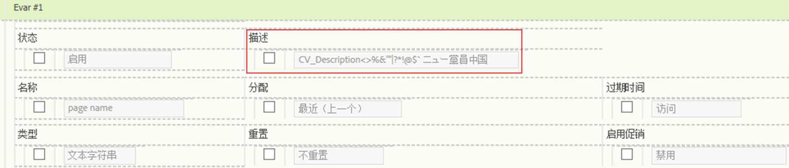

# 自定义报表描述

您可以为 eVar、prop、分类和事件提供自定义报表描述。这些描述对所有最终用户都是可见的。

**[!UICONTROL “分析]** ”&gt;“ **[!UICONTROL 管理员]** ”&gt; **[!UICONTROL “报表包]** ”&gt; **[!UICONTROL “编辑设置]** ”&gt; **[!UICONTROL *变量*]**

>[!NOTE]
>
>添加描述可用于大多数传统分类，但当前不适用于移动分类。

1. 为报表提供描述。最大字符数是 255。
1. 单击&#x200B;**[!UICONTROL 保存]**。

您可以在两个位置看到该描述：

* 报表的标题栏中：

   

* 当您将鼠标悬停在左侧导航内的报表上时，它会作为工具提示出现：

   

