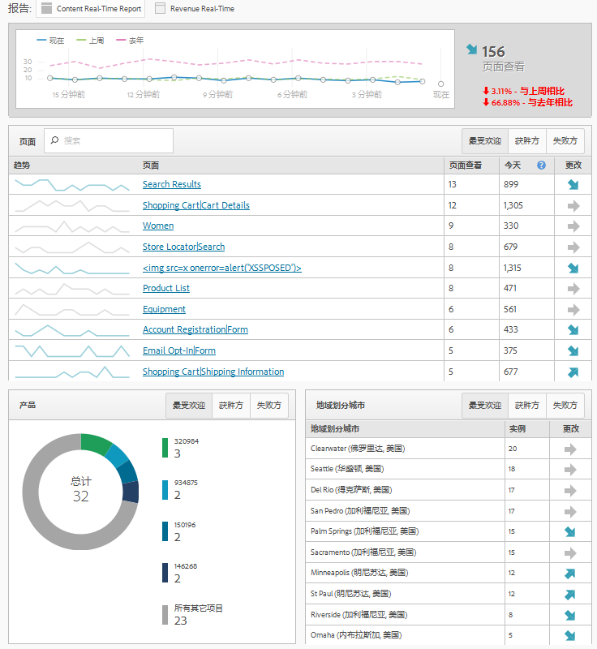

# 实时报表

实时显示 Web 页面流量和并对页面查看次数进行排名。提供制定业务决策所需的可操作数据。

>[!NOTE]
>
>实时报告无需额外的实施或标记。它可以充分利用您现有的 Adobe Analytics 实施。要配置实时报表，请参阅 [实时报表配置](../../../admin/admin/realtime/t-realtime-admin.md#task_1CD03E9B6BDB48B08E9E612183557F40).

**[!UICONTROL 站点指标]** &gt; **[!UICONTROL 实时]**

实时回答以下问题：我的网站上有什么趋势，为什么？它可以让营销人员快速响应并主动管理营销内容和促销活动的表现。报告的实时数据延迟不超过两分钟，并且会每分钟自动更新。

功能板包括 Adobe Analytics 高频率量度和网站分析，直观地报告动态新闻和零售网站的流量及页面查看趋势。只需数秒钟进行收集，即可时时刻刻看到数据的实时趋势。它通过对内容和某些转化进行实时关联和跟踪，来收集数据并将数据传输到自动更新的 UI。

两种最普遍的使用情况包括发布人员希望在用户活动更改时，对文章做出提升/降级处理，以及营销人员希望跟踪新产品线的发布。

作为管理员，您可以

* 使用现有的维度或分类和量度，在每个报表包中最多创建三份实时报表。可使用次要维度来关联（或划分）主要维度。
* 除了 1 个网站范围的量度外，为每个报表添加 3 个维度（或分类），1 个主要，2 个次要。
* 使用任何自定义事件、购物车事件或实例。
* 查看至多 2 小时的历史实时数据，并修改此设置。

   * 最近 15 分钟：1 分钟粒度
   * 最近 30 分钟：1 分钟粒度
   * 最近 1 小时：2 分钟粒度
   * 最近 2 小时：4 分钟粒度

* 例如，将上周的值与上一年的值（以及当日的总计值）进行比较。

请记住，由于没有持续性的概念，eVar（转化量度）不受支持。但是您可以选择转化量度，这些量度仅在与维度设置在同一个页面时，才起作用。有关详细信息，请参阅[设置实时报告](../../../admin/admin/realtime/t-realtime-admin.md#task_1CD03E9B6BDB48B08E9E612183557F40)。

仅管理员或“全部报表访问”和“高级报表”权限组中的所有用户有权设置和查看实时报表。而且，实时报表确实遵守权限设置。例如，如果您没有查看收入的权限，也便无法查看其中包含收入数据的实时报表。

## 由 A4T 配置导致的数据滞后 {#section_806CE36354FC4C539A0DED9266A5C704}

在 Adobe Target 中启用 A4T 集成后，您在 Adobe Analytics 中会额外经历 5 至 10 分钟的滞后。这额外增加的滞后允许您将 Analytics 和 Target 中的数据存储到同一个点击上，从而允许您按页面和网站部分来细分测试。

增加的滞后在所有的 Adobe Analytics 服务和工具（包括实时流和实时报表）中都有所体现，且适用于以下情况：

* 对于实时流、实时报表和 API 请求，以及流量变量的当前数据，仅包含额外数据 ID 的点击会发生延迟。
* 对于转化量度的当前数据、最终数据和数据馈送，所有的点击都会额外延迟 5 至 7 分钟的时间。

请注意，即使您尚未完全实现此集成，滞后时间增加也会在您实施标识服务之后开始。
