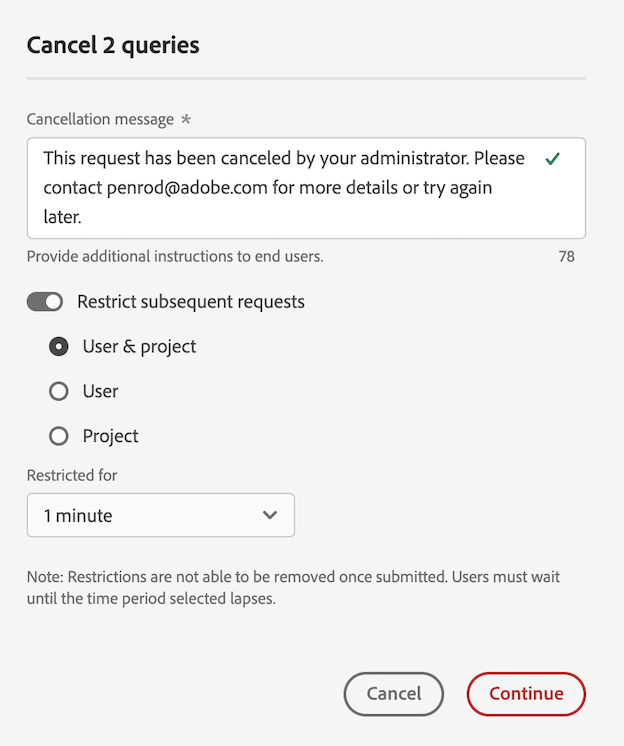

# 在报告活动管理器中取消报告请求

[!UICONTROL 报告活动管理器]使管理员能够快速诊断和取消报告请求，以修复报告高峰期报告容量问题。

取消报告请求时，请考虑以下事项：

* 您可以取消特定请求，取消来自特定用户的所有请求，或取消与特定项目相关的所有请求。

  当您取消请求时，该操作记录在[日志](/help/admin/admin/logs.md)中。 [!UICONTROL **事件类型**]&#x200B;列显示为&#x200B;[!UICONTROL **管理操作**]，[!UICONTROL **事件**]&#x200B;列中提供了有关取消的说明。

* 在取消请求时，您还可以选择限制给定时间期的后续请求。

  限制后续请求时，该操作记录在[日志](/help/admin/admin/logs.md)中。 [!UICONTROL **事件类型**]&#x200B;列显示为&#x200B;[!UICONTROL **管理操作**]，并且在&#x200B;[!UICONTROL **事件**]&#x200B;列中提供了限制的描述。

* 如果请求的&#x200B;[!UICONTROL **用户**]&#x200B;列显示为&#x200B;[!UICONTROL **无法识别**]，则无法取消请求。 如果发生这种情况，则意味着用户所在的登录公司您没有管理权限。

有关报告活动管理器的详细信息，包括主要权益和权限要求，请参阅[报告活动管理器概述](/help/admin/admin/reporting-activity-manager/reporting-activity-overview.md)。

## 取消特定请求

您可以取消占用大量报告容量的单个请求。

1. 在Adobe Analytics中，转到&#x200B;**[!UICONTROL 管理员]** > **[!UICONTROL 报告活动管理器]**。

1. 选择要取消报表请求的报表包。<!--double-check this step-->

   有关此页面上可用数据的更多信息，请参阅[在报告活动管理器中查看报告活动](/help/admin/admin/reporting-activity-manager/reporting-activity.md)。

1. 选择&#x200B;[!UICONTROL **请求**]&#x200B;选项卡，然后选择一个或多个请求。

   <!-- add screenshot -->

1. 选择&#x200B;[!UICONTROL **取消请求**]。

   将显示&#x200B;[!UICONTROL **取消&#x200B;_x_报表请求**]&#x200B;对话框。

1. 取消消息字段显示取消请求时向用户显示的消息。 提供了默认消息。 您可以更新默认消息以提供其他详细信息。

1. （可选）要限制给定时间段的将来请求，请执行以下操作：

   1. 启用选项&#x200B;[!UICONTROL **限制后续请求**]

      

   1. 从以下选项中进行选择：

      | 选项 | 功能 |
      |---------|----------|
      | [!UICONTROL **用户和项目**] | 与所选请求相关联的用户将会被暂时限制运行关联项目的报告请求。 |
      | [!UICONTROL **用户**] | 与所选请求相关的用户将会被暂时限制提交任何报告请求。 |
      | [!UICONTROL **项目**] | 与所选请求相关的项目将会被暂时限制提交所有报告请求。 |
      | [!UICONTROL **限制为**] | 选择限制请求的时长。 您可以选择1分钟（默认）、5分钟、10分钟、15分钟或30分钟。<!-- double-check this -->
设置限制后，不能提前删除限制。
 |

      {style="table-layout:auto"}

1. 选择&#x200B;[!UICONTROL **继续取消**]。

   Analysis Workspace中会显示通知，告知用户请求已被取消。 有关这如何在Analysis Workspace中显示的详细信息，请参阅[用户访问已取消报表时的体验](#experience-when-users-access-a-cancelled-report)。

## 按用户取消请求

您可以取消与一个或多个用户关联的所有请求。

1. 在Adobe Analytics中，转到&#x200B;**[!UICONTROL 管理员]** > **[!UICONTROL 报告活动管理器]**。

1. 选择要取消报表请求的报表包。<!--double-check this step-->

   有关此页面上可用数据的更多信息，请参阅[在报告活动管理器中查看报告活动](/help/admin/admin/reporting-activity-manager/reporting-activity.md)。

1. 选择&#x200B;[!UICONTROL **用户**]&#x200B;选项卡，然后选择一个或多个用户。

   <!-- add screenshot -->

1. 选择&#x200B;[!UICONTROL **取消请求**]。

   显示&#x200B;[!UICONTROL **取消来自x用户的&#x200B;_x_报告请求**]&#x200B;对话框。

1. 取消消息字段显示取消请求时向用户显示的消息。 提供了默认消息。 您可以更新默认消息以提供其他详细信息。

1. （可选）要限制给定时间段的将来请求，请执行以下操作：

   1. 启用选项&#x200B;[!UICONTROL **限制后续请求**]。

      

   1. 从以下选项中进行选择：

      | 选项 | 功能 |
      |---------|----------|
      | [!UICONTROL **用户和项目**] | 所选用户将会被暂时限制提交关联项目的任何报告请求。 |
      | [!UICONTROL **用户**] | 所选用户将会被暂时限制提交任何报告请求。 |
      | [!UICONTROL **项目**] | 与所选用户相关的项目将限制任何用户提交的任何报告请求。 |
      | [!UICONTROL **限制为**] | 选择限制请求的时长。 您可以选择1分钟（默认）、5分钟、10分钟、15分钟或30分钟。<!--double-check this--> 
设置限制后，不能提前删除限制。
 |

      {style="table-layout:auto"}

1. 选择&#x200B;[!UICONTROL **继续取消**]。

   Analysis Workspace中会显示通知，告知用户请求已被取消。 有关这如何在Analysis Workspace中显示的详细信息，请参阅[用户访问已取消报表时的体验](#experience-when-users-access-a-cancelled-report)。

## 按项目取消请求

您可以取消与一个或多个项目关联的所有请求。

1. 在Adobe Analytics中，转到&#x200B;**[!UICONTROL 管理员]** > **[!UICONTROL 报告活动管理器]**。

1. 选择要取消报表请求的报表包。<!--double-check this step-->

   有关此页面上可用数据的更多信息，请参阅[在报告活动管理器中查看报告活动](/help/admin/admin/reporting-activity-manager/reporting-activity.md)。

1. 选择&#x200B;[!UICONTROL **项目**]&#x200B;选项卡，然后选择一个或多个项目。

   <!-- add screenshot -->

1. 选择&#x200B;[!UICONTROL **取消请求**]。

   显示&#x200B;[!UICONTROL **取消来自x项目的&#x200B;_x_报告请求**]&#x200B;对话框。

1. 取消消息字段显示取消请求时向用户显示的消息。 提供了默认消息。 您可以更新默认消息以提供其他详细信息。

1. （可选）要限制给定时间段的将来请求，请执行以下操作：

   1. 启用选项&#x200B;[!UICONTROL **限制后续请求**]。

      

   1. 从以下选项中进行选择：

      | 选项 | 功能 |
      |---------|----------|
      | [!UICONTROL **用户和项目**] | 所选项目将会被暂时限制关联用户提交的任何报告请求。 |
      | [!UICONTROL **用户**] | 与所选项目相关的用户将会被限制提交任何报告请求。 |
      | [!UICONTROL **项目**] | 选定项目将被暂时限制于任何用户发出的任何报告请求中。 |
      | [!UICONTROL **限制为**] | 选择限制请求的时长。 您可以选择1分钟（默认）、5分钟、10分钟、15分钟或30分钟。<!--double-check this--> 
设置限制后，不能提前删除限制。
 |

      {style="table-layout:auto"}

1. 选择&#x200B;[!UICONTROL **继续取消**]。

   Analysis Workspace中会显示通知，告知用户请求已被取消。 有关这如何在Analysis Workspace中显示的详细信息，请参阅[用户访问已取消报表时的体验](#experience-when-users-access-a-cancelled-report)。

## 按应用程序取消请求

您可以取消与一个或多个应用程序关联的所有请求。 在取消与应用程序关联的请求时，您可以选择进一步限制在给定时间段内与该应用程序关联的请求。

应用程序包括：

* Analysis Workspace UI
* 工作区计划项目
* Report Builder
* 生成器 UI：区段、计算量度、注释、受众等。
* 1.4 或 2.0 API 的 API 调用
* 智能警报
* 与任何人共享链接
* 查询Analytics报表引擎的任何其他应用程序

要按应用程序取消请求，请执行以下操作：

1. 在Adobe Analytics中，转到&#x200B;**[!UICONTROL 管理员]** > **[!UICONTROL 报告活动管理器]**。

1. 选择要取消报告请求的连接。<!--double-check this step-->

   有关此页面上可用数据的更多信息，请参阅[在报告活动管理器中查看报告活动](/help/admin/admin/reporting-activity-manager/reporting-activity.md)。

1. 选择&#x200B;[!UICONTROL **应用程序**]&#x200B;选项卡，然后选择一个或多个应用程序。

   <!-- add screenshot -->

1. 选择&#x200B;[!UICONTROL **取消请求**]。

   显示&#x200B;[!UICONTROL **取消来自x项目的&#x200B;_x_报告请求**]&#x200B;对话框。

1. 取消消息字段显示取消请求时向用户显示的消息。 提供了默认消息。 您可以更新默认消息以提供其他详细信息。

1. （可选）要限制给定时间段的将来请求，请执行以下操作：

   1. 启用选项&#x200B;[!UICONTROL **限制后续请求**]

      

   1. 从以下选项中进行选择：

      | 选项 | 功能 |
      |---------|----------|
      | [!UICONTROL **用户和项目**] | 选定的应用程序将被暂时限制在相关用户和项目提出的任何报告请求之外。
这是限制最少的选项。
 |
      | [!UICONTROL **用户**] | 与选定应用程序关联的用户将无法提出任何报告请求。 |
      | [!UICONTROL **项目**] | 与所选应用程序关联的项目将限制于任何用户发出的任何报告请求。 |
      | [!UICONTROL **限制为**] | 选择限制请求的时长。 您可以选择1分钟（默认）、5分钟、10分钟、15分钟或30分钟。<!--double-check this--> 
设置限制后，不能提前删除限制。
 |

      {style="table-layout:auto"}

1. 选择&#x200B;[!UICONTROL **继续取消**]。

   通知显示在应用程序中(例如在Analysis Workspace中)，通知用户请求已被取消。 有关这如何在Analysis Workspace中显示的详细信息，请参阅[用户访问已取消报表时的体验](#experience-when-users-access-a-cancelled-report)。

## 用户访问已取消报告时的体验

在Analysis Workspace中，当用户尝试访问受取消影响的报表或可视化图表时，会看到以下消息：

### 项目消息

当用户尝试访问受取消影响的项目时，他们会看到一条消息，通知他们报告暂时受限：

### 可视化上的消息

当用户尝试访问受取消影响的可视化图表时，他们会看到一条消息，通知他们报告的数据处理暂时受限：

