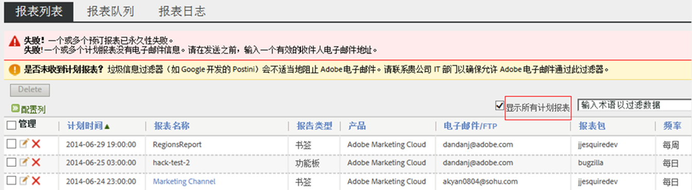
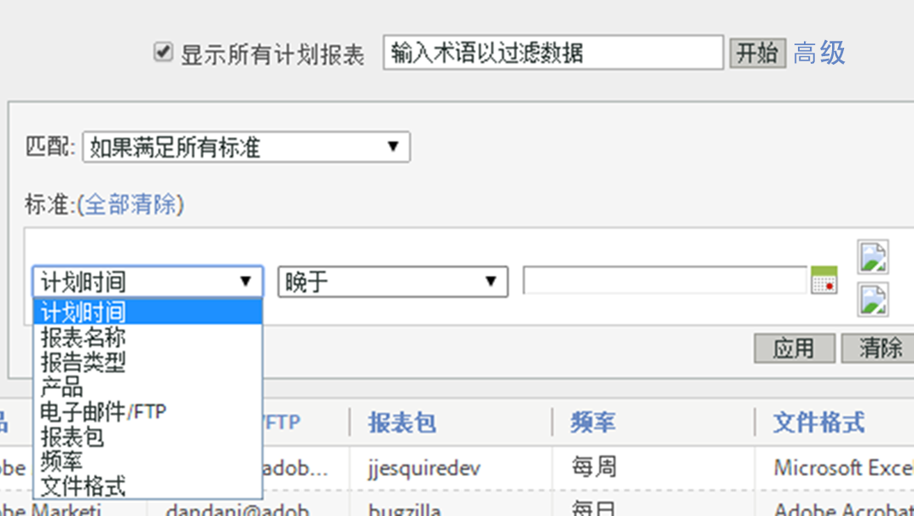
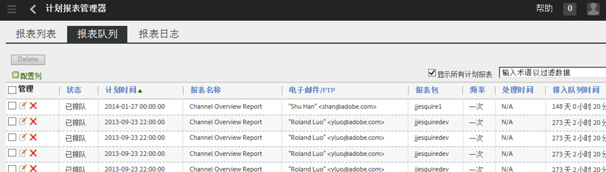
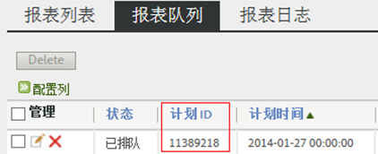

# 计划报表队列

让管理员级别的用户能够跨组织查看和管理计划报表。

**[!UICONTROL Analytics]** &gt; **[!UICONTROL 组件]** &gt; **[!UICONTROL 计划报表]**

计划报表管理器中的管理员级别功能包括：

* 在您的组织中[显示所有计划报表](/help/admin/admin/scheduled-reports-admin.md#section_3F167CAAEEC24140B476CF95B7402690)的选项。
* 跨整个组织的[高级过滤功能](/help/admin/admin/scheduled-reports-admin.md#section_206A52A85DE84947AAB3AD082FBF6275)。
* 新的[报表队列](/help/admin/admin/scheduled-reports-admin.md#section_03C866115D354BB182E90BF4D52F1E0B)选项卡，列出已排入队列并准备在报表服务器上执行的所有报表。
* 在报表队列界面上公布[计划 ID.](/help/admin/admin/scheduled-reports-admin.md#section_568B70F4228C4229977CB85D2DCD53A1)

## 显示所有计划报表 {#section_3F167CAAEEC24140B476CF95B7402690}

在&#x200B;**[!UICONTROL 报表列表]**&#x200B;选项卡中，除了个人计划的报表之外，您还可以在您的组织内&#x200B;**[!UICONTROL 显示所有计划报表]**。

> [!NOTE]**[!UICONTROL 报表名称]**&#x200B;列显示正在计划的报表名称，而&#x200B;**[!UICONTROL 文件名称]**&#x200B;列显示您在“高级提交选项”中设置的任何自定义文件名。因此，如果您计划具有相同报表类型的多个报表，并为每个报表指定自定义名称，则“计划报表管理器”会显示具有相同报表名称和不同文件名称的多个条目。这是因为正在计划的后端报表是相同的，因此报表名称列对于几乎完全自定义的文件名称显示相同的报表名称（如有设置）。

## 高级过滤功能 {#section_206A52A85DE84947AAB3AD082FBF6275}

例如，如果您需要筛选出每小时计划一次的所有报表，那么可以在&#x200B;**[!UICONTROL 高级]**&#x200B;过滤器中指定&#x200B;**[!UICONTROL 频率等于每小时]**，然后单击&#x200B;**[!UICONTROL 应用]**：

## 报表队列 {#section_03C866115D354BB182E90BF4D52F1E0B}

通过此队列可以管理并且有选择地删除任何在队列中处于“堵塞”状态的计划报表。（报表超时通常超过 4 小时。）

报表队列还允许您“跳过计划报表一次”。只需单击&#x200B;**[!UICONTROL 管理]**&#x200B;列中的蓝色图标。

## 计划 ID {#section_568B70F4228C4229977CB85D2DCD53A1}

当您需要联系 Adobe ClientCare 解决计划报表问题时，在报表队列界面中公开&#x200B;**[!UICONTROL 计划 ID]** 可提供帮助。

