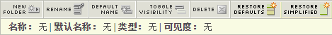

# 简化的报表菜单

在Reports和Analytics中实施简化报告菜单的步骤。

通过简化的 Adobe Reports &amp; Analytics 菜单，您可以选择应用备用的简化菜单，在下层包含经过调整的文件夹。默认情况下，简化的菜单会显示以下选项：

>[!NOTE]
>
>请注意，应用简化的菜单会删除您可能对默认菜单结构进行的所有自定义。它还会对组织中的所有市场 Marketing Reports &amp; Analytics 用户实施此简化菜单结构。在实施新菜单之前，请慎重考虑上述后果（例如，围绕现有菜单结构制定的培训），因为您无法还原现有菜单结构中的任何自定义设置。

1. Navigate to **[!UICONTROL Analytics]** &gt; **[!UICONTROL Admin]** &gt; **[!UICONTROL Report Suites]** to open the Report Suite Manager.
1. 选择您要对其实施简化菜单结构的报表包。
1. Go to **[!UICONTROL Edit settings]** &gt; **[!UICONTROL General]** &gt; **[!UICONTROL Customize Menus]**.
1. Click **[!UICONTROL Restore Simplified]** to implement the simplified menu structure.

   

1. To go back to the (non-customized) default menu, click **[!UICONTROL Restore Defaults]**.
