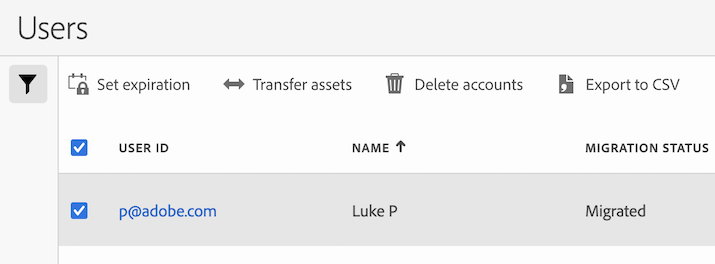

# 转移用户资产或设置帐户有效期

大多数用户和产品管理功能已移至 [Adobe Admin Console](https://helpx.adobe.com/cn/enterprise/using/admin-console.html). (要开始管理Adobe Analytics用户的用户权限，请参阅 [Adobe Admin Console中的Analytics](/help/admin/admin-console/home.md).)

虽然大多数用户和产品管理功能现在只能在Adobe Admin Console中使用，但本页中介绍的管理功能只能从Adobe Analytics管理区域使用。

## 将资产从一个Analytics用户转移到另一个用户 {#transfer}

1. 转到 **管理员** > [!UICONTROL **Analytics用户和资产**].
此时将显示“用户”页面。
1. （可选）使用以下任一选项可更轻松地找到您要查找的任何用户：
   * 在搜索字段中，开始键入要为其设置帐户到期日期的用户名称。
   * 选择 **筛选** 图标  来显示或隐藏筛选器设置。 您可以按迁移状态或旧版登录状态进行过滤。
1. 选择要转移其资产的用户。
   
1. 选择 [!UICONTROL **转移资产**].
1. 在转移资产页面上，在 [!UICONTROL **将资产转移到**] 字段中，开始键入要将资产传输到的用户的名称，然后在此名称出现在下拉菜单中选择其名称。
1. 在 [!UICONTROL **选择要转移的帐户项目**] 部分，导航到要转移的资产，然后选择 [!UICONTROL **转移**].

   您选择的任何资产都会转移到指定用户。

## 设置用户帐户的到期日期 {#expiration}

1. 转到 **管理员** > [!UICONTROL **Analytics用户和资产**].
此时将显示“用户”页面。
（可选）使用以下任一选项可更轻松地找到您要查找的任何用户：
   * 在搜索字段中，开始键入要为其设置帐户到期日期的用户名称。
   * 选择 **筛选** 图标  来显示或隐藏筛选器设置。 您可以按迁移状态或旧版登录状态进行过滤。
1. 选择要为其设置帐户到期日期的用户。
   
1. 选择 [!UICONTROL **设置过期时间**].
1. 选择到期日期，然后选择 [!UICONTROL **完成**].
