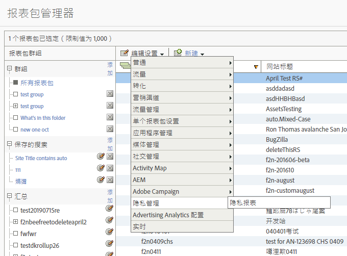
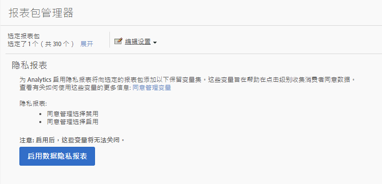
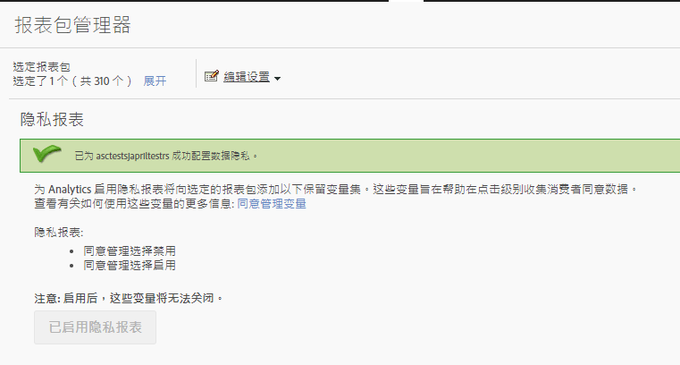
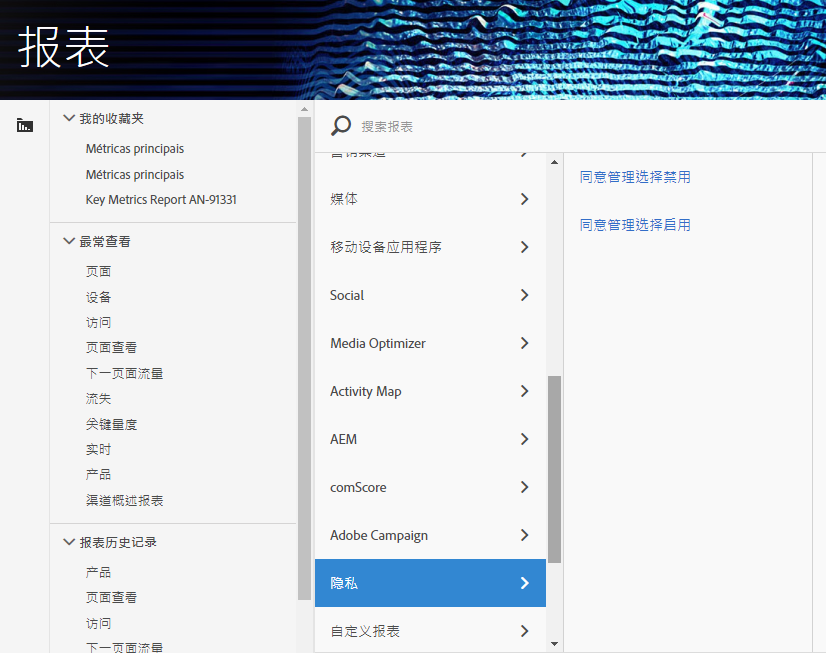

# 同意管理变量

为了在管理隐私数据方面提供额外的帮助，一组保留变量可与特定上下文数据变量一起使用。
这些同意管理变量提供了一个易于使用的框架，用于捕获每次分析点击的同意状态。

## 变量

* 同意管理选择禁用
   * 保留变量：列表属性
   * 类型：逗号分隔的字符串
   * 包含:
      * `contextData.['cm.ssf']=1` 显示为SSF
      * `contextData.['opt.dmp']=N` 显示为DMP
      * `contextData.['opt.sell']=N` 显示为销售

* 同意管理选择启用
   * 保留变量：列表属性
   * 类型：逗号分隔的字符串
   * 包含:
      * `contextData.['opt.dmp']=Y` 显示为DMP
      * `contextData.['opt.sell']=Y` 显示为销售

## 报表

同意管理变量可通过Analytics管理控制台中提供的新隐私设置来启用。

可以将每个报表包配置为：
1. 在“报告与分析”中，单击“管理员”&gt;“报告包”。
1. Select the report suite(s) where you are collecting media data and click [!UICONTROL Edit Settings &gt; Privacy Management]

   

1. 单击“启 [!UICONTROL 用数据隐私报告] ”按钮。  注意: 启用后，这些变量将无法关闭。

   

1. 启用后，您将看到一条确认消息。

   

1. 保留变量现在可用于报告。  请参阅同意管理选择退出和同意管理选择加入。

   

## 实施

已预定义三个上下文数据变量以与同意管理保留变量一起使用。  每位实施工程师都需要确定如何管理和保留这些变量的设置。

有关实 [施上下文数据变量的一般指导](https://docs.adobe.com/help/en/analytics/implementation/javascript-implementation/variables-analytics-reporting/context-data-variables.html) ，请参阅上下文数据变量。

### SSF

* 上下文数据：`contextData.['cm.ssf']`
* 接受的值：
   * `1` -发送值时， `1`这表示服务器端转发处于退出状态。 与此变 `1` 量配对的值将阻止与Adobe Audience manager共享此点击。 请参 [阅AAM ePrivacy Compliance。](https://docs.adobe.com/help/en/analytics/integration/audience-analytics/audience-analytics-workflow/ssf-gdpr.html)
   * 此参数不接受任何其他值

### DMP

* 上下文数据：`contextData.['opt.dmp']`
* 接受的值：
   * `N` -发送值时，这 `N`表示消费者选择不共享到数据管理平台。 请注意，当前不向AAM共享块。  将SSF用于该功能。
   * `Y` -发送值时，这 `Y`表示消费者选择共享到数据管理平台。

### 销售

* 上下文数据：`contextData.['opt.sell']`
* 接受的值：
   * `N` -发送值时，这 `N`表示消费者选择退出共享或向第三方出售数据。
   * `Y` -发送值时， `Y`这表示消费者选择向第三方共享或出售数据。
