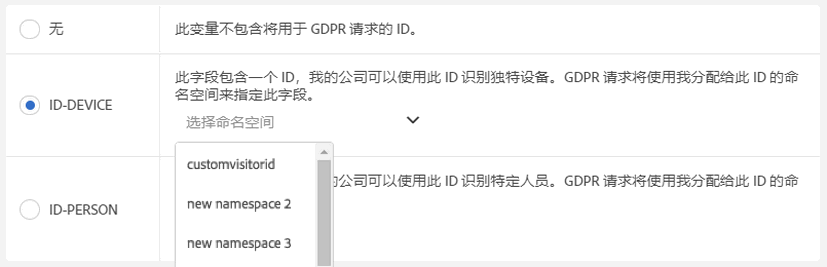
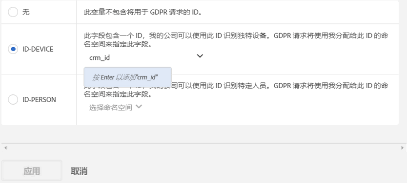

# 分析变量的数据隐私标签

## 为何要为您的数据设置标签？{#section_A075CDF3AD0744BD8CEB41CE3FB7BFB3}

许多Adobe客户都有法律团队审查过数据隐私法（GDPR、CCPA等）并且已就如何处理数据以符合数据隐私法作出自己的结论。 各公司之间做出的法律解释可能有所差异，客户所需的数据处理设置也可能不尽相同。由于客户对数据隐私数据处理的偏好不同，而数据集也不同，Adobe允许Adobe客户作为数据控制者为其唯一数据自定义其所需的数据隐私数据处理设置。 这使每个唯一客户能够以对其品牌和其唯一数据集最有意义的方式处理数据隐私请求。

Adobe Analytics 根据数据的敏感性和合同限制提供了数据标签设置工具。标签非常重要而且有用，它有助于：（1）识别数据主体，（2）确定哪些数据可在访问请求中返回，以及（3）识别必须在删除请求中删除的数据字段。

Before you can figure out which labels should be applied to which variables/fields, you need to [understand the IDs](/help/admin/c-data-governance/gdpr-analytics-ids.md#concept_1BC4CA94B559481F8B08776DA100B23E) that you are capturing in your Analytics data, and to decide which you will use for Data Privacy requests.

Adobe Analytics数据隐私实施支持以下标识数据、敏感数据和数据管理标签。

## DULE 标签 {#section_B2E78130957647338495EF37DE21D6BC}

>[!NOTE]
>
>数据使用标签和强制执行(DULE)框架旨在为跨所有Adobe解决方案／服务／平台提供统一的方式，以跨Adobe Experience cloud捕获、通信和使用有关数据的元数据。 元数据可帮助数据控制者指明哪些数据是个人信息，哪些数据是敏感数据，以及哪些合同限制与数据相关。在初始版本中，Analytics仅公开与数据隐私相关的DULE标签。 随着 Adobe 的其他产品开始实施对 DULE 标签的支持，未来版本将会引入更多的敏感数据标签以及合同标签，这有助于确保产品之间共享的数据只在法律允许的范围内使用。

## 身份数据标签 (DULE) {#section_D7F4E4B60D6D40BEBC86B7004EF42AFF}

身份数据“I”标签用于对可识别或联系特定人员的数据进行分类。

<table id="table_6B5368D714424E52835D5DFE189BD080"> 
 <thead> 
  <tr> 
   <th colname="col1" class="entry"> 标签 </th> 
   <th colname="col2" class="entry"> 定义 </th> 
   <th colname="col3" class="entry"> 其他要求 </th> 
  </tr>
 </thead>
 <tbody> 
  <tr> 
   <td colname="col1"> <p>I1 </p> </td> 
   <td colname="col2"> <p><b>直接可识别</b>：可明确识别个人或允许与个人直接联系的数据，例如姓名或电子邮件地址。 </p> </td> 
   <td colname="col3"> 
    <ul id="ul_4E2AD59D119E40D28B869D0BB63B9FD9"> 
     <li id="li_AC3E99B57E3A4AE2A12BE219680AFC58">不能在事件中设置 </li> 
     <li id="li_BB66992863C8402F8D58656293F31E71">不能在促销 eVar 中设置 </li> 
    </ul> </td> 
  </tr> 
  <tr> 
   <td colname="col1"> <p>I2 </p> </td> 
   <td colname="col2"> <p><b>间接可识别</b>：可与任何其他数据结合使用来识别个人或设备或者允许与个人或设备直接联系的数据。 </p> <p>它本身不能识别个人的身份，但是可以与其他信息（不管该信息是否由您持有）结合起来，用于识别某人的身份。示例包括客户会员号，或公司的 CRM 系统为其每个客户使用的唯一 ID。 </p> </td> 
   <td colname="col3"> 
    <ul id="ul_A0EF0F3DC5804D4FBE228946D697ABEB"> 
     <li id="li_A592EA6DA82C4D8C80E03F02ADF4E20E">不能在事件中设置 </li> 
     <li id="li_46CE7B1E84884CDAB356A6DF89397849">不能在促销 eVar 中设置 </li> 
    </ul> </td> 
  </tr> 
 </tbody> 
</table>

## 敏感数据标签 (DULE) {#section_533E1406F3F24A01B51D94139B94CAEC}

敏感数据“S”标签用于对诸如地理数据之类的敏感数据进行分类。未来，会引入其他敏感数据标签，用于识别其他类型的敏感信息。

<table id="table_A778A508620545CCB37830E5CF1C75B7"> 
 <thead> 
  <tr> 
   <th colname="col1" class="entry"> 标签 </th> 
   <th colname="col2" class="entry"> 定义 </th> 
  </tr>
 </thead>
 <tbody> 
  <tr> 
   <td colname="col1"> <p>S1 </p> </td> 
   <td colname="col2"> <p> 与纬度和经度相关的精确地理位置数据，可用于确定设备的准确位置（在 100 米以内）。 </p> </td> 
  </tr> 
  <tr> 
   <td colname="col1"> <p>S2 </p> </td> 
   <td colname="col2"> <p> 可用于确定广泛定义的地理围栏区域的地理位置数据。 </p> </td> 
  </tr> 
 </tbody> 
</table>

## 数据管理标签（数据隐私） {#section_0C7F9EC4BB414A6D915C69F1D3259F1B}

数据管理标签让用户能够对反映隐私相关考虑因素和合同条件的数据进行分类，以符合相关法规和公司政策规定。

**数据隐私访问标签**

<table id="table_663EFF43A454498386F7F3E60875E0F8"> 
 <thead> 
  <tr> 
   <th colname="col1" class="entry"> 标签 </th> 
   <th colname="col2" class="entry"> 定义 </th> 
   <th colname="col3" class="entry"> 其他要求 </th> 
  </tr>
 </thead>
 <tbody> 
  <tr> 
   <td colname="col1"> <p>无 </p> </td> 
   <td colname="col2"> <p>如果此变量不包含作为数据隐私访问请求的一部分返回给数据主体的数据中必须包含的数据，则选择此选项。 </p> </td> 
   <td colname="col3"> </td> 
  </tr> 
  <tr> 
   <td colname="col1"> <p>ACC-ALL </p> </td> 
   <td colname="col2"> <p>Values in this field should be included in <u>all</u> Data Privacy access requests. </p> <p>如果此命中来自多人共享的设备，则您作为数据控制者，可以通过应用此标签来指示它是可接受的，以便将此字段中的数据与任何有权访问该共享设备的个人共享。 </p> </td> 
   <td colname="col3"> <p>将为所有数据隐私请求返回具有此标签的字段。 </p> </td> 
  </tr> 
  <tr> 
   <td colname="col1"> <p>ACC-PERSON </p> </td> 
   <td colname="col2"> <p> 当我们合理确定点击来自数据主体时（由与ID-PERSON字段的值匹配的数据隐私请求ID确定），此字段中的值应仅包括在数据隐私访问请求中。 </p> </td> 
   <td colname="col3"> <p>您还必须在此报表包中的某个变量上设置了 ID-PERSON 标签，并使用该 ID 提交请求，否则将绝不会应用此标签。 </p> </td> 
  </tr> 
 </tbody> 
</table>

尽管很少会有变量设置其他任何标签，但预计访问标签将会应用到许多变量中。不过，您需要咨询您的法律团队，以决定应该将收集的哪些数据与数据主体共享。

**数据隐私删除标签**

<table id="table_59DFCE4D90214CB5972BDDE5B7391B4D"> 
 <thead> 
  <tr> 
   <th colname="col1" class="entry"> 标签 </th> 
   <th colname="col2" class="entry"> 定义 </th> 
   <th colname="col3" class="entry"> 其他要求 </th> 
  </tr>
 </thead>
 <tbody> 
  <tr> 
   <td colname="col1"> </td> 
   <td colname="col2"> <p>与其他标签不同，这些“删除”标签并不是相互排斥的。您可以选择两者之一、同时选择两者，或者选择“无”。“无”标签不需要另外单独选择，因为不勾选任何一个“删除”选项即表示选择了此标签。 </p> </td> 
   <td colname="col3"> <p>只有当字段中包含的值能够将命中项与该数据主体进行关联时（即，可用来识别数据主体），这些字段才需要使用删除标签。 </p> <p> 不需要删除其他个人信息（收藏夹、浏览/购买历史、健康状况等），因为这会切断与数据主体的关联。 </p> </td> 
  </tr> 
  <tr> 
   <td colname="col1"> <p>DEL-DEVICE </p> </td> 
   <td colname="col2"> <p>对于数据隐私删除请求，仅对于点击中存在指定ID-DEVICE的请求，应匿名化此字段中的值。 </p> <p>如果相同的值出现在其他不删除的命中项中，那么将不对这些其他实例进行更改。这会导致在此字段中计算独特计数的报表的计数发生更改。在共享设备上，这可能会删除其他个人（不仅仅是数据主体）的标识符。 </p> <p>如果此字段还有ID-DEVICE标签，且此字段中的值用作数据隐私请求的ID，则计数不会更改。 </p> </td> 
   <td colname="col3"> 
    <ul id="ul_45C3A09E1F05492B97C3F3DEA7C78FBC"> 
     <li id="li_BAB277F92F284ADE9D7B6839BDD716E2">还需要 I1 或 I2 或 S1 标签 </li> 
     <li id="li_6DDFC0571457489CBA9D76F547247F20">不能在事件中设置 </li> 
     <li id="li_E79C6DFC6C58478EAA1504E3820D512C">不能在促销 eVar 中设置 </li> 
     <li id="li_B78E273212E447D49D0707E174B66DEC">不能在分类中设置 </li> 
     <li id="li_F0F52D0DE7454557A6A97063C1FBC372">您必须使用 ID-DEVICE 提交请求或将 expandIDs 设置为 true，否则将绝不会应用此标签。 </li> 
    </ul> </td> 
  </tr> 
  <tr> 
   <td colname="col1"> <p>DEL-PERSON </p> </td> 
   <td colname="col2"> <p>对于数据隐私删除请求，仅对于点击中存在指定ID-PERSON的请求，应匿名化此字段中的值。 </p> <p>如果相同的值出现在其他不删除的命中项当中，那么将不对这些其他值进行更改。这会导致在此字段中计算独特计数的报表的计数发生更改。如果此字段还有ID-PERSON标签，且此字段中的值用作数据隐私请求的ID，则计数不会更改。 </p> </td> 
   <td colname="col3"> 
    <ul id="ul_6722E42E036E47B4B5E17DC213636D51"> 
     <li id="li_6C1A64FF68AF428A827D8C6C33E22970">还需要 I1 或 I2 或 S1 标签 </li> 
     <li id="li_8053533FFE874EE795C8B6043A4F73B3">不能在事件中设置 </li> 
     <li id="li_D6700CF4D03E44DDA83C4DDBB5B70CC3">不能在促销 eVar 中设置 </li> 
     <li id="li_B6C2B15484B344889DBF29B62E2EA8FD">不能在分类中设置 </li> 
     <li id="li_3BBD0C27D9644C2B9618457A0BFC15EF">您还必须在此报表包中的某个变量上设置了 ID-PERSON 标签，并使用该 ID 提交请求，否则将绝不会应用此标签。 </li> 
    </ul> </td> 
  </tr> 
 </tbody> 
</table>

**数据隐私标识标签**

<table id="table_F6BBC868457443A19A7B693BD6C55B4B"> 
 <thead> 
  <tr> 
   <th colname="col1" class="entry"> 标签 </th> 
   <th colname="col2" class="entry"> 定义 </th> 
   <th colname="col3" class="entry"> 其他要求 </th> 
  </tr>
 </thead>
 <tbody> 
  <tr> 
   <td colname="col1"> <p>无 </p> </td> 
   <td colname="col2"> <p>此变量不包含将用于数据隐私请求的ID。 </p> </td> 
   <td colname="col3"> <p>仅当此字段包含您通过数据隐私API或UI提交访问或删除请求时将使用的ID时，您才需要设置其他标签之一。 </p> </td> 
  </tr> 
  <tr> 
   <td colname="col1"> <p>ID-DEVICE </p> </td> 
   <td colname="col2"> <p>此字段包含一个ID，可用于标识数据隐私请求的设备，但无法区分共享设备的不同用户。 </p> <p>您不需要为包含 ID 的所有变量指定此标签（这是 I1/I2 标签的用途）。如果您使用存储在此变量中的ID提交数据隐私请求，并且希望搜索此变量以查找指定的ID，请使用此标签。 </p> </td> 
   <td colname="col3"> 
    <ul id="ul_618019CB8FCA4A5C94C47636240197B2"> 
     <li id="li_0E5ADED36FF24A348FDD434E2CC8C8EE">还需要 I1 或 I2 标签 </li> 
     <li id="li_20BCFF07B2BF468C8E0D477C10B2EF9F">不能在事件中设置 </li> 
     <li id="li_0BD73EEF4184475D8E97878CF8DBEB90">不能在促销 eVar 中设置 </li> 
     <li id="li_129851035C4A4BF0922296B4C3BEE39B">不能在分类中设置 </li> 
    </ul> </td> 
  </tr> 
  <tr> 
   <td colname="col1"> <p>ID-PERSON </p> </td> 
   <td colname="col2"> <p>此字段包含一个ID，可用于标识已通过身份验证的用户（特定人员）进行数据隐私请求。 </p> <p>您不需要为包含 ID 的所有变量指定此标签（这是 I1/I2 标签的用途）。如果要使用存储在此变量中的ID提交数据隐私请求，并且要搜索此变量以查找指定的ID，请使用此标签。 </p> </td> 
   <td colname="col3"> 
    <ul id="ul_0C7EEC8FCB5C4BCDA5D48F3C98770A67"> 
     <li id="li_2E781AE8D7A046A7996C7300CA854B86">还需要 I1 或 I2 标签 </li> 
     <li id="li_EB4C6430C218405DAAE81DEE010DCAA2">不能在事件中设置 </li> 
     <li id="li_05AA67B45974474F9DA520E8B877BA11">不能在促销 eVar 中设置 </li> 
     <li id="li_8A6BF4B40ED249289EAD46FE1C755FB0">不能在分类中设置 </li> 
    </ul> </td> 
  </tr> 
 </tbody> 
</table>

## 在为变量设置 ID-DEVICE 或 ID-PERSON 标签时提供命名空间 {#section_F0A47AF8DA384A26BD56032D0ABFD2D7}

在为变量设置 ID-DEVICE 或 ID-PERSON 标签时，系统会提示您提供一个命名空间。您可以使用先前已定义的命名空间或者定义一个新的命名空间。

**使用先前已定义的命名空间**

如果您已经为登录公司的任何报表包中的其他变量分配了一个 ID 标签，则可以选择其中一个现有的命名空间。如果此变量包含的 ID 类型与之前已使用此命名空间设置标签的其他变量包含的 ID 类型相同，并且您希望在提交请求时搜索所有这些变量，则应重复使用该命名空间。

1. 单击&#x200B;**[!UICONTROL 选择命名空间]，然后选择其中一个现有的命名空间。**
1. Click **[!UICONTROL Apply]**.



**定义一个新的命名空间**

您也可以定义一个新的命名空间。我们建议将命名空间字符串限制为字母数字字符，以及下划线、短划线和空格。这些字符串将全部转换为小写字母。

1. 单击&#x200B;**[!UICONTROL 选择命名空间]并键入命名空间标题。**

   

1. 按 **[!UICONTROL Enter]以添加此命名空间。**&#x200B;只有现在才可以激活“应用”按钮。
1. Click **[!UICONTROL Apply]**.

您指定为命名空间的字符串与通过数据隐私API提交请求时应使用的字符串与“namespace”参数的值相同。 随后，该请求将促使 Adobe Analytics 搜索报表包中的所有变量，这些变量与该请求指定的 ID 共享此命名空间。

您不需要为包含 ID 的所有变量指定 ID-DEVICE 或 ID-PERSON 标签（这是 I1/I2 标签的用途）。如果您要使用存储在此变量中的ID提交数据隐私请求，并且希望搜索此变量以查找指定的ID，请使用此标签。 例如，如果eVar1可以包含电子邮件地址，而eVar2可以包含登录用户名，但您只能使用用户名提交请求，那么您可以将eVar1标为I1、ACC-PERSON、DEL-PERSON，而将eVar2标为I2、ACC-PERSON、DEL-PERSONID-PERSON，命名空间为“用户名”。 然后，您可以使用“user”部分的 JSON 数据块提交请求，例如：

```
{
     "namespace": "user name",
     "type": "analytics",
     "value": "rocketman123"
}
```

在同一个报表包中，为不同变量使用相同的命名空间是可以接受的。例如，一些自定义实施将 CRM-ID 存储在 prop 和 eVar 中。如果 CRM-ID 总是出现在这两者的其中一个当中（例如 eVar）、只是偶尔出现在另外一个当中 (prop)，并且当 CRM-ID 没有出现在 eVar 中时它也绝不会出现在 prop 中，那么，只有 eVar 需要 ID 标签和命名空间，这是因为 Adobe 可以只在该 eVar 中搜索 ID。但是，如果CRM-ID有时出现在一个变量中，有时出现在另一个变量中，则这两个变量应具有相同的命名空间，Adobe将搜索这两个变量，以查找作为具有此命名空间的数据隐私请求的一部分指定的ID的出现情况。 您仍应在所有这些变量中包含 DEL 标签，以便无论该值何时出现，它都是匿名化的。

列举另一个示例，您可能拥有一个 CRM ID，并且有时会通过 eVar1 发送，有时通过 prop7 发送。然后您使用一个处理规则，将 eVar1 的值（如果存在）复制到 eVar3 中。否则，它会将 prop7 的值复制到 eVar3。在这种情况下，如果 CRM ID是已知的，eVar3 将始终包含该 CRM ID，因此只有 eVar3 需要 ID-PERSON 标签。

> [!CAUTION] 保留命名空间“visitorId”和“customVisitorId”，用于标识Analytics旧版跟踪Cookie和Analytics客户访客ID。 请勿将这些命名空间用于自定义流量或转换变量。

## Variable Types and the Data Privacy/DULE Labels they support {#section_CE7C3EDE1344466A98BC45E394B40762}

数据隐私/DULE标签功能影响四类广泛的Analytics变量。 并非所有变量都支持所有标签。下表显示了各类变量对各种标签的支持情况。

<table id="table_95D4416B3A8A40C28B2610D0003456E6"> 
 <thead> 
  <tr> 
   <th colname="col1" class="entry"> 变量类型 </th> 
   <th colname="col2" class="entry"> 支持的标签 </th> 
   <th colname="col3" class="entry"> 不支持的标签 </th> 
  </tr>
 </thead>
 <tbody> 
  <tr> 
   <td colname="col1"> 
    <ul id="ul_0615B545A5AD43F2A6F25698A47AAD3E"> 
     <li id="li_A4B3E8E241B149C99F2A71B21227AD72">自定义成功事件 </li> 
     <li id="li_8AEF688AE9B8426C82D199E4B195330D">促销 eVar </li> 
     <li id="li_DFFCA65DCC6146AEB6D47476B4D4CC3B">多值变量 (mvVar) </li> 
     <li id="li_3192D08B12C249D1AAA8AAEEDE2FD7D7">层次结构变量 </li> 
    </ul> </td> 
   <td colname="col2"> <p>S1/S2 </p> <p>ACC-ALL、ACC-PERSON </p> </td> 
   <td colname="col3"> <p>I1/I2 </p> <p>ID-DEVICE、ID-PERSON </p> <p>DEL-DEVICE、DEL-PERSON </p> </td> 
  </tr> 
  <tr> 
   <td colname="col1"> <p>分类 </p> </td> 
   <td colname="col2"> <p>I1/I2、S1/S2 </p> <p>ACC-ALL、ACC-PERSON </p> </td> 
   <td colname="col3"> <p>ID-DEVICE、ID-PERSON </p> <p>DEL-DEVICE、DEL-PERSON </p> </td> 
  </tr> 
  <tr> 
   <td colname="col1"> 
    <ul id="ul_1C2FD4D606664965A88F10818E1C11A9"> 
     <li id="li_590975F5C7304317B22C80B20718E914">流量变量 (prop) </li> 
     <li id="li_6E614B7036994434BFDA71A4424529A0">商务变量（非推销 eVar） </li> 
    </ul> </td> 
   <td colname="col2"> <p>所有标签 </p> </td> 
   <td colname="col3"> - </td> 
  </tr> 
  <tr> 
   <td colname="col1"> <p>其他大部分变量 </p> <p><i>（请参阅下表以了解例外情况）</i> </p> </td> 
   <td colname="col2"> <p>ACC-ALL、ACC-PERSON </p> </td> 
   <td colname="col3"> <p>I1/I2、S1/S2 </p> <p>ID-DEVICE、ID-PERSON </p> <p>DEL-DEVICE、DEL-PERSON </p> </td> 
  </tr> 
 </tbody> 
</table>

## 可为其分配除 ACC-ALL/ACC-PERSON 以外的标签的变量/已修改 {#section_4FA003003D1B4E2EBCFCDB1A7CD4A824}

<table id="table_0972910DB2D7473588F23EA47988381D"> 
 <thead> 
  <tr> 
   <th colname="col1" class="entry"> 群组 </th> 
   <th colname="col2" class="entry"> 变量 </th> 
   <th colname="col3" class="entry"> 可修改标签 </th> 
   <th colname="col4" class="entry"> 注释 </th> 
  </tr>
 </thead>
 <tbody> 
  <tr> 
   <td colname="col1" morerows="1"> 
    <ul id="ul_62FA1BAA3B9245909509566D8C03F900"> 
     <li id="li_38F7C4E18ECB42C292370713F502B8EB">转化维度 </li> 
     <li id="li_41CB61F927CB4402AAB4A62E219CD153">自定义流量维度 </li> 
    </ul> </td> 
   <td colname="col2"> <p>所有（分类除外） </p> </td> 
   <td colname="col3"> <p>所有 </p> </td> 
   <td colname="col4"> </td> 
  </tr> 
  <tr> 
   <td colname="col2"> <p>分类 </p> </td> 
   <td colname="col3"> <p>无 / I1 / I2 </p> <p>无 / S1 / S2 </p> </td> 
   <td colname="col4"> </td> 
  </tr> 
  <tr> 
   <td colname="col1"> <p>转化事件 </p> </td> 
   <td colname="col2"> <p>所有 </p> </td> 
   <td colname="col3"> <p>无 / S1 / S2 </p> </td> 
   <td colname="col4"> </td> 
  </tr> 
  <tr> 
   <td colname="col1"> <p>解决方案维度和事件 </p> </td> 
   <td colname="col2"> <p>Activity Map 链接、 </p> <p>Activity Map 页面 </p> </td> 
   <td colname="col3"> <p>无 / I1 / I2 </p> <p>无 / DEL-DEVICE / DEL-PERSON </p> </td> 
   <td colname="col4"> <p>变量可包含 URL 参数，URL 参数又可能包含直接或间接可识别数据。如果您的实施不会在这些变量中直接或间接收集可识别数据，那么它们就不需要标识或删除标签。 </p> <p>请注意，删除时会清除 URL 参数，但保留基本 URL。 </p> </td> 
  </tr> 
  <tr> 
   <td colname="col1"> <p>数据处理维度 </p> </td> 
   <td colname="col2"> <p>自定义访客 ID </p> </td> 
   <td colname="col3"> <p>ID-DEVICE / ID-PERSON </p> <p>DEL-DEVICE / DEL-PERSON </p> </td> 
   <td colname="col4"> <p>您无法删除ID或DEL标签（设置为“无”），但可以根据您的自定义ID实现将其更改为DEVICE或PERSON变体。 </p> <p>如果您不使用自定义访客ID，则设置不重要。 </p> </td> 
  </tr> 
  <tr> 
   <td colname="col1" morerows="1"> 
    <ul id="ul_5EB0193732D44A20AEA08CE9DFE01DBD"> 
     <li id="li_F70D969F83314A94BD8567449968EE2F">标准维度 </li> 
     <li id="li_6046764B19FF4679B51E55671C2C0ADB">数据处理维度 </li> 
    </ul> </td> 
   <td colname="col2"> <p>IP 地址 </p> <p>IP 地址 2 </p> </td> 
   <td colname="col3"> <p>DEL-DEVICE / DEL-PERSON </p> </td> 
   <td colname="col4"> <p>您不可以删除 DEL 标签，但可以将其更改为 DEL-DEVICE 或 DEL-PERSON，或者 DEL-DEVICE 和 DEL-PERSON。 </p> </td> 
  </tr> 
  <tr> 
   <td colname="col2"> <p>ClickMap 操作（旧版）、 </p> <p>ClickMap 上下文（旧版）、 </p> <p>页面、 </p> <p>页面 URL、 </p> <p>原始登录页面 URL、 </p> <p>反向链接、 </p> <p>访问起始页 URL </p> </td> 
   <td colname="col3"> <p>无 / I1 / I2 </p> <p>无 / DEL-DEVICE / DEL-PERSON </p> </td> 
   <td colname="col4"> <p>变量可包含 URL 参数，URL 参数又可能包含直接或间接可识别数据。如果您的实施不会在这些变量中直接或间接收集可识别数据，那么它们就不需要标识或删除标签。 </p> <p>请注意，删除时会清除 URL 参数，但保留基本 URL。 </p> </td> 
  </tr> 
 </tbody> 
</table>

## 删除处理 {#section_F3DEE591671A4B16A8E043F91C137ECB}

Adobe Analytics对数据隐私删除请求的支持旨在最大限度地减少对报告的影响。 在大多数情况下，报表中显示的量度不应发生变化。在删除数据隐私之前运行的历史报告将与执行删除后运行的相同报告相匹配。 这是通过将已删除的数据与数据主体完全解除关联、同时又保留不可识别的数据来完成的，以便使报告的值保持一致。

下表说明了各种变量的“删除”方式。 这不是一个完整的列表。

<table id="table_A329C2E2645F4685BC208826D070A5F6"> 
 <thead> 
  <tr> 
   <th colname="col1" class="entry"> 变量 </th> 
   <th colname="col2" class="entry"> 删除方法 </th> 
  </tr>
 </thead>
 <tbody> 
  <tr> 
   <td colname="col1"> <p>• 流量变量 (prop) </p> <p>• 商务变量 (eVar) </p> </td> 
   <td colname="col2"> <p>现有值将替换为“数据隐私-356396D55C4F9C7AB3FBB2F2FA223482”形式的新值，其中“数据隐私-”后的32位十六进制值是加密的强128位伪随机数。 因为现有值基本上被随机字符串替换，所以无法从这个新值确定原始值，也无法从原始值导出新值。 </p> <p>对于给定变量，如果与被替换的值相同的值出现在同一数据隐私请求中同时被删除的其他点击中，则该值的所有实例都将替换为相同的新值。 </p> <p>若某个值的部分实例被删除请求替换，且稍后的请求删除了原始值的其他（新）实例，则新的替换值与原始替换值不同。 </p> </td> 
  </tr> 
  <tr> 
   <td colname="col1"> <p>购买 ID </p> </td> 
   <td colname="col2"> <p>现有值由“G-7588FCD8642718EC50”形式的新值替换，其中“G-”前缀后的18个十六进制数字是加密强128位伪随机数的前18个数字。 适用于删除流量变量和商务变量的所有注释在此处也适用。 </p> <p>购买 ID 是一种交易 ID，其主要目的是为了确保某次购买行为不会被计入两次，例如，当购物者刷新其购买确认页面时。该 ID 本身可能会将该次购买绑定到您用来记录购买事务的数据库中的一行。大多数情况下无需删除该 ID，因此默认不会删除它。如果您仍然能够在数据隐私删除请求删除您自己的数据后将购买绑定到用户，那么您可能需要删除此字段，这样此访客的Analytics数据就无法绑定回购买者。 </p> </td> 
  </tr> 
  <tr> 
   <td colname="col1"> <p>访客 ID </p> </td> 
   <td colname="col2"> <p>此值是一个 128 位整数，且被加密性强的 128 位伪随机值替换。 </p> </td> 
  </tr> 
  <tr> 
   <td colname="col1"> <p>• MCID </p> <p>• 自定义访客 ID </p> <p>• IP 地址 </p> <p>• IP 地址 2 </p> </td> 
   <td colname="col2"> <p>清除值（根据变量的类型，设置为空字符串或0）。 </p> </td> 
  </tr> 
  <tr> 
   <td colname="col1"> <p>• ClickMap 操作（旧版） </p> <p>• ClickMap 上下文（旧版） </p> <p>• 页面 </p> <p>• 页面 URL </p> <p>• 原始登入页面 URL </p> <p>• 反向链接 </p> <p>• 访问起始页 URL </p> </td> 
   <td colname="col2"> <p>清除/删除 URL 参数。如果该值看起来不像是 URL，则清除该值（将其设为空字符串）。 </p> </td> 
  </tr> 
  <tr> 
   <td colname="col1"> <p>• 纬度 </p> <p>• 经度 </p> </td> 
   <td colname="col2"> <p>精度降低到不低于 1 公里。 </p> </td> 
  </tr> 
 </tbody> 
</table>

## Variables that Don't Support the Expected Delete Labels {#section_956B766EFFEC427E87E6CFF3A4217E86}

本节旨在阐明有关不支持删除的Analytics变量的信息。 有时候，这些变量会被非 Analytics 用户（例如法律团队）删除，这些用户不了解变量中包含的数据类型，因此会根据变量的名称做出不正确的假设。以下是这些变量的列表，以及它们为什么不需要删除，或者它们为什么不需要特定的删除标签。

<table id="table_6FECF3D654514862912D371E6BE4143B"> 
 <thead> 
  <tr> 
   <th colname="col1" class="entry"> 变量 </th> 
   <th colname="col2" class="entry"> 注释 </th> 
  </tr>
 </thead>
 <tbody> 
  <tr> 
   <td colname="col1"> <p>新访客 ID </p> </td> 
   <td colname="col2"> <p>“新访客 ID”是一个布尔值，如果给定的访客 ID 是我们第一次看到，则该值为 True。一旦访客 ID 匿名化之后，就不需要再删除它。匿名化后，它将与我们第一次看到的此匿名 ID 相对应。 </p> </td> 
  </tr> 
  <tr> 
   <td colname="col1"> <p>邮政编码 </p> <p>地理邮政编码 </p> </td> 
   <td colname="col2"> <p>邮政编码已设置为仅适用于来自美国的命中。对于来自欧盟地区的命中，未设置邮政编码。即使设置了邮政编码，它们也只能提供大致的地理区域，很难用来重新识别数据主体。 </p> </td> 
  </tr> 
  <tr> 
   <td colname="col1"> <p>地理纬度 </p> <p>地理经度 </p> </td> 
   <td colname="col2"> <p>经纬度提供了从 IP 地址派生的一个大概位置。其精度通常与邮政编码相似，位于实际位置的几十公里范围之内。 </p> </td> 
  </tr> 
  <tr> 
   <td colname="col1"> <p>用户代理 </p> </td> 
   <td colname="col2"> <p>用户代理识别所用浏览器的版本。 </p> </td> 
  </tr> 
  <tr> 
   <td colname="col1"> <p>用户 ID </p> </td> 
   <td colname="col2"> <p> 指定包含该数据的 Analytics 报表包（以数字表示）。 </p> </td> 
  </tr> 
  <tr> 
   <td colname="col1"> <p>报表包 ID </p> </td> 
   <td colname="col2"> <p> 指定包含该数据的 Analytics 报表包的名称。 </p> </td> 
  </tr> 
  <tr> 
   <td colname="col1"> <p>访客 ID </p> <p>MCID / ECID </p> </td> 
   <td colname="col2"> <p> 这些 ID 具有 DEL-DEVICE 标签，但不能添加 DEL-PERSON 标签。如果您指定了对每个请求都进行<a href="../../admin/c-data-governance/gdpr-id-expansion.md#concept_917A5666010A4E6BA599FE372DADD1BD" format="dita" scope="local">ID 扩展</a>，则在处理删除请求时，这些 ID 都会被自动删除，即使是使用了 ID-PERSON 的 ID 也是如此。 </p> <p>如果您不使用 ID 扩展，但您希望当 prop 或 eVar 中包含匹配 ID 时，这些 Cookie ID 能够对命中项匿名化，那么即使该 prop 或 eVar 可真正识别个人，您也可以通过为其设置 ID-DEVICE 标签来解决此标签限制（也需要将所有 DEL-PERSON 标签更改为 DEL-DEVICE 标签）。在这种情况下，由于只有访客 ID 或 ECID 的部分实例被匿名化，因此历史报表中的独特访客计数将发生变化。 </p> </td> 
  </tr> 
  <tr> 
   <td colname="col1"> <p>AMO ID </p> </td> 
   <td colname="col2"> <p> Adobe Advertising Cloud ID是一个解决方案变量，具有不可修改的DEL-DEVICE标签。 与访客 ID 和 MCID 一样，它由 Cookie 填充。只要删除这些其他 ID，它就会从命中项当中删除。更多详细信息，请参阅这些变量的描述。 </p> </td> 
  </tr> 
 </tbody> 
</table>

## 访问请求的日期字段 {#section_6678FB4FF42B481C9B78E64F61782397}

有五个标准变量包含时间戳：

<table id="table_49A9255366254F799E1682C30CBD98EB"> 
 <thead> 
  <tr> 
   <th colname="col1" class="entry"> 时间戳 </th> 
   <th colname="col2" class="entry"> 定义 </th> 
  </tr>
 </thead>
 <tbody> 
  <tr> 
   <td colname="col1"> <p>命中时间 UTC </p> </td> 
   <td colname="col2"> <p>Adobe Analytics 接收到命中项的时间。 </p> </td> 
  </tr> 
  <tr> 
   <td colname="col1"> <p>自定义命中时间 UTC </p> </td> 
   <td colname="col2"> <p>发生命中的时间，某些移动应用程序和其他实施的命中发生时间可能会早于接收时间。例如，当命中发生时但网络连接不可用，应用程序可能会保留该命中项，并在网络连接可用时将其发出。 </p> </td> 
  </tr> 
  <tr> 
   <td colname="col1"> <p>日期时间 </p> </td> 
   <td colname="col2"> <p>与自定义命中时间 UTC 为同一值，但在报表包的时区列显示为 UTC 而不是 GMT。</p> </td> 
  </tr> 
  <tr> 
   <td colname="col1"> <p>首次命中时间 GMT </p> </td> 
   <td colname="col2"> <p>针对此命中的访客 ID 值收到的首次命中的自定义命中时间 UTC 值。 </p> </td> 
  </tr> 
  <tr> 
   <td colname="col1"> <p>访问开始时间 UTC </p> </td> 
   <td colname="col2"> <p>针对此访客 ID 当前访问收到的首次命中的自定义命中时间 UTC 值。</p> </td> 
  </tr> 
 </tbody> 
</table>

用于生成为数据隐私访问请求返回的文件的代码要求前三个时间戳变量中的至少一个包含在访问请求中（具有适用于请求类型的ACC标签）。 若不包含上述三个中的任意一个，则“自定义命中时间 UTC”将被视为含有 ACC-ALL 标签。

为数据隐私访问请求返回的点击级CSV文件会将这些字段中的值从unix时间戳转换为格式为YYYY-MM-DD HH:MM:SS的日期／时间字段（例如，2018-05-01 13:49:22）。 在 HTML 摘要文件中，这些时间戳值将会被截断为仅包含日期（YYYY-MM-DD），以缩短这些字段中出现的唯一值的长度。
