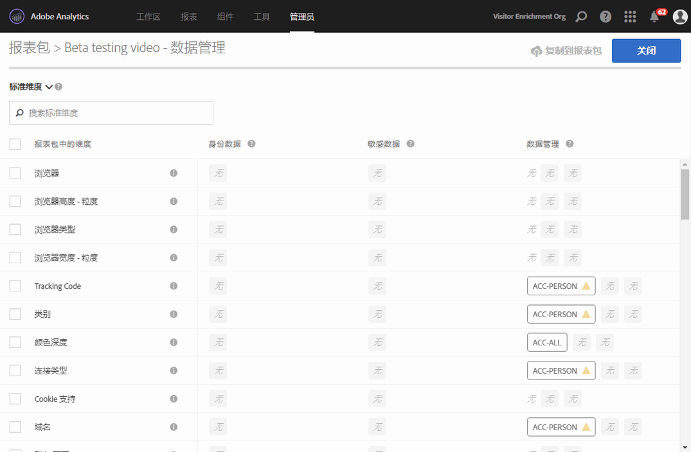
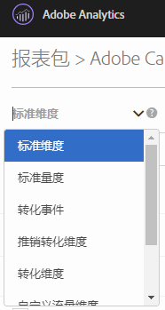
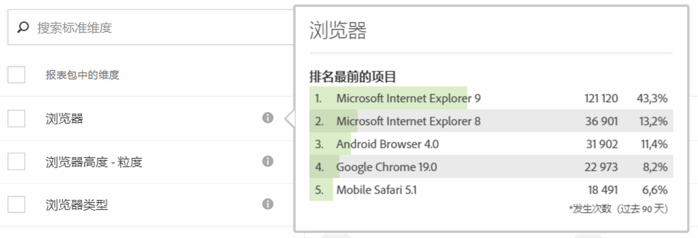
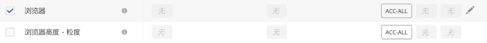
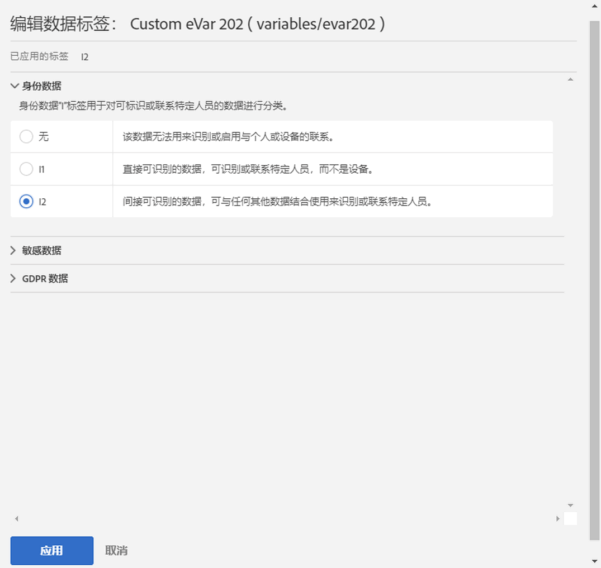
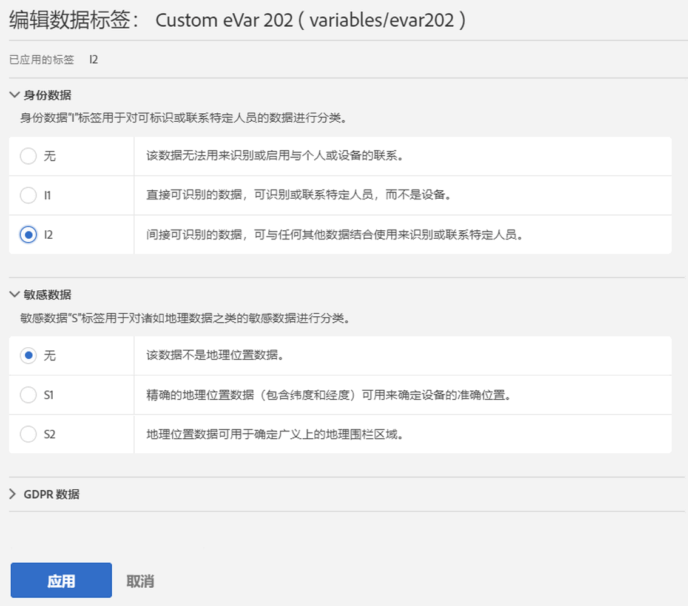
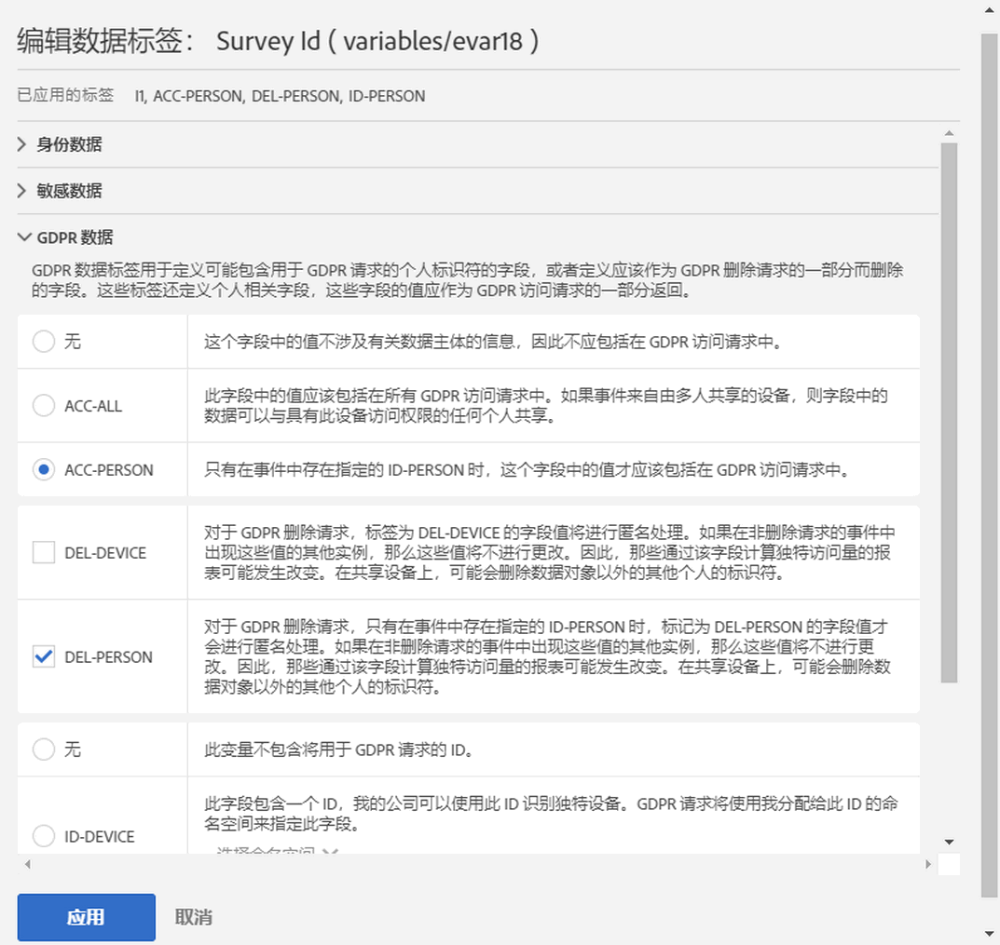
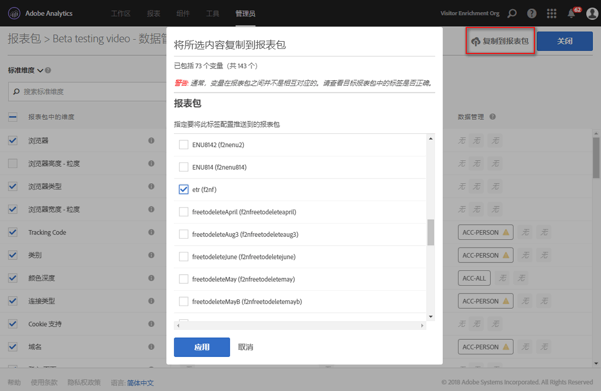

# 标签报表套件数据

为报表包数据设置标签即是向给定报表包中的每个变量分配身份、敏感性和数据管理标签。请确保您首先要熟悉标签及其定义。

>[!NOTE]
>
>请记住，每次创建新报表包或在现有报表套件中启用新变量时，都需要审核标记。当启用新的解决方案集成时，您可能也需要审核标签设置，因为这些集成将出现要求设置标签的新变量。重新实施您的移动应用程序或网站时，可能会改变现有变量的使用方式，这或许也需要更新标签。

## 分配或编辑报表包标签 {#section_39F829F35A274EACA532E2F6FF392996}

**示例**：作为数据控制者，您可以计划从数据主体收集电子邮件地址和 Cookie ID，以处理他们的 GDPR 请求。这些 Cookie ID 存储在 Adobe Analytics 的报表包中。要为电子邮件地址和 Cookie ID 创建标签，您必须在 Analytics 中使用 Adobe Cloud Platform 的数据使用标签和执行 (DULE) 框架。

1. In Analytics, navigate to **[!UICONTROL Admin]** &gt; **[!UICONTROL Data Governance]** &gt; **[!UICONTROL[select report suite].]** 

1. 选择要为哪个变量组设置标签。

   

   * **标准维度**（Adobe Analytics 现成维度）
   * **标准量度**（Adobe Analytics 现成量度）
   * **转化事件**（自定义成功事件）
   * **促销转化维度**（促销 eVar）
   * **转化维度**（非推销 eVar）
   * **自定义流量维度** (prop)
   * **解决方案维度和事件**（与以下内容相关的维度/事件：移动设备、视频、Activity Map 等解决方案，以及与诸如 Adobe Campaign、Adobe Experience Manager、Advertising Cloud 等解决方案的集成）
   * **数据处理维度**（不会直接通过 Adobe Analytics UI 在报表中显示、但可通过数据馈送和/或 Data Warehouse 请求提供给您的变量）

1. （可选）单击每个变量旁边的信息 (i) 图标，以更好地了解过去 90 天中最常见的值。（此功能不适用于数据处理维度，因为它们在 Analytics UI 中不可用。）

   

1. 单击一个或多个变量的复选框以将其选中，然后选择&#x200B;**[!UICONTROL 编辑]图标（位于右侧）以编辑一个或多个变量。**

   

1. 此时，**身份数据**&#x200B;标签对话框会自动打开。这些标签对数据进行分类，可单独使用，也可与其他数据结合使用，以识别个人或能够用来与个人直接联系。有关这些选项的更多信息，请参阅[身份数据标签 (DULE)](../../admin/c-data-governance/gdpr-labels.md#section_B2E78130957647338495EF37DE21D6BC)。

   >[!NOTE]
   >
   >数据使用标签和执行(DLUE)框架设计为跨解决方案/服务/平台提供一致的方式，以捕获、交流和使用Adobe Experience Cloud中的数据元数据。元数据可帮助数据控制者指明哪些数据是个人信息，哪些数据是敏感数据，以及哪些合同限制与数据相关。

   

1. 打开&#x200B;**敏感数据**&#x200B;部分，以设置敏感数据标签，它可以对地理位置数据进行分类。有关这些选项的更多信息，请参阅[敏感数据标签 (DULE)](../../admin/c-data-governance/gdpr-labels.md#section_533E1406F3F24A01B51D94139B94CAEC)。

   

1. 打开“GDPR 数据”部分，以设置&#x200B;**数据管理**&#x200B;标签。使用此部分指导 Adobe 如何处理 GDPR 访问和删除请求的每个变量，并且定义应该扫描哪些变量以查找这些请求的数据主体 ID。有关这些选项的更多信息，请参阅[数据管理标签 (GDPR)](../../admin/c-data-governance/gdpr-labels.md#section_0C7F9EC4BB414A6D915C69F1D3259F1B)。

   

1. 完成所有标签设置后，请单击&#x200B;**[!UICONTROL 应用]。**

## 将标签复制到报表包{#section_7C6FDAFF049F4126B84F6261F72668EE}

如果您要将相同的 DULE/GDPR 设置应用于多个报表包，则可以执行以下步骤：

1. 选择变量组（标准维度、转化维度等）包含要复制的变量。请注意，您一次只能复制一组变量的标签。
1. 选择此变量组中的部分或所有变量。
1. 单击“数据管理”对话框右上角的&#x200B;**[!UICONTROL 将标签复制到报表包]。**

   

1. 勾选&#x200B;**[!UICONTROL 全选]以复制所有报表包的所选变量的标签，或者选择您要将标签复制到其中的个别报表包。**

   >[!IMPORTANT]
   >
   >请记住，您选择的所有报告包都必须映射到Experience Cloud组织。

   将一个变量或一组变量的标签复制到不同的报表包时，复制的标签会转到目标报表包中相应位置的变量中。对于标准维度、标准量度、解决方案维度和事件以及数据处理维度，标签将被复制到目标报表包中具有&#x200B;**相同名称**&#x200B;的变量中。

   然而，对于转化变量 (eVar)、促销转化维度和自定义流量维度 (prop)，标签将被复制到目标报表包中具有&#x200B;**相同编号**&#x200B;的变量中。例如，eVar12 将被复制到所有目标报表包的 eVar12 中。在确定复制的目标时，会忽略这些变量的名称。如果相应的变量未在目标报表包中启用，则针对该变量的标签复制将会失败。

   在复制为变量定义的分类标签时，标签将被复制到与目标报表包中相应变量对应的（例如 eVar7 至 eVar7）分类中，该分类的名称要与被复制的分类名称相同。否则，该分类标签的复制将会失败。

   应用了一组标签后，会显示一条状态消息。状态消息将包含复制失败的所有目标变量或分类及其报表包的名称。

   >[!IMPORTANT]
   >
   >您应始终检查目标报表包，以确保正确复制标签。对于具有 ID 或 DEL 标签的变量来说，这一点尤为重要。

1. Click **[!UICONTROL Apply]**.

