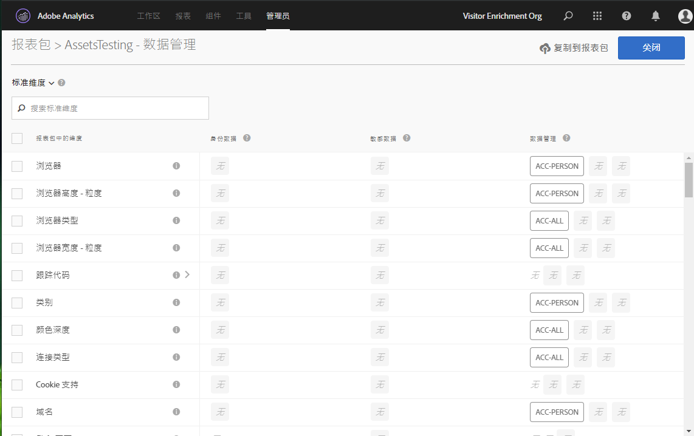
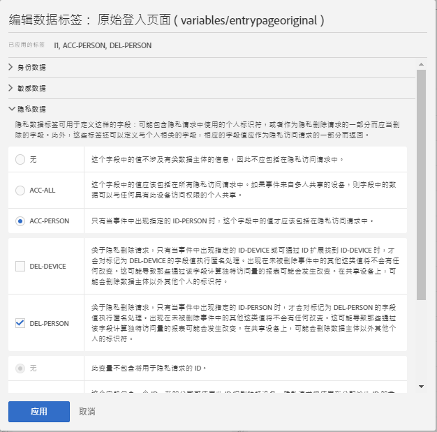

# 为报表包数据设置标签

为报表包数据添加标签意味着您可以为给定报表包中的每个变量分配标识、敏感度和数据管理标签。 请确保您首先熟悉标签及其定义。

>[!NOTE] 请记住，每次创建新报表包后或在现有报表包中启用新变量时，都需要对标签设置进行审核。在启用新的解决方案集成时，您可能还需要查看标签，因为它们可能会显示需要标签的新变量。 重新实施您的移动应用程序或网站可能会改变现有变量的使用方式，这也可能需要更新标签。

## 分配或编辑报表包标签 {#section_39F829F35A274EACA532E2F6FF392996}

**示例**：作为数据控制者，您可以计划从数据主体收集电子邮件地址和 Cookie ID，以处理他们的数据隐私请求。这些Cookie ID存储在Adobe Analytics的报表包中。 要为电子邮件地址和cookie ID创建标签，您必须在Analytics中使用Adobe Cloud Platform的数据使用标签和强制执行(DULE)框架。

1. 在Analytics中，导航到 **[!UICONTROL Admin]** > **[!UICONTROL Data Governance]** > **[!UICONTROL (select report suite)]**

1. 选择要标记的变量组。

   

   * **标准维度** （Adobe Analytics现成的维度）
   * **标准指标** （Adobe Analytics现成指标）
   * **转化事件**（自定义成功事件）
   * **促销转化维度**（促销 eVar）
   * **转化维度** （非销售eVar）
   * **自定义流量维度** (prop)
   * **解决方案维度和事件** (与移动、视频、活动图等解决方案相关的维度/事件，以及与Adobe Campaign、Adobe Experience Manager、Advertising Cloud等解决方案集成)
   * **数据处理维度** (不直接通过Adobe Analytics UI在报告中公开的变量，但通过数据馈送和／或数据仓库请求可用)

1. （可选）单击每个变量旁边的信息(i)图标，以便更好地了解其在过去90天内的最常用值。 （此功能不适用于数据处理维，因为它们在Analytics UI中不可用。）

   

1. Select one or more variables by clicking their checkbox, then select the **[!UICONTROL Edit]** icon (to the right) to edit one or more variable(s).

   

1. “标 **识数据** ”标签对话框自动打开。 这些标签对数据进行分类，这些数据可以单独使用，也可以与其他数据组合使用，以识别或允许与个人直接联系。 有关这些选项的更多信息，请参阅[身份数据标签 (DULE)。](/help/admin/c-data-governance/gdpr-labels.md#identity-data-labels)

   >[!NOTE]
   >
   >数据使用标签和执行 (DULE) 框架旨在提供一个跨解决方案/服务/平台的统一方式，以便在整个 Adobe Experience Cloud 中捕获、传输和使用有关数据的元数据。元数据可帮助数据控制者指明哪些数据是个人信息，哪些数据是敏感数据，以及哪些合同限制与数据相关。

   

1. 打开&#x200B;**敏感数据**&#x200B;部分，以设置敏感数据标签，它可以对地理位置数据进行分类。有关这些选项的更多信息，请参阅[敏感数据标签 (DULE)。](/help/admin/c-data-governance/gdpr-labels.md#sensitive-data-labels)

   

1. 打开数据隐私“数据”部分，以设置&#x200B;**数据管理**&#x200B;标签。使用本节信息指导 Adobe 如何处理数据隐私访问和删除请求的每个变量，并且定义应该扫描哪些变量以查找这些请求的数据主体 ID。有关这些选项的更多信息，请参阅[数据管理标签（数据隐私）](/help/admin/c-data-governance/gdpr-labels.md#data-governance-labels)。

   

1. Click **[!UICONTROL Apply]** once you have completed all labeling.

## 将标签复制到报表包 {#section_7C6FDAFF049F4126B84F6261F72668EE}

如果您要将相同的 DULE/数据隐私设置应用于多个报表包，则可以执行以下步骤：

1. 选择变量组（标准维、转换维等）包含要复制的变量。 请注意，一次只能复制一组变量的标签。
1. 选择此组中的部分或所有变量。
1. 单击 **[!UICONTROL Copy Labels to Report Suite(s)]** “数据管理”对话框右上角的。

   

1. Either check **[!UICONTROL Select All]** to copy labels for the selected variables to all report suites or select the individual report suites that you want to copy the labels to.

   >[!IMPORTANT]
   >
   >请记住，您选择的所有报表包都必须映射到您的 Experience Cloud 组织。

   将一个变量或一组变量的标签复制到不同的报表包时，复制的标签会转到目标报表包中相应位置的变量中。对于标准维度、标准度量、解决方案维度和事件以及数据处理维度，标签将复制到目标报表包中名 **称相同** 的变量。

   但是，对于“转换变量”(eVar)、“销售转换维度”和“自定义流量维度”(props)，副本将复制到目标报表包中 **编号相同** 的变量。 例如，eVar12将复制到所有目标报表包中的eVar12中。 在确定副本的目标时，将忽略这些变量的名称。 如果目标报告包中未启用相应的变量，则该变量的复制将失败。

   在复制为变量定义的分类的标签时，标签将复制到目标报表包中相应变量的分类（如eVar7到eVar7），该分类的名称与要复制的分类的名称相同。 否则，该分类的标签的复制将失败。

   在应用一组标签后，将显示状态消息。 状态消息将包括复制失败的任何目标变量或分类的名称及其报表包。

   >[!IMPORTANT]
   >
   >您应该经常检查目标报表包，以确保正确复制标签。对于具有 ID 或 DEL 标签的变量来说，这一点尤为重要。

1. 单击 **[!UICONTROL Apply]**.

