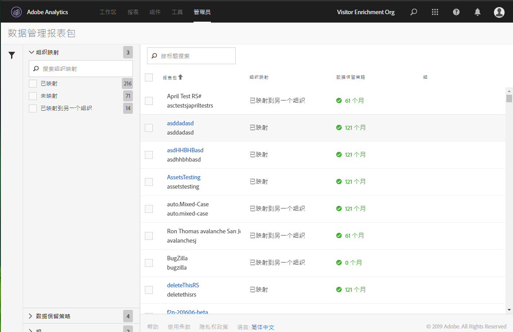

# 查看/管理报表包的数据管理设置

“管理工具”中的“数据管理”对话框概述了哪些报表包已配置数据管理，是否已将这些报表包映射到 Experience Cloud 组织，以及是否已为这些报表包设置数据保留策略。

1. 登录到 Adobe Experience Cloud。
1. 导航至 **[!UICONTROL Analytics]** > **[!UICONTROL 管理员]** > **[!UICONTROL 数据管理]**。

>[!NOTE]
>
>如果看不到此菜单项，则需要将您添加到 [产品配置文件Admin Console](https://experienceleague.adobe.com/docs/analytics/admin/admin-console/permissions/product-profile.html) 具有此功能的权限。

1. 查看属于登录公司的所有报表包：

   

| 设置 | 描述 |
| --- | --- |
| **[!UICONTROL 报表包]** | 第一行列出了报表包的友好名称。第二行包含了报表包的内部名称。如果您允许为报表包设置标签，则第一行将是一个可单击的链接，单击该链接，便可前往标签设置页面。 |
| **[!UICONTROL 组织映射]** | <ul><li>已映射：已将此报表包映射到与您已登录的 Analytics 登录公司相同的 Experience Cloud 组织。只可以对具有此设置的报表包设置标签。</li><li>已映射到另一个组织：另一个 Experience Cloud 组织已将此报表包映射到其组织。</li></ul> |
| **[!UICONTROL 数据保留策略]** | Analytics 数据隐私实施要求您制定适当的数据保留策略。此设置显示是否：<ul><li>已为此报表包制定适当的数据保留策略，以及</li><li>数据在被删除之前将由 Adobe 保留多久。默认数据保留期限为 25 个月。</li></ul>**注意**:如果未设置数据保留期限，Adobe Analytics将无法协助您处理数据隐私API请求，例如，处理您从最终用户那里收到的访问或删除请求。 请联系您的客户成功经理以便设置数据保留期限。 |
| **[!UICONTROL 群组]** | 当前尚未实施群组功能。 |
| 左边栏 | 单击漏斗图标，以打开或关闭左边栏。的 [!UICONTROL 组织映射] 部分显示属于每个所述类别的报表包数量。 的 [!UICONTROL 数据保留策略] 部分显示贵组织当前可用的每个唯一数据保留策略以及分配了该保留策略的报表包数量。 |
| **[!UICONTROL 导出到 CSV]** | 如果您在一个或多个报表包旁边勾选了复选框，则会显示导出到 CSV 选项。通过这个选项，您可以下载一个 CSV 文件，其中包含所有选定报表包的所有变量的当前标签定义。我们建议您的法律团队审核标签设置选择，该选项有助于这种审核。无需登录到“数据管理”界面，您即可通过共享 .CSV 文件来进行审核。 |
