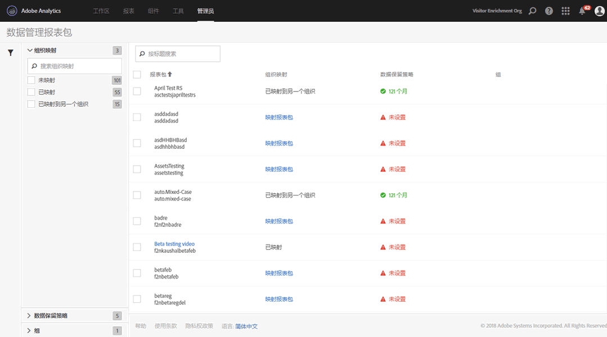
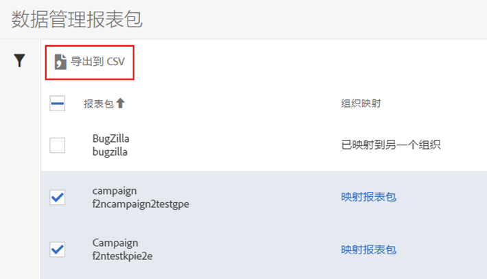

# 查看/管理报表包的数据管理设置

“管理工具”中的“数据管理”对话框概述了哪些报表包已配置数据管理，是否已将这些报表包映射到 Experience Cloud 组织，以及是否已为这些报表包设置数据保留策略。

1. 登录到 Adobe Experience Cloud。
1. Navigate to  **[!UICONTROL Analytics]** &gt; **[!UICONTROL Admin]** &gt; **[!UICONTROL Data Governance]** .

   您将看到您的登录公司拥有的所有报表包：

   

<table id="table_448292730FF0475E9DCB731882F9A29B"> 
 <thead> 
  <tr> 
   <th colname="col1" class="entry"> 设置 </th> 
   <th colname="col2" class="entry"> 描述 </th> 
  </tr> 
 </thead>
 <tbody> 
  <tr> 
   <td colname="col1"> 
报表包 
 </td> 
   <td colname="col2"> 
第一行列出了报表包的友好名称。第二行包含了报表包的内部名称。如果您允许为报表包设置标签，则第一行将是一个可单击的链接，单击该链接，便可前往标签设置页面。 
 </td> 
  </tr> 
  <tr> 
   <td colname="col1"> 
组织映射 
 </td> 
   <td colname="col2"> 
    <ul id="ul_EF8F613B0C5E42D19DB60BD0C89C114B"> 
     <li id="li_B35EE88555F547EFBF55ADE9D0C9EC3B"><b>已映射</b>：已将此报表包映射到与您已登录的 Analytics 登录公司相同的 Experience Cloud 组织。只可以对具有此设置的报表包设置标签。 </li> 
     <li id="li_4E800BF80CFF477BAA091EF272D9071C"><b>映射报表包</b>：单击此链接可将<a href="https://marketing.adobe.com/resources/help/en_US/mcloud/report-suite-mapping.html" format="html" scope="external">报表包映射</a>到 Experience Cloud 组织。 
这意味着您将被重定向到Experience Cloud组织-报表包映射管理页面，您必须找到报表包，然后将其分配给相应的组织。完成后，立即导航回到此数据管理 UI。 
 </li> 
     <li id="li_FF825A65D089487BBF5FCB0D74D41CD7"><b>已映射到另一个组织</b>：另一个 Experience Cloud 组织已将此报表包映射到其组织。 </li> 
    </ul> </td> 
  </tr> 
  <tr> 
   <td colname="col1"> 
数据保留策略 
 </td> 
   <td colname="col2"> 
Analytics GDPR 实施要求您制定适当的数据保留策略。 
 
此设置显示是否 
 
    <ul id="ul_AC1F0827293B47E39BFEC4B1766A0CAC"> 
     <li id="li_3AAD93EA92B94C6180E5AEBC5E4D10FB">已为此报表包制定适当的数据保留策略，以及 </li> 
     <li id="li_2E8D71905C734F8BB3245FEEDA953B3E">数据在被删除之前将由 Adobe 保留多久。默认数据保留期限为 25 个月。 </li> 
    </ul> 
注意：如果未设置数据保留期限，Adobe Analytics 将无法协助您处理 GDPR API 请求，例如，处理从最终用户那里收到的访问或删除请求。请联系您的客户成功经理以便设置数据保留期限。 
 </td> 
  </tr> 
  <tr> 
   <td colname="col1"> 
群组 
 </td> 
   <td colname="col2"> 
当前尚未实施群组功能。 
 </td> 
  </tr> 
  <tr> 
   <td colname="col1"> 
左边栏 
 </td> 
   <td colname="col2"> 
单击漏斗图标，以打开或关闭左边栏。 
 
“组织映射”部分显示属于每个所述类别的报表包的数量。 
 
“数据保留策略”部分显示了当前为您的组织实施的每个唯一的数据保留策略，以及分配了该数据保留策略的报表包的数量。 
 </td> 
  </tr> 
  <tr> 
   <td colname="col1"> 
导出到 CSV 
 </td> 
   <td colname="col2"> 
如果您在一个或多个报表包旁边勾选了复选框，则会显示导出到 CSV 选项。通过这个选项，您可以下载一个 CSV 文件，其中包含所有选定报表包的所有变量的当前标签定义。 
 
我们建议您的法律团队审核标签设置选择，该选项有助于这种审核。无需登录到“数据管理”界面，您即可通过共享 .CSV 文件来进行审核。 
 
 
 </td> 
  </tr> 
 </tbody> 
</table>

