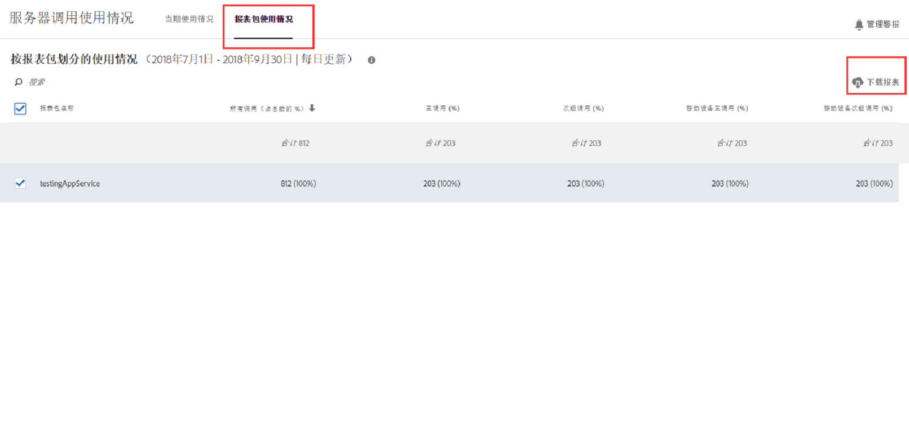
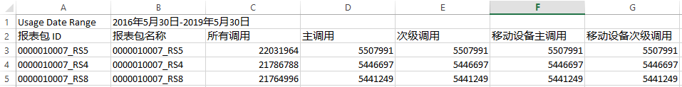

# 查看报告套件使用情况

“报表包使用情况”选项卡提供与您的账单公司关联的所有登录公司所具有的各个报表包在当前使用时段内的服务器调用使用情况数据。

**[!UICONTROL “分析]** ”&gt;“ **[!UICONTROL 管理员]** ”&gt; **[!UICONTROL “服务器调用使用情况]** ”&gt; **[!UICONTROL “报告套件使用情况”]**

>[!IMPORTANT]
>
>If a report suite is not [linked to an Experience Cloud Organization](https://marketing.adobe.com/resources/help/en_US/mcloud/report-suite-mapping.html), its usage data will not be reflected in this dashboard. 此外，一个账单 ID 可同时与多个 Experience Cloud 绑定；组织和账单 ID 之间并不总是一一对应的关。

“报表包使用情况”功能板

* 可显示您的 Experience Cloud 组织中的各个报表包在当前使用时段内的服务器调用使用情况（所有调用、主调用、次级调用、移动设备主调用、移动设备次级调用）。
* 显示每个服务器调用类别的使用量在总使用量中所占的百分比。
* 每日更新。
* 可下载。
* 允许您访问&#x200B;**[!UICONTROL 管理警报]UI。**

| 列 | 定义 |
|--- |--- |
| 报表包名称 | 报表包的友好名称 |
| 所有调用（占总数的 %） | 当前使用时段内的所有服务器调用。 |
| 主调用 (%) | 当前使用时段内发起的所有主服务器调用（及其占总数的百分比）。 |
| 次级调用 (%) | 当前使用时段内发起的所有次级服务器调用（及其占总数的百分比）。 |
| 移动设备主调用 (%) | 当前使用时段内发起的所有移动设备主服务器调用（及其占总数的百分比）。 |
| 移动设备次级调用 (%) | 当前使用时段内发起的所有移动设备次级服务器调用（及其占总数的百分比）。 |

## 下载“使用情况”报表 {#section_D7345660B5E043CD8850954216509A3D}

此选项允许您下载当前使用时段内的数据，及之前的时间段内（最早可达 2015 年 1 月）的数据。此报表将下载为 .csv 文件。

1. 请至少选择一个报表包。
1. Click **[!UICONTROL Download Report]**.

   

| 报表元素 | 描述 |
|--- |--- |
| 文件名 | Hardcoded name: Usage Report `day and time of report creation.csv` |
| 包含的报表包 | 此列表中将包含您在“报表服务器使用情况”页面上选择的任何报表包。 |
| 包含的调用类型 | 指定以下选项的任一组合：所有调用（默认）、主调用、次级调用、移动设备主调用、移动设备次级调用。 |
| 时间范围 | 您可以选择当前使用时段，也可以指定自定义的时间范围。对于自定义的时间范围，请指定范围起始时间和范围结束时间。 **注意：** 您不能在2015年月之前下载使用数据  。 |

1. Click **[!UICONTROL Download]**.

以下是下载的. csv文件的外观快照。它包含报表包ID的列。报表包ID指定只能包含字母数字字符的唯一ID。创建报表包后，无法更改此ID。

