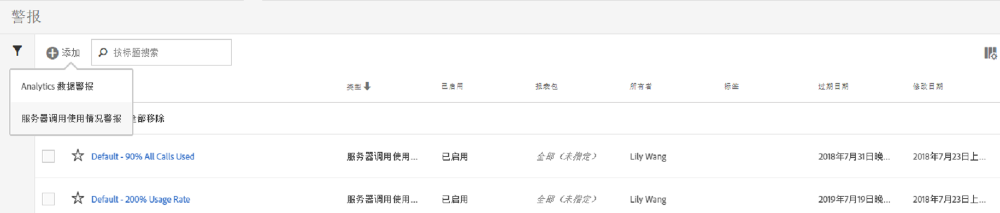
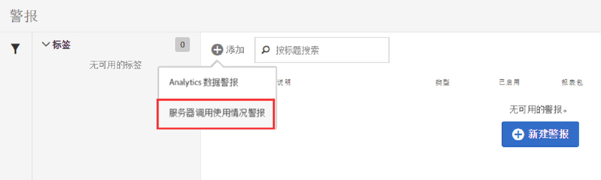
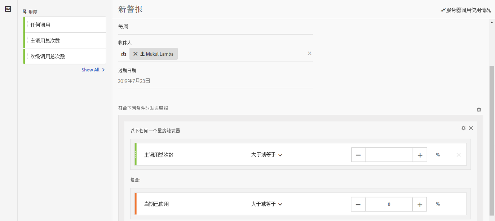
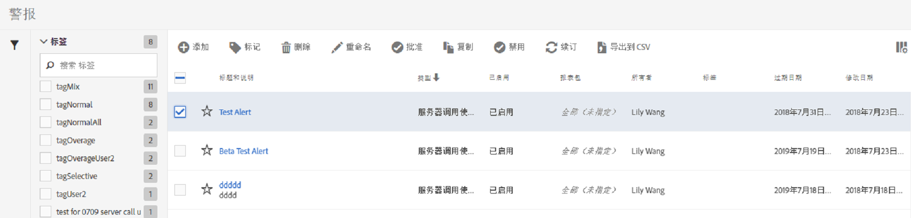

# 服务器调用使用通知

设置警报后，该警报将应用于账单公司旗下的所有登录公司所具有的全部报表包。

## 概述

A new alert category called **[!UICONTROL Server Calls Usage Alert]** is part of the the existing [Alert Management](https://marketing.adobe.com/resources/help/en_US/analytics/analysis-workspace/intellligent_alerts.html) user interface.

It is pre-populated with **1 default alert** that appears within any login company that has access to the Server Call Usage feature. 如果满足以下任一条件，此警告将触发已解决的通知，通知所有登录公司的管理员：

* 您有权使用的“任何”服务器调用类型所对应的使用量“大于或等于”100%；或者
* 您有权使用的“任何”服务器调用类型所对应的使用量“大于或等于”90%；或者
* 您有权使用的“任何”服务器调用类型所对应的使用量“大于或等于”75%，且“所用的时段”“小于或等于”总使用时段的 75%。

您可以通过以下两种方式访问“服务器调用使用情况”警报：

* 单击“当前使用情况”选项卡或“报表包使用情况”选项卡右上角的&#x200B;**[!UICONTROL 管理警报]；或**
* Navigate to **[!UICONTROL Components]** &gt; **[!UICONTROL Alerts]** in Adobe Analytics.

## 创建“服务器调用使用情况”警报 {#section_2A2882C6D48D47C1944D52FB7C766BEC}

要创建更多警报，请

1. Click **[!UICONTROL + Add]** and select **[!UICONTROL Server Call Usage Alert]**.

   

1. 定义警报。

   

   * **标题**：指定描述性名称。如果没有名称，您将无法保存警报。
   * **时间粒度**：指警报的选中频率。*我们当前支持的粒度为“每周”。*&#x200B;这表示将每周查看一次警报，并回顾当前使用时段的数据。
   * **收件人**：指定组织中的任何人在警报触发指定阈值时应获得电子邮件的任何人。
   * **过期日期**：默认情况下，过期日期为警报创建日期的一年。
   * **发送警报时间**:

      * 任何这些指标触发器将服务器调用/s类型添加为指标，通过选择修饰符和阈值指定警报阈值：
         * 大于或等于
         * 小于或等于
      * 使用指定使用期限支出的阈值和条件(高于或等于或等于或等于)。

1. 单击&#x200B;**[!UICONTROL 保存]**。

## 管理“服务器调用使用情况”警报 {#section_8FF98170763C4B5CBEC6DD43F893177A}

要管理警报，请执行以下操作：

1. 选中一个或多个警报旁的复选框。警报管理的各个操作即会显示在顶部。
1. 完成下面的一个或多个操作：

   | 操作 | 定义 |
   |--- |--- |
   | + 添加 | 通过单击 [!UICONTROL + 添加]访问[警报生成器](../../admin/c-server-call-usage/scu-alerts.md)。 |
   | 标记 | 通过做标记来管理警报，以便于使用。 |
   | 删除 | 您可以删除所有警报（默认警报除外）。 |
   | 重命名 | 您可以重命名所有警报（默认警报除外）。 |
   | 批准 | 您可以批准警报，以使其成为“官方”警报。 |
   | 启用/禁用 | 您可以启用或禁用所有警报，甚至包括默认警报。 |
   | 续订 | 在选择了一个或多个警报后，可以进行续订。这会将它们的过期日期延长一年的时间（从单击[!UICONTROL 续订]之日算起，而不考虑它们的原始过期日期）。 |
   | 导出到 CSV | 请参阅[下载“使用情况”报表](../../admin/c-server-call-usage/report-suite-usage.md) |

