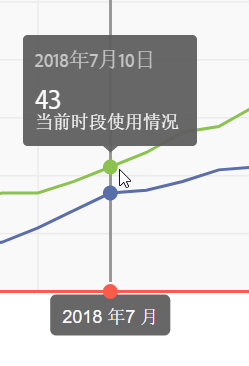
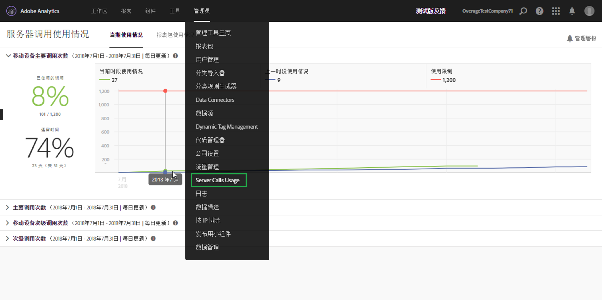

# 查看当前服务器调用使用情况

**[!UICONTROL “分析]** ”&gt;“ **[!UICONTROL 管理员]** ”&gt; **[!UICONTROL “服务器调用使用情况]** ”&gt; **[!UICONTROL “当前使用情况”]**

>[!IMPORTANT]
>
>您看到的所有使用和承诺编号均在所有登录公司和报告套件中累积。

“当前使用情况”功能板

* 可显示根据各个服务器调用类型划分的服务器调用使用情况和使用承诺详细信息。此视图对于不同的客户可能会有所不同，但与合同中包含的相关内容一致。例如，您可能注册了 4 种不同类型的服务器调用，分别为 Web 主调用、Web 次级调用、移动设备主调用和移动设备次级调用。在这种情况下，此视图将包含 4 个选项卡，每种类型分别对应一个选项卡。在每个选项卡中，您将能够查看当前使用时段内的使用情况。
* 将当前使用量（绿线）与合同规定的使用限制（红线）进行比较。

   

* 将当前时段的使用量（绿线）与去年的使用量（蓝色）进行比较。显而易见，仅当贵公司具有上一年的服务器调用使用情况数据时蓝线才会显示。

   >[!NOTE]
   >
   >If you want to view usage for a previous time period, you have to go to the [Report Suite Usage](../../admin/c-server-call-usage/report-suite-usage.md#concept_E50FA5BD93404EB8B2FE954F658FDAFD) tab and download the usage data for a previous period.

* 列出了已使用的调用所占的百分比（使用百分数和原始数据）以及已使用的时段所占的百分比（使用百分数和原始数据）。
* 默认情况下，此数据每日更新一次，但由于需要处理，因此会延迟 5 天。
* 允许您折叠和展开所有缩图报表。

| 用户界面术语 | 定义 |
|---|---|
| 当前时段的使用情况（绿线） | 当前时段以[使用时段](../../admin/c-server-call-usage/overage-overview.md#section_CBA348A039F34563B097CD8890AB358D)为基础。 |
| 上一时段的使用情况（蓝线） | 上一时段是指当前使用时段的前一年。 |
| 使用限制（红线） | 合同中规定的此使用时段内的使用限制。 |

