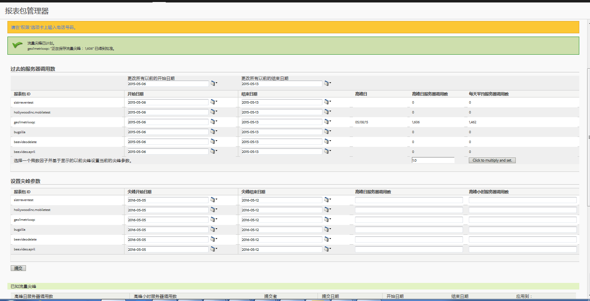

# 评估过去的服务器调用并计划流量尖峰

比如说，您可以了解去年特定时间范围内的每日服务器调用平均值，以及服务器调用量在今年的预期增加量。您随后可计划基于此乘数因子的流量峰值。

1. Log in to Analytics as an Admin and go to **[!UICONTROL Admin]** &gt; **[!UICONTROL Traffic Management]**.

1. 单击&#x200B;**[!UICONTROL 展开]**&#x200B;以展开报表包列表，然后单击&#x200B;**选择报表包]以选择多个报表包。[!UICONTROL **

1. Click **[!UICONTROL Schedule Spikes]**.
1. Under **[!UICONTROL Past Server Calls]**, select a start and end date for the selected report suites.

   此时会生成“高峰日”、“高峰日服务器调用数”和“每天平均服务器调用数”的数量。

1. Input a value for the multiplication factor and click **[!UICONTROL Click to multiply and set]**.

   此时每个报表包都会对其中每列的值进行乘法运算。

1. Under **[!UICONTROL Set Spike Parameters]**, submit the spike parameters for the selected report suites.

   现在已为每个选定的报表包计划了尖峰。

