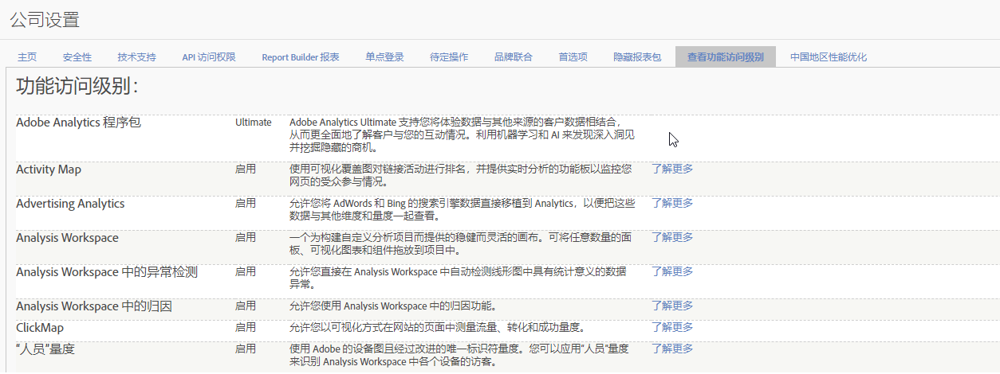

# 功能访问级别

**[!UICONTROL 管理员]** &gt; **[!UICONTROL 公司设置]** &gt; **[!UICONTROL 查看功能访问级别]**

此组设置允许您查看您的公司有权访问的 Adobe Analytics 功能的访问级别。某些功能仅随更高级的产品 SKU 提供，例如 [Adobe Analytics Ultimate](https://www.adobe.com/data-analytics-cloud/analytics/ultimate.html)。

