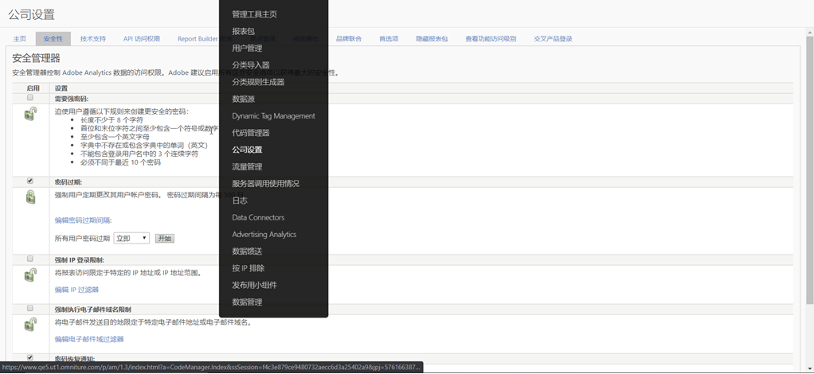

# 安全管理器

可让您控制对报表数据的访问。相关选项包括强密码、密码过期时间、IP 登录限制及电子邮件域限制。

**[!UICONTROL Analytics]** &gt;管 **[!UICONTROL 理员]** &gt;公司 **[!UICONTROL 设置]** &gt;安 **[!UICONTROL 全性]**

<table id="table_F1AD9DE5094A4FC2B9DA8D01198F944B"> 
 <thead> 
  <tr> 
   <th colname="col1" class="entry"> 元素 </th> 
   <th colname="col2" class="entry"> 描述 </th> 
  </tr> 
 </thead>
 <tbody> 
  <tr> 
   <td colname="col1">  需要强密码  </td> 
   <td colname="col2">迫使用户遵循以下规则来创建更安全的密码： 
    <ul id="ul_100CC57EB4374DAA87B2074BA8B46F26"> 
     <li id="li_4D9102C361044FADBC14402A8398F2F3">长度不少于 8 个字符。 </li> 
     <li id="li_AFE9568C14894E93BFDFDC84DCD2838D">首位和末位字符之间至少包含一个符号或数字。 </li> 
     <li id="li_ECA05BEF7BFD4430B09D4A953B41D2A6">至少包含一个英文字母。 </li> 
     <li id="li_6928045588E94E28851BB15991C8D51E">英语词典中找不到或不得包含词典中的单词。 </li> 
     <li id="li_C3DD4608CA6F43E4B1E4FCFC6D116371">不能包含登录用户名中的 3 个连续字符。 </li> 
     <li id="li_687838CA01B94EE29EF4C09F485C5537">必须不同于最近使用过的 10 个密码。 </li> 
    </ul> 
注意：此功能对以后的新密码强制实施。它不检查现有密码，或者强制用户更改现有密码。因此，请考虑启用密码过期以强制用户更改其密码并遵守强密码规则。 
 </td> 
  </tr> 
  <tr> 
   <td colname="col1">  密码过期 </td> 
   <td colname="col2"> 强制用户定期更改其用户帐户密码。您可以指定密码过期的时间周期，也可以强制密码立即过期。 </td> 
  </tr> 
  <tr> 
   <td colname="col1">  强制 IP 登录限制 </td> 
   <td colname="col2"> 
(此功能不能与Experience cloud登录名一起使用。 请注意，此功能自2020年10月起将不再可用。)将报表访问限定于特定的 IP 地址或 IP 地址范围。 
 
您可以在 IP 地址过滤器列表中添加最多 100 个条目，每个条目可以是一个特定的地址或地址范围。 
 
 只有当 IP 地址过滤器列表中至少有一个条目时，才会执行强制 IP 登录限制。 
 
  接受的IP地址:要指定IP地址范围，请将范围括在括号中(例如， <code>
       192.168.10.[20-240]
     </code>)。 You can also use wildcards (*) to specify any number from 0 to 255 (for example, 
     <code>
       192.168.[10-14].*
     </code>) 
 
失败的登录将被记录并可从<a href="/help/admin/admin/logs.md#section_6FBAF92D9EA244809C45A78A2F0A7232">使用与访问日志</a>查看。 
 </td> 
  </tr> 
  <tr> 
   <td colname="col1">  强制执行电子邮件域名限制 </td> 
   <td colname="col2"> 
对电子邮件地址和域进行过滤，以限制 Analytics 能够将书签、可下载报表和警报发送到哪些地址。 
 
电子邮件过滤器列表支持最多 100 个条目，每个条目可以是一个电子邮件地址或整个电子邮件域。 
 
如果计划的报表有一个未批准的电子邮件目的地，则 Analytics 会发送一封电子邮件告知该问题，并提供链接以取消该报表的运行计划。 
 
 只有当已接受的电子邮件域过滤器列表中至少有一个条目时，才会强制执行电子邮件域名限制。 
 
  已接受的电子邮件地址和域:要指定IP地址范围，请将范围括在括号中(例如， <code>
       192.168.10.[20-240]
     </code>)。 You can also use wildcards (*) to specify any number from 0 to 255 (for example, 
     <code>
       192.168.[10-14].*
     </code>) 
 </td> 
  </tr> 
  <tr> 
   <td colname="col1">  密码恢复通知 </td> 
   <td colname="col2"> 
当用户试图重置用户帐户密码时，通知指定的管理员。 
 
 现有管理员：显示所有管理员。您可以按住 Ctrl 键或 Shift 键并单击，以选择多个管理员。 
 
 电子邮件成员：显示当前定义的电子邮件群组。 
 </td> 
  </tr> 
 </tbody> 
</table>

## 强制IP登录限制 [!UICONTROL 的终止]

强制 **[!UICONTROL IP登录限制功能是一项即将推出的传统Analytics功能]** ，它允许您将认为安全的特定IP地址列入白名单，以允许成功登录并访问您的Adobe Analytics环境。 在许多情况下，此功能用于将企业IP地址设置为用户可从中登录的唯一安全IP地址。 因此，要使用Adobe Analytics，这要求用户在公司办公室或通过VPN登录网络。

### 为什么我们会考虑终身？

在某些情况下，Experience cloud登录迁移和／或Experience cloud登录会破坏此功能。 众所周知，使用客户属性或受众库 **[!UICONTROL 的客户]** ，会 **[!UICONTROL 中断]**。

此外，如果您拥有多个Experience cloud解决方案，则可以使用其他解决方案之一登录Experience Cloud来绕过此要求，因为Analytics本身之外不存在或不支持此功能。 用户还可以通过IP欺骗来绕过此问题。

最后，Adobe通过单点登录和联合ID提供了功能强大且出众的替代解决方案。 此功能可让您更好地控制用户的登录体验并提高安全性。

### 删除此功能对您有何影响？

对于设置了“强 **[!UICONTROL 制IP登录限制]** ”的任何客户，此功能将于2020年10月删除。 此时，任何仍然有效的IP登录限制将不再得到实施。 如果您仍需要按IP地址限制登录，则应查看并实施推荐的单点登录和联合ID解决方案（下面的更多信息和资源）。

此外，强制 **[!UICONTROL IP登录限制管理器将从Analytics UI中的]** dmin &gt;公司设置&gt;安全管理器 **[!UICONTROLA]** （如下所示）中删除。

### 您还有哪些选择？

如上所述，此Analytics功能将停止运行。 为了给您时间实施SSO和Federated ID，我们已将EOL日期延迟至2020年10月。

SSO和Federated ID都是我们目前所具备的IP登录限制功能的出众解决方案，将为您提供更多控制、安全和功能。

有关如何设置SSO/Federated ID的信息，我们提供以下帮助文档。 我们建议您仔细阅读并与您的IT部门合作，以实现这些功能：

* [单点登录和Experience Cloud](https://spark.adobe.com/page/JeSB8EPEQIvjD/)
* [Admin Console —— 身份设置文档](https://helpx.adobe.com/enterprise/using/set-up-identity.html)
* [Admin Console —— 身份设置教程（视频）](https://helpx.adobe.com/enterprise/how-to/identity-directories-domains.html?playlist=/ccx/v1/collection/product/enterprise/topics/enterprise-identity/collection.ccx.js&ref=helpx.adobe.com)
* [配置Federated ID教程（视频）](https://helpx.adobe.com/enterprise/how-to/identity-configure-ids.html?playlist=/ccx/v1/collection/product/enterprise/topics/enterprise-identity/collection.ccx.js&ref=helpx.adobe.com)
* [单点登录——常见问题](https://helpx.adobe.com/enterprise/using/sso-faq.html)
* [Adobe支持的身份类型](https://helpx.adobe.com/enterprise/using/identity.html)

如果您希望继续表达对IP登录限制的支持并请求IP登录限制由Experience cloud提供，您可以在“论坛”页面上投票支持此 [功能](https://forums.adobe.com/ideas/11648)。 有关SSO/Federated ID和EXC的其他问题或信息，请联系Ryan Monger(monger@adobe.com)。
