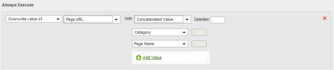

# 处理规则用例

在组织中使用处理规则的应用场合非常广泛。 以下部分将详细介绍一些对您有利的常用方法。

+++将上下文数据变量复制到 eVar

处理规则用于将值从[上下文数据变量](/help/implement/vars/page-vars/contextdata.md)移动到[Props](/help/components/dimensions/prop.md)和[eVars](/help/components/dimensions/evar.md)。 如果没有处理规则，上下文数据变量将毫无意义，并且不会在 Analytics 中填充任何报表。

[!UICONTROL 上下文变量]列表包含最近30天发送到报表包的所有变量。 如果您知道上下文数据变量名称，但尚未将其发送到当前报表包，则可以手动添加它：

以下示例采用`search_term`上下文数据变量并将其值放入eVar3：

| 规则集 | 值 |
| --- | --- |
| 条件 | `search_term` （上下文数据）已设置 |
| 操作 | [!UICONTROL 用]覆盖`search_term` eVar3的值（上下文数据） |

当要填充的 eVar 只有几个时，以上示例非常有用。如果贵组织有数百个上下文数据变量，而每个变量都需要自己的 eVar，则可以使用条件语句。一条处理规则中可以包含数十个条件语句，这使您的组织能够在报表包中填充所有 eVar，而不会遇到 150 条规则的处理规则限制。

以下示例使用变化的上下文数据变量填充多个变量。 一个操作还包含一个条件语句：

| 规则集 | 值 |
| --- | --- |
| 操作 | [!UICONTROL 用]覆盖`spa.billing_customer_name`的eVar55值（上下文数据） |
| 操作 | 如果设置了[!UICONTROL  （上下文数据），则使用] （上下文数据）覆盖`testhierarchy` Prop7的值`testhierarchy` |
| 操作 | [!UICONTROL 用]覆盖`spa.ims_org` eVar8的值（上下文数据） |

+++

+++使用上下文数据变量设置事件

处理规则可以触发基于[上下文数据变量](/help/implement/vars/page-vars/contextdata.md)的事件。

[!UICONTROL 上下文变量]列表包含最近30天发送到报表包的所有变量。 如果您知道上下文数据变量名称，但尚未将其发送到当前报表包，则可以手动添加它：

以下规则定义在包含特定上下文数据变量的每次点击上设置事件：

| 规则集 | 值 |
| --- | --- |
| 条件 | `search_term` （上下文数据）已设置 |
| 操作 | [!UICONTROL 将event] Event1设置为[!UICONTROL 自定义值] `1` |

+++

+++使用查询字符串参数填充变量

您可以使用查询字符串参数填充变量。 在大多数情况下，您通常会调整实施以获取所需的查询字符串值。 但是，如果您无法轻松调整实施以收集此数据，则处理规则便是一个适当的替代方法。 如果发生拼写错误或类似问题妨碍了填充值，则可以使用处理规则填充变量。

在覆盖该值之前，请始终检查该值是否为空或包含预期值。

| 规则集 | 值 |
| --- | --- |
| 条件 | 未设置营销活动 |
| 操作 | [!UICONTROL 使用]查询字符串参数[!UICONTROL 覆盖]促销活动的值`cpid` |

| 规则集 | 值 |
| --- | --- |
| 条件 | [!UICONTROL 查询字符串参数] `q` [!UICONTROL 已设置] |
| 操作 | [!UICONTROL 使用]查询字符串参数[!UICONTROL 覆盖]内部搜索词的值`q` |

+++

+++有条件地设置任何事件

可根据处理规则中可用的任何条件设置事件。 例如，您可以在页面名称等于“产品概述”时触发事件。

| 规则集 | 值 |
| --- | --- |
| 条件 | 如果[!UICONTROL Page Name]等于“产品概述” |
| 操作 | [!UICONTROL 将事件] [!UICONTROL 产品查看次数]设置为[!UICONTROL 自定义值] `1` |

+++

+++通过连接类别和页面名称添加子类别

您可以使用关联选项通过组合其他值来填充值。

| 规则集 | 值 |
| --- | --- |
| 条件 | 无（始终执行） |
| 操作 | [!UICONTROL 用]串联值[!UICONTROL 类别+页面名称覆盖]eVar1的值 |

+++

+++清理报告中的值

您可以根据收集的错误拼写形式匹配值并更新这些值，以便它们能在报表中正确显示。

Adobe建议使用最严格的匹配选项，以避免不需要的覆盖。 您可以对变量运行报告并搜索要使用的潜在规则条件。 字符串比较不区分大小写。

| 规则集 | 值 |
| --- | --- |
| 条件 | 如果prop1 [!UICONTROL 以] &quot;[!DNL Shoping]&quot;开头 |
| 操作 | [!UICONTROL 用]自定义值[!UICONTROL “]”覆盖[!DNL Shopping] Prop1的值 |

+++

+++通过点击删除事件

您可以使用处理规则从点击中删除或丢弃特定事件，而无需更改实施。 如果将事件设置为自定义值`0`，则该事件不计数。

| 规则集 | 值 |
| 条件 | 无（始终执行） |
| 操作 | [!UICONTROL 将event] Event1设置为[!UICONTROL 自定义值] `0` |

+++
