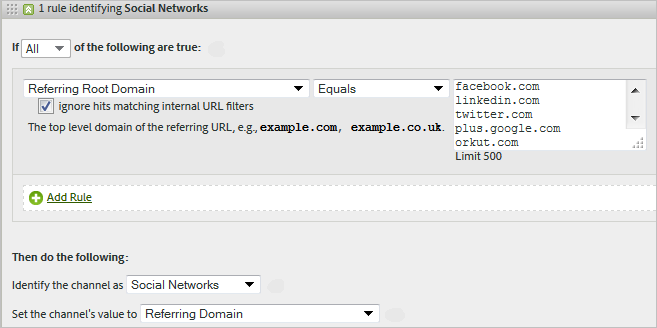

# 营销渠道的处理规则

营销渠道处理规则通过处理访客在您的网站上进行的每次点击，确定访客点击是否满足分配给渠道的条件。系统会按您指定的顺序处理规则，当一个规则得到满足时，系统会停止处理剩余规则。

**[!UICONTROL Analytics]** > **[!UICONTROL 管理员]** > **[!UICONTROL 报表包]** > **[!UICONTROL 编辑设置]** > **[!UICONTROL 营销渠道]** > **[!UICONTROL 营销渠道处理规则]**。

有关处理规则的附加说明：

* 使用这些规则收集的数据是永久的。收集数据后改变的规则不具有追溯力。Adobe 强烈建议您在保存[!UICONTROL 营销渠道处理规则]之前审查并考虑所有情况，以减少在不正确的渠道中收集数据。
* 您最多可以配置 25 个独立的营销渠道。
* 规则可以访问已由 VISTA 设置的变量，但不能访问已被 VISTA 删除的数据。
* 两个营销渠道从不会接收相同事件的信用，如购买或点击次数。在这方面，营销渠道不同于 eVar（两个 eVar 可能会接收相同事件的信用）。
* 如果规则的覆盖范围存在空隙，您可能会看到[未识别渠道](/help/components/c-marketing-channels/c-faq.md)。

## 先决条件

* 查看[《营销渠道快速入门》](/help/components/c-marketing-channels/c-getting-started-mchannel.md)中的概念信息。
* 创建一个或更多渠道，以便您将规则分配给它们。请参阅[添加营销渠道](/help/admin/tools/manage-rs/edit-settings/marketing-channels/c-channels.md)。
* 查看将[!UICONTROL 营销渠道]与[!UICONTROL 归因]一起使用的最佳实践。

## 创建营销渠道处理规则

创建营销渠道处理规则，这些规则决定访客点击是否符合分配到渠道的标准。

1. 单击 **[!UICONTROL Analytics]** > **[!UICONTROL 管理员]** > **[!UICONTROL 报表包]**。
2. 选择某个报表包。

   如果您的报表包未定义渠道，则会显示[!UICONTROL “营销渠道：自动设置”]页面。

   请参阅[运行自动设置](/help/components/c-marketing-channels/c-getting-started-mchannel.md)。

3. 单击&#x200B;**[!UICONTROL 编辑设置]** > **[!UICONTROL 营销渠道]** > **[!UICONTROL 营销渠道处理规则]**。如果您运行自动设置，则将自动为您定义一组渠道和规则。

   

4. 如果您要添加规则，请从&#x200B;**[!UICONTROL 添加新规则集]**&#x200B;菜单中选择。如果您选择某个渠道，则会向您提供规则模板，如果您选择“自定义”，则从空白板开始。这两个选项均允许您根据需要修改规则集。

   

5. 要继续处理规则，请单击&#x200B;**[!UICONTROL 添加新规则集规则]**。
6. 要对规则优先排序，请将其拖放到所需位置。
7. 单击&#x200B;**[!UICONTROL 保存]**。

### 设置营销渠道值

**[!UICONTROL 设置渠道的值]**&#x200B;定义可供该渠道使用的营销渠道详细信息维度。

### 规则条件

此参考数据表定义您可以用于定义“营销渠道处理规则”的字段、选项和点击属性。

>[!NOTE]
>
>您定义的任意文本字段，例如查询字符串参数或要匹配的值列表，均作为&#x200B;**不区分大小写**&#x200B;值进行评估。例如，如果您有一条规则，其中会查询字符串参数 `cmp = abc123`，则 `cmp` 和 `abc123` 的所有大写和小写变体均匹配。

| 术语 | 定义 |
|--- |--- |
| 全部 | 仅当规则中的所有条件都成立时才激活此渠道。 |
| 任何 | 当规则中的任一条件成立时，激活此渠道。仅当规则中存在多个条件时，此选项才可用。 |
| AMO ID | Adobe Advertising和Advertising Analytics集成使用的主要跟踪代码。 如果启用其中一个集成，则可以使用跟踪代码前缀来标识特定于Advertising的渠道。 对于Search and Social，请使用以“AL”开头的“AMO ID”；对于Display，请使用以“AC”开头的“AMO ID”。 在营销渠道中使用AMO ID时，点击/成本/展示次数量度可归因于正确的渠道。 如果未配置AMO ID，这些量度将转至“直接”或“无”。 |
| AMO EF ID | Adobe Advertising使用的辅助跟踪代码。 此跟踪代码的主要用途是用作将数据发送回Advertising的键。 但是，它也可用于将“显示点进次数”和“显示视图点进次数”标识为两个单独的营销渠道。 为此，请为显示点进次数设置以`:d`结尾的“AMO EF ID”的营销渠道逻辑，为显示视图点进次数设置以`:i`结尾的“AMO EF ID”的营销渠道逻辑。 如果您不希望将显示拆分为两个渠道，可以改为使用 AMO ID 维度。 |
| 转化变量 | 由为本报表包启用的 eVar 组成，并且只在通过网页上的 Adobe 代码设置变量时才适用。 |
| 存在 | 可使用若干选项，包括：<ul><li>**不存在**：指定请求上不存在点击属性。例如在反向链接域中，如果用户键入一个 URL 或单击一个书签，则该反向链接域属性不存在。</li><li>**为空**：指定点击属性存在，通常为 eVar 或查询字符串参数，但没有任何与点击属性相关的值。</li><li>**不包含**：例如，您可以指定反向链接域不包含特定值（与使用选项“包含”相反）。</li></ul> |
| 将渠道识别为 | 将规则与您添加到“营销渠道管理器”页面上的营销渠道相关联。 |
| 匹配付费搜索检测规则 | Adobe 检测的付费搜索。付费搜索是指公司向列出它们网站的搜索引擎支付费用。付费搜索通常出现在搜索结果顶部或右侧。 |
| 匹配免费搜索检测规则 | Adobe 报告检测的免费搜索。 |
| 引用网站与内部 URL 过滤器匹配 | 按照“管理工具”中对报表包的定义，页面 URL 与内部 URL 过滤器匹配的访问。 |
| 引用网站与内部 URL 过滤器不匹配 | 按照“管理工具”中对报表包的定义，引用 URL 与内部 URL 筛选器不匹配。您可以使用此设置与“页面 URL”和“存在”来设置一个通配符规则，从而确保没有访问会被归入报告的“未识别渠道”部分。 |
| 忽略与内部 URL 过滤器匹配的点击量 | （关于反向链接）只跟踪来自外部引用网站的点击量。通常，将此设置保留为启用状态，除非您希望包括内部流量。 |
| 是访问的首次点击 | Adobe报表检测到的访问的首次点击。 |
| 页面 | [页面](/help/components/dimensions/page.md)维度。 |
| 页面域 | 访客所登陆页面的域，如 `products.example.com`。 |
| 页面域和路径 | 域和路径，如 `products.example.com/mens/pants/overview.html`。 |
| 页面根目录域 (TLD+1) | 访客所登陆页面的根目录域，如 example.co.uk。 |
| 页面 URL | 网站上网页的 URL。 |
| 反向链接域 | [反向链接域](/help/components/dimensions/referring-domain.md)维度 |
| 查询字符串参数 | 使用单独的查询字符串参数。您只可为每个条件指定一个查询字符串参数。要添加额外的查询字符串参数，可使用 `ANY` 作为您的运算符，然后将查询字符串参数添加到规则中。 |
| 反向链接 | 访客在访问您的网站前所在的网页位置（完整的 URL）。反向链接存在于所定义域的外部。 |
| 引荐域和路径 | 引荐域和 URL 路径的组合。示例包括：    `www.example.com/products/id/12345` 或 `ad.example.com/foo` |
| 引荐参数 | 反向链接 URL 上的查询字符串参数。例如，如果您的访客来自 `example.com/?page=12345&cat=1`，则 page 和 cat 为引荐参数。 |
| 引荐根目录域 | 引荐的根目录域。反向链接存在于所定义域的外部。 |
| 搜索引擎 | Google 或 Yahoo! 等引导访客进入您网站的搜索引擎。 |
| 搜索关键词 | 用于在搜索引擎上执行搜索的单词。 |
| 搜索引擎 + 关键词 | 唯一识别搜索引擎的搜索关键词和搜索引擎组合。例如，如果您搜索 computer 这个词，搜索引擎和关键词识别如下：`Search Tracking Code = "<search_type>:<search engine>:<search keyword>" where    search_type = "n" or "p", search_engine = "Google", and search_keyword = "computer"`**注释：** n = 免费；p = 付费 |
| 将渠道值设置为 | 设置[营销渠道详情](/help/components/dimensions/marketing-detail.md)维度。您可以确定在规则的上下文中什么值是最佳的。示例包括横幅广告 ID、搜索关键词或电子邮件活动。 |

## 营销渠道规则顺序和定义 {#channel-rules}

渠道规则按您指定的顺序处理。Adobe 建议先放置付费或受管渠道（例如，付费搜索、免费搜索、显示或电子邮件），以便它们通过有机渠道接收点数（例如，直接域、内部域、反向链接域）。

以下是渠道规则的建议顺序和示例定义：

### 付费搜索 {#paid-search}

付费搜索是指您向搜索引擎支付一定费用，以让某个单词或短语出现在搜索结果中。此渠道通常根据查询字符串参数（请参阅显示渠道示例）或付费搜索检测规则来定义。

#### 付费搜索检测

为了匹配付费搜索检测规则，营销渠道使用[!UICONTROL 付费搜索检测]页面上配置的设置。（**[!UICONTROL 管理员]** > **[!UICONTROL 报表包]** > **[!UICONTROL 编辑设置]** > **[!UICONTROL 常规]** > **[!UICONTROL 付费搜索检测]**）。目标 URL 匹配该搜索引擎的现有付费搜索检测规则。

对于营销渠道规则，[!UICONTROL 付费搜索]设置如下：

有关详细信息，请参阅[付费搜索检测](../general/paid-search-detection/paid-search-detection.md)。

### 免费搜索 {#natural-search}

免费搜索是指，访问者通过搜索引擎找到您的网站，搜索引擎对您的网站进行排名，而不需要您付费。

Adobe 根据搜索引擎的内部查找情况来确定搜索流量。如果反向链接符合搜索引擎的标准，则它会使用您配置的[付费搜索检测](../general/paid-search-detection/paid-search-detection.md)规则来确定其是付费的还是免费的。当匹配结果与任何付费搜索检测规则不匹配时，该匹配将会被视为免费搜索。

对于营销渠道规则，“免费搜索”设置如下：

### 显示 {#display}

这项规则识别来自横幅广告的访客。它是由目标 URL 中的查询字符串参数标识的，在此例中为 *`Ad_01`*。查询字符串参数和所查找的值均作为不区分大小写的值评估。

### 电子邮件 {#email}

这项规则识别来自电子邮件营销活动的访客。它是由目标 URL 中的查询字符串参数标识的，在此例中为 *`eml`*：

### 附属活动 {#afilliates}

这项规则识别来自一组指定的反向链接域的访客。在规则中，您需要按如下所示列出要跟踪的附属活动域：

### 其他营销活动 {#other-campaigns}

最佳实践是在所有付费渠道规则之后包含“其他营销活动”渠道。此渠道捕获所有未分类的付费流量。

### 社交网站 {#social-networks}

此规则标识来自社交网站的访客，例如 Facebook。此渠道通常重命名为“原始社交”。其设置如下所示：

### 内部（会话刷新）渠道 {#internal}

此规则访客的引用 URL 与 Admin Console 中的内部 URL 过滤器设置相匹配，这意味着来自网站内的访客要开始其访问。此渠道通常重命名为“会话刷新”。

请参阅[内部原因（会话刷新）](/help/components/c-marketing-channels/c-faq.md#internal)，以了解发生此渠道的原因的更多信息。

### 直接 {#direct}

这项规则可识别没有反向链接域的访客，包括直接进入您网站的访客，例如，从“收藏夹”链接进入或通过将链接粘贴到浏览器中进入的访客。此渠道通常重命名为“直接键入/已添加书签”。

### 反向链接域渠道 {#referring-domains}

反向链接域渠道可识别具有反向链接域的访客。内部域、直接域和反向链接域渠道一起捕获所有尚未分类到渠道的其余点击。

