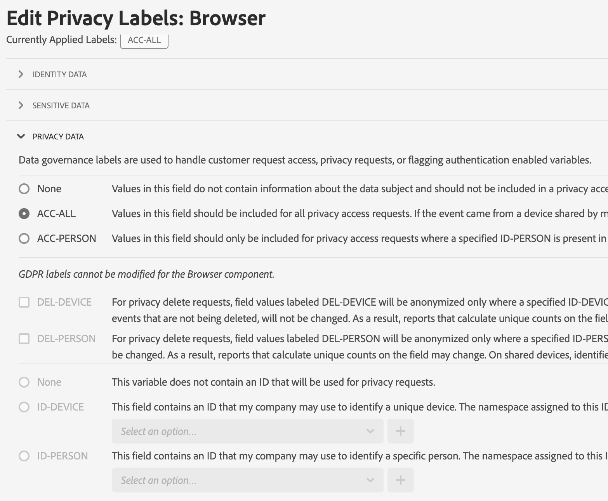

# 隐私标签概述

为报告包数据设置标签即是向给定报告包中的每个变量分配身份标识、敏感性和数据管理标签。请确保您首先要熟悉[标签及其定义](/help/admin/tools/privacy-labeling/labels.md)。

>[!NOTE]
>
>请记住，每次创建新报告包或在现有报告包中启用新变量时，都需要对标签设置进行审核。当启用新的解决方案集成时，您可能也需要审核标签设置，因为这些集成将出现要求设置标签的新变量。重新实施您的移动应用程序或网站时，可能会改变现有变量的使用方式，这或许也需要更新标签。

## 分配或编辑报告包隐私标签 {#assign-edit}

**示例**：作为数据控制者，您可以计划从“数据主体”收集电子邮件地址和 Cookie ID，以处理他们的数据隐私请求。这些 Cookie ID 存储在 Adobe Analytics 的报告包中。

1. 在 Adobe Analytics 中，导航至&#x200B;**[!UICONTROL 管理员]** > **[!UICONTROL 所有管理员]** > **[!UICONTROL 数据配置和收集]** > **[!UICONTROL 数据治理]**。

   

1. 从顶部的&#x200B;**[!UICONTROL 报告包]**&#x200B;选择器中选择一个报告包。

1. 在左侧的过滤器部分中，选择要标记的变量组。您一次只能标记一组变量。

   * **标准组件** – 标准组件是在 Analytics 实施中默认收集的现成的 Analytics 维度和量度。
   * **转化变量** – 自定义分析转化变量（或 eVar）置于您网站所选网页的 Adobe 代码中。其主要目的是在自定义市场营销报告中划分转化成功量度区段。eVar 可以是基于访问的，其功能与 Cookie 类似。在预先设定的一段时间内，传递到 eVar 变量的值将始终“跟随”着用户。
   * **列表变量** – 列表变量是自定义变量，您可以根据需要随意使用。它们的工作方式与 eVar 类似，只是它们可以在同一点击中包含多个值。列表变量没有字符限制。
   * **流量变量** – 自定义分析流量变量（或 props）可让您将自定义数据与特定流量相关事件进行关联。prop 变量会嵌入网站每个页面的执行代码中。
   * **成功事件** – 成功事件（也称为转化事件或自定义事件）是可以跟踪的操作。 什么是成功事件完全由您来决定。例如，如果访客购买一件产品，该购买事件可被视为成功事件。
   * **分类** – 分类用于将 Analytics 报告数据映射到相关属性。 分类的用途广泛，但最常用于对促销活动跟踪代码（内部和外部）和产品 ID 进行分类。

1. 通过单击其复选框来选择一个变量，然后单击屏幕底部显示的蓝色条上的&#x200B;**[!UICONTROL 编辑隐私标签]**。

   

   此屏幕显示当前应用的标签，并可让您应用其他标签。您可能无法应用或修改所有标签，具体取决于组件。

   

1. 完成所有标签设置后，请单击&#x200B;**[!UICONTROL 应用]**。

