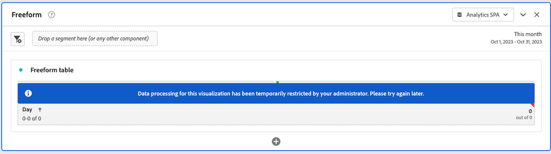

# 取消报告活动管理器中的报告请求

[!UICONTROL 报告活动管理器]使管理员能够快速诊断和取消报告请求，以便在报告高峰期解决报告容量问题。

取消报告请求时请考虑以下事项：

* 您可以取消特定的请求、取消来自特定用户的所有请求或取消与特定项目相关的所有请求。

  当您取消请求时，该操作将记录在[日志](/help/admin/tools/logs.md)中。[!UICONTROL **事件类型**] 列显示为&#x200B;[!UICONTROL **管理员操作**]，[!UICONTROL **事件**]&#x200B;列中提供了取消的描述。

* 当您取消请求时，您还可以选择在给定的时间段内限制后续请求。

  当您限制后续请求时，该操作将记录在[日志](/help/admin/tools/logs.md)中。[!UICONTROL **事件类型**] 列显示为&#x200B;[!UICONTROL **管理员操作**]，[!UICONTROL **事件**]&#x200B;列中提供了限制的描述。

* 如果请求的&#x200B;[!UICONTROL **用户**]&#x200B;列显示为&#x200B;[!UICONTROL **无法识别**]，则无法取消请求。出现这种情况，则表示用户处于您没有管理权限的登录公司。

有关报告活动管理器的更多信息，包括主要优点和权限要求，请参阅[报告活动管理器概述](/help/admin/tools/reporting-activity-manager/reporting-activity-overview.md)。

## 取消特定请求

您可以取消使用大量报告容量的单个请求。

1. 在 Adobe Analytics 中，转到&#x200B;**[!UICONTROL 管理员]** > **[!UICONTROL 报告活动管理器]**。

1. 选择要取消报告请求的报告包。<!--double-check this step-->

   有关此页面上可用数据的更多信息，请参阅[在报告活动管理器中查看报告活动](/help/admin/tools/reporting-activity-manager/reporting-activity.md)。

1. 选择&#x200B;[!UICONTROL **请求**]&#x200B;选项卡，然后选择一个或多个请求。

   <!-- add screenshot -->

1. 选择&#x200B;[!UICONTROL **取消请求**]。

   将显示&#x200B;[!UICONTROL **取消 _x_ 次报告请求**]&#x200B;对话框。

1. 取消消息字段显示在用户的请求被取消时显示的消息。提供了默认消息。您可以更新默认消息以提供更多详细信息。

1. （可选）要限制给定时间段内的未来请求：

   1. 启用&#x200B;[!UICONTROL **限制后续请求**]&#x200B;选项

      

   1. 从以下选项中进行选择：

      | 选项 | 功能 |
      |---------|----------|
      | [!UICONTROL **用户和项目**] | 与所选请求相关联的用户将会被暂时限制运行关联项目的报告请求。 |
      | [!UICONTROL **用户**] | 与所选请求相关的用户将会被暂时限制提交任何报告请求。 |
      | [!UICONTROL **项目**] | 与所选请求相关的项目将会被暂时限制提交所有报告请求。 |
      | [!UICONTROL **限制进行**] | 选择限制请求的时间长度。您可以选择 1 分钟（默认）、5 分钟、10 分钟、15 分钟或 30 分钟。<!-- double-check this -->
设置限制后，您无法提前将其移除。
 |

      {style="table-layout:auto"}

1. 选择&#x200B;[!UICONTROL **继续取消**]。

   Analysis Workspace 中会显示一条通知，告知用户请求已被取消。有关其在 Analysis Workspace 中如何显示的详细信息，请参阅[用户访问已取消的报告时的体验](#experience-when-users-access-a-cancelled-report)。

## 按用户取消请求

您可以取消与一个或多个用户相关联的所有请求。

1. 在 Adobe Analytics 中，转到&#x200B;**[!UICONTROL 管理员]** > **[!UICONTROL 报告活动管理器]**。

1. 选择要取消报告请求的报告包。<!--double-check this step-->

   有关此页面上可用数据的更多信息，请参阅[在报告活动管理器中查看报告活动](/help/admin/tools/reporting-activity-manager/reporting-activity.md)。

1. 选择&#x200B;[!UICONTROL **用户**]&#x200B;选项卡，然后选择一个或多个用户。

   <!-- add screenshot -->

1. 选择&#x200B;[!UICONTROL **取消请求**]。

   将显示&#x200B;[!UICONTROL **取消 x 个用户的 _x_ 次报告请求**]&#x200B;对话框。

1. 取消消息字段显示在用户的请求被取消时显示的消息。提供了默认消息。您可以更新默认消息以提供更多详细信息。

1. （可选）要限制给定时间段内的未来请求：

   1. 启用&#x200B;[!UICONTROL **限制后续请求**]&#x200B;选项。

      

   1. 从以下选项中进行选择：

      | 选项 | 功能 |
      |---------|----------|
      | [!UICONTROL **用户和项目**] | 所选用户将会被暂时限制提交关联项目的任何报告请求。 |
      | [!UICONTROL **用户**] | 所选用户将会被暂时限制提交任何报告请求。 |
      | [!UICONTROL **项目**] | 与所选用户相关的项目将限制任何用户提交的任何报告请求。 |
      | [!UICONTROL **限制进行**] | 选择限制请求的时间长度。您可以选择 1 分钟（默认）、5 分钟、10 分钟、15 分钟或 30 分钟。<!--double-check this--> 
设置限制后，您无法提前将其移除。
 |

      {style="table-layout:auto"}

1. 选择&#x200B;[!UICONTROL **继续取消**]。

   Analysis Workspace 中会显示一条通知，告知用户请求已被取消。有关其在 Analysis Workspace 中如何显示的详细信息，请参阅[用户访问已取消的报告时的体验](#experience-when-users-access-a-cancelled-report)。

## 按项目取消请求

您可以取消与一个或多个项目相关联的所有请求。

1. 在 Adobe Analytics 中，转到&#x200B;**[!UICONTROL 管理员]** > **[!UICONTROL 报告活动管理器]**。

1. 选择要取消报告请求的报告包。<!--double-check this step-->

   有关此页面上可用数据的更多信息，请参阅[在报告活动管理器中查看报告活动](/help/admin/tools/reporting-activity-manager/reporting-activity.md)。

1. 选择&#x200B;[!UICONTROL **项目**]&#x200B;选项卡，然后选择一个或多个项目。

   <!-- add screenshot -->

1. 选择&#x200B;[!UICONTROL **取消请求**]。

   将显示&#x200B;[!UICONTROL **取消 x 个项目的 _x_ 次报告请求**]&#x200B;对话框。

1. 取消消息字段显示在用户的请求被取消时显示的消息。提供了默认消息。您可以更新默认消息以提供更多详细信息。

1. （可选）要限制给定时间段内的未来请求：

   1. 启用&#x200B;[!UICONTROL **限制后续请求**]&#x200B;选项。

      

   1. 从以下选项中进行选择：

      | 选项 | 功能 |
      |---------|----------|
      | [!UICONTROL **用户和项目**] | 所选项目将会被暂时限制关联用户提交的任何报告请求。 |
      | [!UICONTROL **用户**] | 与所选项目相关的用户将会被限制提交任何报告请求。 |
      | [!UICONTROL **项目**] | 所选项目将暂时限制任何用户提交的任何报告请求。 |
      | [!UICONTROL **限制进行**] | 选择限制请求的时间长度。您可以选择 1 分钟（默认）、5 分钟、10 分钟、15 分钟或 30 分钟。<!--double-check this--> 
设置限制后，您无法提前将其移除。
 |

      {style="table-layout:auto"}

1. 选择&#x200B;[!UICONTROL **继续取消**]。

   Analysis Workspace 中会显示一条通知，告知用户请求已被取消。有关其在 Analysis Workspace 中如何显示的详细信息，请参阅[用户访问已取消的报告时的体验](#experience-when-users-access-a-cancelled-report)。

## 按应用程序取消请求

您可以取消与一个或多个应用程序相关联的所有请求。取消与应用程序相关联的请求时，您可以选择在给定时间段内进一步限制与该应用程序相关联的请求。

应用程序包括：

* Analysis Workspace UI
* Workspace 计划项目
* Report Builder
* 生成器 UI：区段、计算量度、注释、受众等。
* 1.4 或 2.0 API 的 API 调用
* 警报
* 与任何人共享链接
* 查询 Analytics 报告引擎的任何其他应用程序

要按应用程序取消请求：

1. 在 Adobe Analytics 中，转到&#x200B;**[!UICONTROL 管理员]** > **[!UICONTROL 报告活动管理器]**。

1. 选择您想要取消报告请求的连接。<!--double-check this step-->

   有关此页面上可用数据的更多信息，请参阅[在报告活动管理器中查看报告活动](/help/admin/tools/reporting-activity-manager/reporting-activity.md)。

1. 选择&#x200B;[!UICONTROL **应用程序**]&#x200B;选项卡，然后选择一个或多个应用程序。

   <!-- add screenshot -->

1. 选择&#x200B;[!UICONTROL **取消请求**]。

   将显示&#x200B;[!UICONTROL **取消 x 个项目的 _x_ 次报告请求**]&#x200B;对话框。

1. 取消消息字段显示在用户的请求被取消时显示的消息。提供了默认消息。您可以更新默认消息以提供更多详细信息。

1. （可选）要限制给定时间段内的未来请求：

   1. 启用&#x200B;[!UICONTROL **限制后续请求**]&#x200B;选项

      

   1. 从以下选项中进行选择：

      | 选项 | 功能 |
      |---------|----------|
      | [!UICONTROL **用户和项目**] | 所选应用程序将会被暂时限制关联用户和项目提交的任何报告请求。
这是限制最少的选项。
 |
      | [!UICONTROL **用户**] | 与所选应用程序相关的用户将会被限制提交任何报告请求。 |
      | [!UICONTROL **项目**] | 与所选应用程序相关的项目将限制任何用户提交的任何报告请求。 |
      | [!UICONTROL **限制进行**] | 选择限制请求的时间长度。您可以选择 1 分钟（默认）、5 分钟、10 分钟、15 分钟或 30 分钟。<!--double-check this--> 
设置限制后，您无法提前将其移除。
 |

      {style="table-layout:auto"}

1. 选择&#x200B;[!UICONTROL **继续取消**]。

   应用程序中（如在 Analysis Workspace 中）会显示一条通知，告知用户请求已被取消。有关其在 Analysis Workspace 中如何显示的详细信息，请参阅[用户访问已取消的报告时的体验](#experience-when-users-access-a-cancelled-report)。

## 用户访问已取消报告时的体验

在 Analysis Workspace 中，当用户尝试访问受取消影响的报告或可视化图表时，他们会看到以下消息：

### 项目上的消息

当用户尝试访问受取消影响的项目时，他们会看到一条消息，通知他们报告暂时受到限制：

### 可视化图表上的消息

当用户尝试访问受取消影响的可视化图表时，他们会看到一条消息，通知他们报告的数据处理暂时受到限制：

