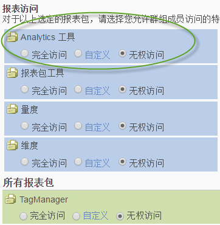

# 自定义 Analytics 工具权限

>[!IMPORTANT]
>
>用户和产品管理已移到 [Admin Console](https://helpx.adobe.com/enterprise/using/admin-console.html)。 Adobe 会通知您何时迁移用户。After all customers have migrated, help content for **[!UICONTROL Analytics]** &gt; **[!UICONTROL Admin]** &gt; **[!UICONTROL User Management]** will be retired.

启用常规项目（帐单、日志等）、公司管理、工具、Web 服务访问、Report Builder 和 Data Connectors 集成的用户权限。

**[!UICONTROL “用户管理]** ”&gt;“ **[!UICONTROL 组]** ”&gt;“所有 **[!UICONTROL 报告访问”]** &gt;“分析工具 ******[!UICONTROL ”&gt;“自定义”]**

>[!NOTE]
>
>2016年秋季版本（10月20日）对组管理进行了更改。 See [Administrative Changes - Fall 2016](../../../admin/user-management2/c-user-management/permissions-changes.md#concept_86581595B86B47D5B8F90282FC3E31EF) for a summary of changes.

## 报表访问 - Analytics 工具

单击&#x200B;**[!UICONTROL 自定义]可选择此群组有权访问的项目。**

## 字段描述

此页面上的设置与“[!UICONTROL 定义用户群组]”页面上选择的报表包有关。

| 元素 | 描述 |
|--- |--- |
| **常规** |  |
| [代码管理器](../../../admin/admin/code-manager-admin.md) | 启用下载适用于 Web 和移动平台的数据收集代码的权限。 |
| 代码管理器 - Web 服务 | 允许非管理用户通过 Web 服务访问代码管理器。 |
| [日志](../../../admin/admin/logs.md) | 启用日志文件权限，日志文件有助于您了解用户登录的时间、用户使用情况、访问情况、报表包，以及管理员执行的更改。 |
| 日志 - Web 服务 | 允许非管理用户通过 Web 服务访问管理工具日志。 |
| [流量管理](../../../admin/c-traffic-management/traffic-management.md) | 使用“流量管理”页面可以指定预期流量的变更。 |
| 权限管理 | 授予非管理员用户访问管理工具中的“用户管理”页面的权限。这些用户具有“读取”权限，但没有“写入”权限。 |
| 权限（写入）- Web 服务 | 在 Web 服务中的“用户管理”下向非管理员用户授予读写权限设置。 此设置专门针对管理员 API 中指示的权限操作。 |
| 权限（读取）- Web 服务 | 允许非管理用户在 Web 服务中查看“用户管理”下的权限设置。 此设置专门针对管理员 API 中指示的权限操作。 |
| **公司管理** |  |
| [安全性](../../../admin/company/security-manager.md) | 授予通过“安全管理器”页面控制报表数据访问权限的权限。相关选项包括强密码、密码过期时间、IP 登录限制及电子邮件域限制。 |
| 支持信息 | 授予访问“公司设置”中的“支持信息”的权限。 |
| [Web 服务](../../../admin/company/web-services-admin.md) | 允许访问“管理工具”界面中的“Web 服务”页面（[!UICONTROL 公司设置] &gt; [!UICONTROL Web 服务]）。 Web 服务 API 提供了一种通过编程访问 Adobe Analytics 服务的方式，让您可以复制和扩展通过用户界面提供的功能。 |
| 单点登录（旧版） | 授予对管理工具中的单点登录页面的访问权限。 **注意：** Adobe Experience Cloud 中的单点登录是通过 Experience Cloud 与各个解决方案之间的[帐户关联](https://marketing.adobe.com/resources/help/en_US/mcloud/organizations.html)实现的。 |
| [待定操作](../../../admin/company/pending-actions-admin.md) | 授予在“[!UICONTROL 公司设置]”中管理待定操作的权限。 |
| [联合品牌](../../../admin/company/co-branding-admin.md) | 授予对 Analytics 进行品牌联合的权限。 |
| [首选项](../../../admin/admin/preferences-manager.md) | 授予访问[!UICONTROL 首选项管理器]的权限。 |
| [隐藏报表包](../../../admin/company/c-hide-report-suites.md) | 授予在 Adobe Analytics 用户界面中隐藏报表包的权限。 |
| **工具** | 以下设置授予对 Analytics 工具（界面和应用程序）及分段和计算量度等高级功能的访问权限。 |
| [当前数据](https://marketing.adobe.com/resources/help/en_US/reference/data_latency.html) | 授予在报表中使用“当前数据”功能的权限。 |
| Ad Hoc Analysis 授权用户 | 授予访问 [!UICONTROL Ad Hoc Analysis] 的权限。 |
| Web 服务访问 | 为非管理员用户启用 Web 服务访问权限。生成 Web 服务凭据。 |
| [Report Builder](https://marketing.adobe.com/resources/help/en_US/arb/setup.html) | 授予该群组成员对 [!UICONTROL Report Builder] 许可证的访问权限。 |
| [Analysis Workspace](https://marketing.adobe.com/resources/help/en_US/analytics/analysis-workspace/) 访问权限 | 授予用户访问 Analysis Workspace（[!DNL Adobe Analytics] 的推荐报表界面）的权限。 |
| [Reports and Analytics](https://marketing.adobe.com/resources/help/en_US/sc/user/) | 授予用户访问 Reports &amp; Analytics 的权限。 |
| [计算量度创建](https://marketing.adobe.com/resources/help/en_US/analytics/calcmetrics/) | 授予用户创建计算量度的权限。 |
| [区段创建](https://marketing.adobe.com/resources/help/en_US/analytics/segment/) | 授予用户创建区段的权限。 |
| **Data Connectors** |  |
| 集成（创建、更新或删除） | 授予创建、更新和删除 Data Connector 集成的权限。 |
