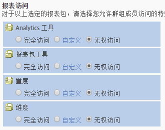

# 自定义报告访问权限-概述

>[!IMPORTANT]
>
>User and product management is moving to the [Admin Console](https://helpx.adobe.com/enterprise/using/admin-console.html). Adobe 会通知您何时迁移用户。After all customers have migrated, help content for **[!UICONTROL Analytics]** &gt; **[!UICONTROL Admin Tools]** &gt; **[!UICONTROL User Management]** will be retired.

自定义 Analytics 工具、报表包工具、量度和维度的群组权限。

**[!UICONTROL 添加新组]** &gt; **[!UICONTROL 报告访问权限]**

“[!UICONTROL 定义用户群组]”页面上的“[!UICONTROL 报表访问]”部分提供了允许您在粒度级别自定义权限的访问权限类别。

例如，您可以创建一个群组，并为其授予对多个 Analytics 工具（[!UICONTROL Analysis Workspace]、“[!UICONTROL Reports &amp; Analytics]”和“[!UICONTROL Report Builder]”）的访问权限，以及使用特定量度和维度（包括 eVar）及区段或计算量度创建等功能的权限。

## 您应了解的权限相关信息 {#section_3D25D4A5BD044008870C5B98F696244E}

<table id="table_DB7806E05E2040EC9A4CB7C3596879EC"> 
 <thead> 
  <tr> 
   <th colname="col1" class="entry"> 项目 </th> 
   <th colname="col2" class="entry"> 描述 </th> 
  </tr> 
 </thead>
 <tbody> 
  <tr> 
   <td colname="col1"> 
管理员访问权限/预定义群组 
 </td> 
   <td colname="col2"> 
 管理员不再需要预定义群组。管理员现在具有对所有项目（工具、量度、维度）以及 Web 服务访问、Report Builder、Activity Map 和 Ad Hoc Analysis 的访问权限。 
 
群组的用途是授予或限制非管理用户的访问权限。 
 </td> 
  </tr> 
  <tr> 
   <td colname="col1"> 
自定义群组 
 </td> 
   <td colname="col2"> 
 自定义群组取代了预定义群组。现有预定义群组将迁移到自定义群组，所用的群组名称保持不变。您已创建的任何自定义群组（包括其设置）将被保留。但您会发现，设置的位置将发生移动。例如，“自定义管理控制台”中的“公司设置”现在位于<a href="../../../admin/user-management2/c-customize-report-access/groups-analytics-tools.md#concept_C4383A6C0F5E4130875FDD3756F2E2FC" format="dita" scope="local">自定义 Analytics 工具</a>中。 
 
 Users belonging to  All Report Access have been migrated to a custom group with access to: 
 
    <ul id="ul_7E1B443DEEF7452E85FEB30CA0BBC8BE"> 
     <li id="li_A510C2A4129340E0AB08EEBDBE4AEAD9">所有维度 </li> 
     <li id="li_8BA1D7A2527C4F10AC93108B9E87F418">所有量度 </li> 
     <li id="li_265830A2C6B94AF28720DA99980EAA51">所有报表包 </li> 
     <li id="li_685B99DEAB814D7B9C11B14AA4CB8CD4">渠道报表 </li> 
     <li id="li_B35420302AAB42509BD6AF0FA6349BF8">异常检测 </li> 
     <li id="li_3787E4696C454D3ABD1D75F6C282A9A2">实时报表 </li> 
     <li id="li_3797DF9C40D1426588819116362962F5">Analysis Workspace 访问权限 </li> 
    </ul> 
管理员可以删除自定义群组并创建他们自己的群组，因为之前在预定义群组中提供的所有设置都可以在“定义用户群组”中的“报表访问</a>”设置下进行自定义。 
 </td> 
  </tr> 
  <tr> 
   <td colname="col1"> 
维度级别权限 
 </td> 
   <td colname="col2"> 
您可以对权限进行自定义，以便包含或排除对维度（和量度）的访问权限。 
 
    <ul id="ul_DA5A54223673474E9151AF979DA50659"> 
     <li id="li_C3E82F7BC07A4F2F83A85D3D511292CC"> 
自定义群组内的所有当前维度和量度均已自动迁移到新类别。如果现有的群组启用了量度，则默认情况下将为其提供所有新增的许可维度（eVar 和内容识别）和量度。 
 </li> 
     <li id="li_CC56F9181CC14AB59318628E72F2E8C9"> 分类导入器（前身为 SAINT）权限：分类的访问权限取决于对此分类所依据的<a href="https://marketing.adobe.com/resources/help/en_US/reference/c_classifications.html" format="html" scope="external">变量</a>的访问权限。 </li> 
    </ul> 
See <a href="../../../admin/user-management2/c-customize-report-access/groups-dimensions.md#concept_68B36161345341369B6D01DC7DD42A22" format="dita" scope="local"> Customize Dimension Permissions</a>. 
 </td> 
  </tr> 
  <tr> 
   <td colname="col1"> 
<a href="https://helpx.adobe.com/enterprise/using/admin-console.html" format="html" scope="external"> Adobe Admin Console</a> 
 </td> 
   <td colname="col2"> 
仅建议新客户或<a href="https://marketing.adobe.com/resources/help/en_US/mcloud/core_services.html" format="html" scope="external">已在 Experience Cloud 中设置了</a>公司的客户使用。现有 Analytics 客户向 Experience Cloud 身份管理系统的迁移已经提上计划日程。 
 
<a href="https://marketing.adobe.com/resources/help/en_US/experience-cloud/admin-console/analytics-migration/" format="html" scope="external"> Analytics User Migration to the Admin Console</a>中提供更多信息。 
 </td> 
  </tr> 
  <tr> 
   <td colname="col1"> 
内容识别 
 </td> 
   <td colname="col2"> 
内容识别包括一些变量，让您可以管理与 Experience Cloud 解决方案集成相关的量度的权限。您可以管理 Social、Mobile 或通过 Experience Cloud 集成插入的任何其他数据的权限。默认情况下，将启用这些权限。 
 </td> 
  </tr> 
  <tr> 
   <td colname="col1"> 
失效的权限/报表 
 </td> 
   <td colname="col2"> 
以下这些失效的报表将被删除： 
 
    <ul id="ul_C0415CFF0562472297272EC58ECC0774"> 
     <li id="li_62B1CE33B1454987B878B321EB40D62E">每月概要 </li> 
     <li id="li_71CD776D212540A18F9B083D2E11A296">访客主页 </li> 
     <li id="li_406200AD68C74D11B5F53988A4E76A68">Netscape 插件 </li> 
     <li id="li_A124637D69C94C78921C8B028D890541">关键访客 </li> 
     <li id="li_5C26FF95371B4F3080FF75C7F8DE0F72">关键访客查看的页面 </li> 
     <li id="li_E7E262BD0CF64E16B838F995F6A13B8A">访客快照 </li> 
     <li id="li_0EDC74625C0D4B1A992FCA49B648E4C0">DRM </li> 
     <li id="li_ACC92E6EA188409486E7C943F26B9DAC">网络协议 </li> 
     <li id="li_6E18C4D12377416A8124BBD13164B03A">Java 版本 </li> 
     <li id="li_1599265E59EF4F34BB406356410C9E68">书签 URL 长度 </li> 
     <li id="li_3035442010984C409089B21E03DB7BCC">设备号传输 </li> 
     <li id="li_6B2163ED8FC84EBF933D97A504B4D527">PTT </li> 
     <li id="li_0EB8A4A7619B45DF87109B183A7C69C8">修饰邮件支持 </li> 
     <li id="li_989FAC662F7344E6BDDC517B79D4581E">信息 </li> 
     <li id="li_F1FB7F8E415443F3B63F6D11D59A04AB">信息服务 </li> 
    </ul> 
这些报表将会： 
 
    <ul id="ul_F71505C59F734EA9B541BF8AB9F9388F"> 
     <li id="li_7D461907B895447280E69CF1520DF47C">仍可通过书签访问。 </li> 
     <li id="li_27BA2DD6BA4C446FBAA06B6C76CD171F">不包含在新的维度权限类别中。 </li> 
     <li id="li_504E9D8421714406A0F37DEF1E10E34B">不可再编辑它们的权限。 </li> 
     <li id="li_0022E8DCA07344C793847E8282EFBEEF">将保留具有当前访问权限的自定义群组的访问权限。 </li> 
    </ul> </td> 
  </tr> 
 </tbody> 
</table>

