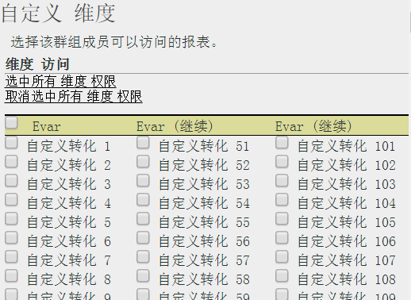

# 自定义维度权限

>[!IMPORTANT]
>
>User and product management is moving to the [Admin Console](https://helpx.adobe.com/enterprise/using/admin-console.html). Adobe 会通知您何时迁移用户。After all customers have migrated, help content for **[!UICONTROL Analytics]** &gt; **[!UICONTROL Admin Tools]** &gt; **[!UICONTROL User Management]** will be retired.

在粒度级别自定义用户访问权限，包括 eVar、流量报表、解决方案报表和路径报表。

**[!UICONTROL “用户管理”]** &gt; **[!UICONTROL “组]** ”&gt; **[!UICONTROL “报告访问权限]** ”&gt; **[!UICONTROL “维度]** ”&gt; **[!UICONTROL “自定义”]**

>[!IMPORTANT]
>
>此时某些维度不可授予权限。这些维度包括：移动书签长度；移动设备编号；移动 DRM；移动信息服务；移动 Java 虚拟机；移动邮件装饰；移动网络协议；移动操作系统；移动一键通。
>
>无论其他权限如何，这些维度可供所有用户使用。

此页面上的设置与“[!UICONTROL 定义用户群组]”页面上选择的报表包有关。

了解以下有关权限所属维度类别的信息。

* eVar 1 至 250 是单独授权的。
* 所有流量报表都属于维度类别。
* 视频和移动报告是维度以及其他Analytics解决方案报告(Experience Manager、Advertising Cloud、Social和on on.)
* 如果用户拥有父维度的访问权限，则路径报表将可用。
* 自定义群组内的所有当前维度和量度均已自动迁移到新类别。如果现有的群组启用了量度，则默认情况下将为其提供所有新增的许可维度（eVar 和内容识别）和量度。
* 分类导入器（前身为 SAINT）权限：分类的访问权限取决于对此分类所依据的[变量](https://marketing.adobe.com/resources/help/en_US/reference/c_classifications.html)的访问权限。

有关详细信息，请参阅[关于权限更改的常见问题](https://marketing.adobe.com/resources/help/en_US/reference/permissions_faq.html)。

**自定义维度**

以下各项是您可以授予访问权限的维度。

<table id="table_F37D74A1619A4560A5F5651E855DAF1C"> 
 <thead> 
  <tr> 
   <th colname="col1" class="entry"> 元素 </th> 
   <th colname="col2" class="entry"> 描述 </th> 
  </tr> 
 </thead>
 <tbody> 
  <tr> 
   <td colname="col1"> 
 <a href="../../../admin/admin/conversion-var-admin/conversion-var-admin.md#concept_C02F7AA01DE242F1AA1A4E74022BE9DE" format="dita" scope="local"> eVar </a> 
 </td> 
   <td colname="col2"> 
eVar 1 至 250 是单独授权的。eVar 是自定义转化变量，可用来对自定义报表中的转化成功量度进行分段。 
 </td> 
  </tr> 
  <tr> 
   <td colname="col1"> 
 <a href="https://marketing.adobe.com/resources/help/en_US/sc/implement/props_eVars.html" format="html" scope="external"> Prop </a> 
 </td> 
   <td colname="col2"> 
Prop 是自定义流量变量。 
 
请参阅 Analytics 实施中的<a href="https://marketing.adobe.com/resources/help/en_US/sc/implement/props_eVars.html" format="html" scope="external">流量 prop 和转化 eVar</a>。 
 </td> 
  </tr> 
  <tr> 
   <td colname="col1"> 
 <a href="https://marketing.adobe.com/resources/help/en_US/sc/implement/hierN.html" format="html" scope="external"> 层级 </a> 
 </td> 
   <td colname="col2"> 
 层级 (hierN) 变量确定页面在网站层级或页面结构中的位置。 
 </td> 
  </tr> 
  <tr> 
   <td colname="col1"> 
 <a href="https://marketing.adobe.com/resources/help/en_US/sc/implement/listN.html" format="html" scope="external"> Listvar </a> 
 </td> 
   <td colname="col2"> 
 与“列表属性”的功能类似，“列表变量”允许在同一图像请求中包含多个值。 
 </td> 
  </tr> 
  <tr> 
   <td colname="col1"> 
标准 
 </td> 
   <td colname="col2"> 
指 Analytics 中的标准(现成) Analytics中的维度。 
 </td> 
  </tr> 
  <tr> 
   <td colname="col1"> 
 <a href="https://marketing.adobe.com/resources/help/en_US/em/" format="https" scope="external"> AEM </a> 
 </td> 
   <td colname="col2"> 
Adobe Experience Manager 
 </td> 
  </tr> 
  <tr> 
   <td colname="col1"> 
 <a href="https://marketing.adobe.com/resources/help/en_US/media-optimizer/" format="https" scope="external"> AMO </a> 
 </td> 
   <td colname="col2"> 
Adobe Advertising Cloud 
 </td> 
  </tr> 
  <tr> 
   <td colname="col1"> 
 <a href="https://marketing.adobe.com/resources/help/en_US/analytics/activitymap/" format="https" scope="external"> Activity Map </a> 
 </td> 
   <td colname="col2"> 
 Activity Map 报表维度：Activity Map 页面；Activity Map 链接；Activity Map 地区；按地区划分的 Activity Map 链接；Activity Map XY 
 </td> 
  </tr> 
  <tr> 
   <td colname="col1"> 
 <a href="https://marketing.adobe.com/resources/help/en_US/mobile/" format="https" scope="external"> Mobile </a> 
 </td> 
   <td colname="col2"> 
Adobe Mobile Services 
 </td> 
  </tr> 
  <tr> 
   <td colname="col1"> 
 Comscore 
 </td> 
   <td colname="col2"> 
此合作伙伴集成已经失效。 
 </td> 
  </tr> 
  <tr> 
   <td colname="col1"> 
 <a href="https://marketing.adobe.com/resources/help/en_US/sc/appmeasurement/hbvideo/nielsen-partnership.html" format="html" scope="external"> Nielsen </a> 
 </td> 
   <td colname="col2"> 
合作伙伴集成。 
 </td> 
  </tr> 
  <tr> 
   <td colname="col1"> 
 社交 
 </td> 
   <td colname="col2"> 
未使用。 
 </td> 
  </tr> 
 </tbody> 
</table>

