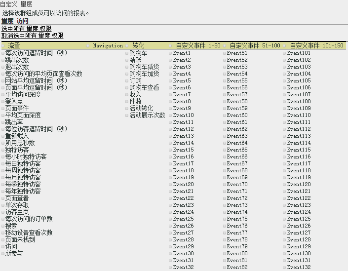

# 自定义量度权限

>[!IMPORTANT]
>
>User and product management is moving to the [Admin Console](https://helpx.adobe.com/enterprise/using/admin-console.html). Adobe 会通知您何时迁移用户。After all customers have migrated, help content for **[!UICONTROL Analytics]** &gt; **[!UICONTROL Admin Tools]** &gt; **[!UICONTROL User Management]** will be retired.

启用流量量度、转化量度、自定义事件、解决方案事件和内容识别的权限。

**[!UICONTROL “用户管理”]** &gt; **[!UICONTROL “组]** ”&gt; **[!UICONTROL “报告访问权限]** ”&gt;“ **[!UICONTROL 指标]** ”&gt; **[!UICONTROL “自定义”]**

“自定义量度”页面上的设置适用于在“[!UICONTROL 定义用户群组]”页面上选择的报表包。

## 解决方案事件

In addition to [Custom Events](https://marketing.adobe.com/resources/help/en_US/sc/implement/events.html), this category includes Analytics solution events, including Experience Manager (AEM), Advertising Cloud (AMO), Mobile, Video, and Social.). 具有任何量度的每个自定义群组会将所有 Analytics 解决方案事件添加为新量度。

您可以设置“自定义事件”和 Analytics 解决方案事件（AEM、AMO、Mobile、Video 和 Social）的权限。

具有任何量度的每个自定义群组会将所有 Analytics 解决方案事件添加为新量度。

See [Metrics overview](/help/components/c-variables/c-metrics/metricslist.md) for information about metrics used in Analytics.

## 内容识别

内容识别包括一些变量，让您可以管理与 Experience Cloud 解决方案集成相关的量度的权限。You can manage permissions on [!DNL Social], [!DNL Mobile], or any other data that was inserted through a [!DNL Experience Cloud] integration. 默认情况下，将启用这些权限。
