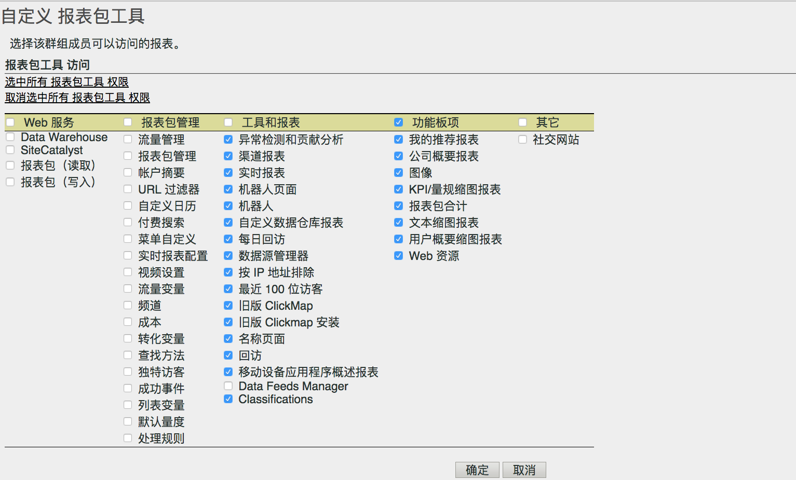

# 自定义报表包工具权限

>[!IMPORTANT]
>
>User and product management is moving to the [Admin Console](https://helpx.adobe.com/enterprise/using/admin-console.html). Adobe 会通知您何时迁移用户。After all customers have migrated, help content for **[!UICONTROL Analytics]** &gt; **[!UICONTROL Admin Tools]** &gt; **[!UICONTROL User Management]** will be retired.

启用 API 访问、报表包管理、工具和报表及功能板项目的用户权限。

**[!UICONTROL “用户管理]** ”&gt; **[!UICONTROL “组]** ”&gt; **[!UICONTROL “报告访问权限]** ”&gt; **[!UICONTROL “报告套件工具”]** &gt; **[!UICONTROL “自定义”]**

“[!UICONTROL 自定义报表包工具]”页面授予群组成员访问以下项目的权限。

## 字段描述

此页面上的设置与“[!UICONTROL 定义用户群组]”页面上选择的报表包有关。

| 元素 | 描述 |
|--- |--- |
| **Web 服务** |  |
| 这些设置可使用户能够调用 Data Warehouse 方法和提取报表包设置。 |  |
| Data Warehouse | 允许非管理用户通过Web服务API使用数据仓库方法进行呼叫。See [Data Warehouse - Developer Documentation](/help/export/data-warehouse/data-warehouse.md) |
| 报表包（读取） | 允许非管理员用户在 API 中使用报表包方法。 |
| 报表包（写入） | 允许非管理员用户在 API 中使用报表包方法。 |
| **报表包管理** |  |
| These settings grant access to the menu items in  Admin &gt;  Report Suites  &gt;  Edit Settings ([Report Suite Manager](../../../admin/c-manage-report-suites/report-suites-admin.md)). |  |
| [流量管理](../../../admin/c-traffic-management/traffic-management.md) | 授予访问“流量管理”的权限。 |
| [报表包管理](../../../admin/c-manage-report-suites/report-suites-admin.md) | 授予管理报表包的权限。 |
| [帐户摘要](../../../admin/admin/general-acct-settings-admin.md) | 授予为报表包编辑帐户设置的权限。 |
| [URL 过滤器](../../../admin/admin/internal-url-filter-admin.md) | 授予访问报表包中的“内部 URL 过滤器”的权限。“内部 URL 过滤器”用来确定哪些反向链接或反向链接页面来自您网站的内部。 |
| [自定义日历](../../../admin/admin/custom-calendar.md) | 授予编辑客户日历的权限。 |
| [付费搜索](https://marketing.adobe.com/resources/help/en_US/reference/paid_search_detection.html) | 付费搜索检测可将搜索引擎和搜索关键词报表中的付费搜索与免费搜索区别开来。 |
| [菜单自定义](../../../admin/admin/customize-menus.md) | 自定义用户在“Reports &amp; Analytics”中看到的报表菜单。 |
| [实时报表配置](../../../admin/admin/realtime/t-realtime-admin.md) | 设置实时报表分析的权限。 |
| [视频设置](../../../admin/admin/video-management.md) | 指定一组自定义转化变量 (eVar) 和自定义事件，用于跟踪和报告视频详细信息的权限。 |
| [视频分类](https://marketing.adobe.com/resources/help/en_US/sc/appmeasurement/video/video_config.html) | 指定一组自定义转化变量 (eVar) 和自定义事件，用于跟踪和报告视频详细信息的权限。 |
| [流量变量](../../../admin/admin/c-traffic-variables/traffic-var.md) | 将自定义数据与特定流量相关事件关联的权限。 |
| [流量分类](/help/admin/admin/c-traffic-variables/traffic-classifications.md) | 已合并到“分类”中（在“工具和报表”下）。 |
| [渠道](https://marketing.adobe.com/resources/help/en_US/mchannel/index.html) | 授予报表包管理器 &gt; 编辑设置 &gt; 营销渠道中的“营销渠道”设置的权限。 |
| [成本](https://marketing.adobe.com/resources/help/en_US/mchannel/c_overview_budget.html) | 启用“报表包管理器”中营销渠道 &gt; 营销渠道成本的权限。 |
| [转化变量](../../../admin/admin/conversion-var-admin/conversion-var-admin.md) | “自定义分析转化变量”（或 eVar）置于您网站所选网页的 Adobe 代码中。其主要目的是在自定义市场营销报告中划分转化成功量度区段。 |
| [查找方法](../../../admin/admin/finding-methods.md) | 可让您标识各种查找方法报表如何接收您网站上转化成功事件的信用。 |
| [转化分类](../../../admin/admin/conversion-var-admin/conversion-classifications.md) | 已合并到“分类”中（在“工具和报表”下）。 |
| [页面查看次数](https://marketing.adobe.com/resources/help/en_US/reference/t_unique_visitor_variable.html) | 授予指定独特访客变量的权限。 |
| [成功事件](https://marketing.adobe.com/resources/help/en_US/reference/success_event.html) | 可跟踪的操作，如产品查看、结账和购买。 |
| [分类层次结构](../../../components/c-classifications2/classification-hierarchies.md) | 已合并到“分类”中（在“工具和报表”下）。 |
| [列表变量 ](https://marketing.adobe.com/resources/help/en_US/sc/implement/listN.html) | 也称为 List Var（列表变量）。与“列表属性”的功能类似，“列表变量”允许在同一图像请求中包含多个值。 |
| [默认量度](../../../admin/admin/default-metrics.md) | 除非用户选择一组自定义量度，否则“Reports &amp; Analytics”会在所有转化报表中显示一组默认的量度。所选量度向关联报表包的所有用户显示。 |
| [处理规则](https://marketing.adobe.com/resources/help/en_US/sc/implement/ref-processing-rules.html) | 授予对处理规则的访问权限，这会简化数据收集并管理发送到报表的内容。 |
| **工具和报表** |  |
| [异常检测](https://marketing.adobe.com/resources/help/en_US/analytics/analysis-workspace/anomaly_detection.html) | 授予“异常检测”的权限，“异常检测”提供了一种统计方法来确定给定的量度相对于以前的数据发生了什么变化。 |
| [渠道报表](https://marketing.adobe.com/resources/help/en_US/mchannel/index.html) | 授予营销渠道报表的权限，此类报表可在报表 &gt; 营销渠道报表中找到。 |
| [实时报表](../../../admin/admin/realtime/t-realtime-admin.md) | 授予对实时报表的访问权限。 |
| [机器人页面](../../../admin/admin/bot-removal/bot-rules.md#concept_A306689C65EB4D0F9AE65E3FD48ED5F7) | 使用机器人规则，您可以从报表包中删除已知蜘蛛程序和机器人程序生成的流量。删除机器人程序流量可为您网站上的用户活动提供更准确的测量。 |
| [机器人](../../../admin/admin/bot-removal/bot-rules.md) | 使用机器人规则，您可以从报表包中删除已知蜘蛛程序和机器人程序生成的流量。删除机器人程序流量可为您网站上的用户活动提供更准确的测量。 |
| [自定义 Data Warehouse 报表](../../..//export/data-warehouse/data-warehouse.md) | Data Warehouse 是指用于存储的、未经处理的原始数据副本，以及可通过过滤这些数据而运行的自定义报表。您可让报表根据您的特定问题显示原始数据的高级数据关系。 |
| [每日回访](../../../components/c-variables/dimensionslist/reports-daily-return-visits.md) | （旧版）此报表可显示在指定的日期内访问网站的次数超过一次的访客数量。一日定义为过去 24 小时。 |
| [数据源管理器](../../../admin/admin/data-sources.md) | “数据源”功能允许您将数据从离线资源导入 Analytics。 |
| [按 IP 地址排除](../../../admin/admin/exclude-ip.md) | 您可以从报表中排除特定 IP 地址的数据，例如，内部网站活动、站点测试和员工使用情况。 |
| 旧版 ClickMap | 授予对旧版 ClickMap 叠加图工具菜单的访问权限。 |
| 旧版 Clickmap 安装 | 授予安装旧版 ClickMap 工具的权限。 |
| [回访](../../../components/c-variables/dimensionslist/reports-return-visits.md) | 此报表显示访问次数大于 1 的访问量。回访报表包括不带 Cookie 的访客。 |
| [分类导入器](https://marketing.adobe.com/resources/help/en_US/reference/c_working_with_saint.html)/导出器和[规则生成器](https://marketing.adobe.com/resources/help/en_US/reference/classification_rule_builder.html) | 已合并到“分类”中（请参阅下文）。 |
| 数据馈送管理器 | 授予对 Analytics 数据馈送. |
| 分类 | 组合以下权限：“流量分类”、“视频分类”、“转换分类”、“分类层次结构”、“分类管理者”和“分类导入程序/导出程序和规则生成器”。注意：凭借此权限，用户可以编辑所有报告包的分类，而不仅仅是选定的报表包。 |
| [贡献分析](https://marketing.adobe.com/resources/help/en_US/analytics/analysis-workspace/contribution-analysis.html) | 授予在 Analysis Workspace 中使用贡献分析的权限。 |
| **功能板项目** |  |
| 通过仪表板项目中的设置，可以访问Reports&amp; Analytics中的 [缩图报表](https://marketing.adobe.com/resources/help/en_US/sc/user/dashboard.html) ：我推荐的报表、公司摘要缩图报表、图像、KPI/评估报告、报告套件合计、文本、报告、使用摘要报告和Web资源 |  |
| **其他** |  |
| 社交 | 控制对报表包管理器中“社交管理”菜单的访问权限。 |
