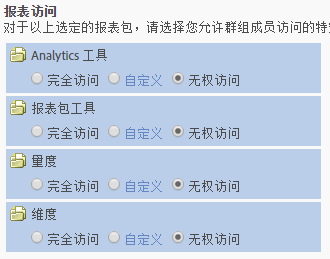
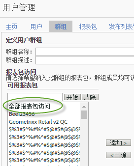

# 用户和组权限更改

>[!IMPORTANT]
>
>User and product management is moving to the [Admin Console](https://helpx.adobe.com/enterprise/using/admin-console.html). Adobe 会通知您何时迁移用户。After all customers have migrated, help content for **[!UICONTROL Analytics]** &gt; **[!UICONTROL Admin Tools]** &gt; **[!UICONTROL User Management]** will be retired.

## 更改了哪些内容？{#section_2C205DE94155441B9E9D3E4C46CCF2EE}

**[!UICONTROL 管理员]** &gt; **[!UICONTROL 用户管理]** &gt; **[!UICONTROL 组]**

>[!NOTE]
>
>由于可用的许可组合数量很大，我们无法提供所有可用于每个权限组合中的API方法的文档。通常，被授予 Web 服务访问权限的非管理员将只有 API 方法的读取权限。他们将没有这些方法的写入权限。

由于 API 和界面使用相同的权限系统，因此无论管理员在界面（Adobe 管理控制台）中为特定的非管理员授予怎样的权限，该用户在 API 中都将拥有相同的权限。

<table id="table_D1DB0DE37752450BBCCA44DB760BB505"> 
 <thead> 
  <tr> 
   <th colname="col1" class="entry"> 增强功能 </th> 
   <th colname="col2" class="entry"> 描述 </th> 
  </tr> 
 </thead>
 <tbody> 
  <tr> 
   <td colname="col1"> 
更改了“报表访问”（自定义群组） 
 </td> 
   <td colname="col2"> 
  新增群组 &gt; 报表访问 
 
“定义用户群组”页面上的“报表访问”部分已精简为四个类别，它们允许您在某一个粒度级别自定义权限。 
 
 </img> 
 
这些项目以前位于 
 
    <ul id="ul_16D5EF18D57D4608AEEDEC40D90D8828"> 
     <li id="li_F29E84C6228A464C8807F09205AEAAC6"> 
 <a href="../../../admin/user-management2/c-customize-report-access/groups-analytics-tools.md#concept_C4383A6C0F5E4130875FDD3756F2E2FC" format="dita" scope="local">Analytics 工具</a>：启用常规项目（帐单、日志等）、公司管理、工具、Web 服务访问、Report Builder 和 Data Connectors 集成的用户权限。 
 
 <b>注意：</b>“自定义管理控制台”类别中的“公司设置”已被移动到“Analytics 工具”中。 
 </li> 
     <li id="li_A6EB788162A2455E94CE54B9279A854D"> 
 <a href="../../../admin/user-management2/c-customize-report-access/groups-report-suite-tools.md#concept_C94E9864349B428AB9CCE0CA4B0A40FF" format="dita" scope="local">报表包工具</a>：启用 Web 服务、报表包管理、工具和报表及功能板项目的用户权限。 
 </li> 
     <li id="li_EDB0255E009B4F1CAFAF53966B41363C"> 
 <a href="../../../admin/user-management2/c-customize-report-access/groups-metrics.md#concept_05D54436430E4320A48C7C685D337FBE" format="dita" scope="local">量度</a>：启用流量、转化、自定义事件、解决方案事件和内容识别等的权限。 
 </li> 
     <li id="li_8DAE87D1DEF54803A9C6FE31C01F0FB0"> 
 <a href="../../../admin/user-management2/c-customize-report-access/groups-dimensions.md#concept_68B36161345341369B6D01DC7DD42A22" format="dita" scope="local">维度</a>：在粒度级别自定义用户访问权限，包括 eVar、流量报表、解决方案报表和路径报表。 
 </li> 
    </ul> 
例如，您可以创建一个群组，并为其授予对多个 Analytics 工具（Analysis Workspace、“Reports &amp; Analytics”和“Report Builder”）的访问权限，以及使用特定量度和维度（包括 eVar）及区段或计算量度创建等功能的权限。 
 </td> 
  </tr> 
  <tr> 
   <td colname="col1"> 
更改了预定义群组 
 </td> 
   <td colname="col2"> 
 <b>管理员访问权限：</b>管理员不再需要预定义群组。管理员现在具有对所有项目（工具、量度、维度）以及 Web 服务访问、Report Builder、Activity Map 和 Ad Hoc Analysis 的访问权限。 
 
从此以后，群组的用途是授予或限制非管理用户的访问权限。 
 
 <b>自定义群组：</b>自定义群组取代了预定义群组。现有预定义群组将迁移到自定义群组，所用的群组名称保持不变。您已创建的任何自定义群组（包括其设置）将被保留。但您会发现，设置的位置将发生移动。例如，“自定义管理控制台”中的“公司设置”现在位于<a href="../../../admin/user-management2/c-customize-report-access/groups-analytics-tools.md#concept_C4383A6C0F5E4130875FDD3756F2E2FC" format="dita" scope="local">自定义 Analytics 工具</a>中。 
 
 Users belonging to  All Report Access have been migrated to a custom group with access to: 
 
    <ul id="ul_696A9243F5FD4AF187352C2F4B1CFDC2"> 
     <li id="li_683A0A3BB7214CFFBC61D5A4CD237F48">所有维度 </li> 
     <li id="li_D8FDBF6A32224731AB706315DEA0A03E">所有量度 </li> 
     <li id="li_65ABE5C95D43444D88E63EE95C9AED05">所有报表包 </li> 
     <li id="li_7ED1505590144B38B3B9851BAA6BBB49">渠道报表权限 </li> 
     <li id="li_F718FE1FCF9A4B05AB933CA3F105F3EC">异常检测报表权限 </li> 
     <li id="li_527BD52007E846FE8B5F71AB3C12F695">实时报表权限 </li> 
     <li id="li_AFFB58C7FB644AC8A85E2D76BA7D51F5">Analysis Workspace 访问权限 </li> 
    </ul> 
管理员可以删除自定义群组并创建他们自己的群组，因为之前在预定义群组中提供的所有设置都可以在“定义用户群组”中的“<a href="../c-user-groups/groups.md" format="dita" scope="local">报表访问</a>”设置下进行自定义。 
 </td> 
  </tr> 
  <tr> 
   <td colname="col1"> 
维度级别权限 
 </td> 
   <td colname="col2"> 
您可以对权限进行自定义，以便包含或排除对维度（和量度）的访问权限。 
 
    <ul id="ul_DA5A54223673474E9151AF979DA50659"> 
     <li id="li_C3E82F7BC07A4F2F83A85D3D511292CC"> 
自定义群组内的所有当前维度和量度均已自动迁移到新类别。如果现有的群组启用了量度，则默认情况下将为其提供所有新增的许可维度（eVar 和内容识别）和量度。 
 </li> 
     <li id="li_CC56F9181CC14AB59318628E72F2E8C9"> 分类导入器（前身为 SAINT）权限：分类的访问权限取决于对此分类所依据的<a href="https://marketing.adobe.com/resources/help/en_US/reference/c_classifications.html" format="html" scope="external">变量</a>的访问权限。 </li> 
    </ul> 
See <a href="../../../admin/user-management2/c-customize-report-access/groups-dimensions.md#concept_68B36161345341369B6D01DC7DD42A22" format="dita" scope="local"> Customize Dimension Permissions</a>. 
 </td> 
  </tr> 
  <tr> 
   <td colname="col1"> 
Admin Console 
 </td> 
   <td colname="col2"> 
仅建议新客户或<a href="https://marketing.adobe.com/resources/help/en_US/mcloud/core_services.html" format="html" scope="external">已在 Experience Cloud 中设置了</a>公司的客户使用。现有 Analytics 客户向 Experience Cloud 身份管理系统的迁移已经提上计划日程。 
 
More information is available in <a href="https://helpx.adobe.com/enterprise/using/manage-permissions-and-roles.html" format="html" scope="external"> Manage product permissions in the Admin Console</a>. 
 </td> 
  </tr> 
 </tbody> 
</table>

## 关于权限更改的常见问题解答 {#section_02809EFC95054B40A089E6C6E4FACA13}

以下是有关新更新和计划更新以及这些更新对管理环境有何影响的重要新增信息。

<table id="table_1E93F45C66E841E6882FB602509F30A3"> 
 <thead> 
  <tr> 
   <th colname="col1" class="entry"> 问题 </th> 
   <th colname="col2" class="entry"> 回答 </th> 
  </tr> 
 </thead>
 <tbody> 
  <tr> 
   <td colname="col1"><b>2016 年 7 月</b>版本做出了哪些权限更改？ </td> 
   <td colname="col2"> 
 <b>全部报表包访问</b> 
 
在添加要包含在群组中的报表包时，您可以指定全部报表包访问。此设置会将群组权限应用到所有当前和后续的报表包。 
 
要启用此功能，请导航至用户管理 &gt; 群组 &gt; 添加新用户群组，然后选择全部报表包访问。 
 
 
 </td> 
  </tr> 
  <tr> 
   <td colname="col1"> 
我是否应使用Admin Console管理用户或现有Analytics用户管理？ 
 </td> 
   <td colname="col2"> 
在“Analytics”(分析)&gt;“Admin”(管理)&gt;“User Management”(用户管理)中所做的更改不会反映在Admin Console中。因此，只有已经使用Admin Console的新客户和组管理人员才应继续执行此操作。计划将现有Analytics组管理迁移到Admin Console。 
 </td> 
  </tr> 
  <tr> 
   <td colname="col1"> 
<b>2016 年 10 月</b>版本做出了哪些权限更改？ 
 </td> 
   <td colname="col2"> 
在以下方面增强了当前的管理工具界面： 
 
 
     <ul id="ul_2A31E8DC17A94B7FABDBA9C87C3947EF"> 
      <li id="li_AE2ECCA01CC64D30B109BE74379EE474">Permission changes as described in <a href="../../../admin/user-management2/c-user-management/permissions-changes.md#concept_86581595B86B47D5B8F90282FC3E31EF" format="dita" scope="local"> Administrative Changes - Fall 2016</a>. </li> 
      <li id="li_33CB2B6A2E5F45BE97CC5E0983AF280E">删除菜单中不再包含的失效流量报表。 </li> 
      <li id="li_57234CF27E1D405987DE89312CD62C52">分类权限：访问分类将由访问分类所对应的变量来确定。 </li> 
     </ul> 
 </td> 
  </tr> 
  <tr> 
   <td colname="col1"> 
我需要做什么来迁移用户？ 
 </td> 
   <td colname="col2"> 
您不需要做任何操作，所有权限迁移的执行都将是透明的。 
 
 
     <ul id="ul_654F85286EC04416B3E0BA725EBE10AD"> 
      <li id="li_8050B8941F794103B82A0ADF0930D216">当前自定义群组中的所有流量报表都将自动迁移到新的维度类别中。 </li> 
      <li id="li_B97079DB29A346B98D066F11AB7F94AF">如果自定义群组已经启用任何量度，则将自动为其提供所有新增的可授权维度（eVar 和解决方案变量）。 </li> 
      <li id="li_F1219EF490DA473BA15F2B215F2995AE"> 对于至少具有一个量度的自定义群组，将自动为其授予对所有 eVar 及其他内容识别维度的访问权限，新提供的流量维度（以前称为流量报表）<b>除外</b>。 </li> 
      <li id="li_F494CE6144A04A6199CFBBA1D7BEA32B">每个预定义群组都将更改为权限。这些新权限将被添加到新的 Analytics 工具类别中。 </li> 
      <li id="li_2FCD9254FC3C4FD7871EEF9453E5CE1E">具有任何量度的每个自定义群组会将所有 Analytics 解决方案事件添加为新量度。 </li> 
      <li id="li_34C4560769B64F28A4E83BAE71065DCC">过去位于“全部报表访问”中的每个用户都将被添加到新的自定义群组中。“全部报表访问”将不再存在。 </li> 
     </ul> 
 </td> 
  </tr> 
  <tr> 
   <td colname="col1"> 
哪些功能没有变化？ 
 </td> 
   <td colname="col2"> 
“访客属性”仍将不可授权。 
 </td> 
  </tr> 
 </tbody> 
</table>

## 授权快速参考 {#section_A3FDD8259F524B21A5489833533D1B28}

下表列出了相关任务以及执行这些任务的位置（具体取决于公司的状态）。

>[!NOTE]
>
>A *`migrated user`* and *`Experience Cloud user`* refer to users who have accepted an email invitation to join the Experience Cloud. 如果电子邮件邀请未被接受，则用户仍是Analytics用户，无法在Admin Console中管理。（迁移时使用了[企业或联合 ID](https://helpx.adobe.com/enterprise/using/set-up-identity.html) 的情况除外。在这种情况下，当管理员逐个迁移用户时，将迁移此类用户。）

<table id="table_B68FD00FC5D24823A86BB69558C0327C"> 
 <thead> 
  <tr> 
   <th colname="col1" class="entry"> 任务 </th> 
   <th colname="col2" class="entry"> 未迁移的登录公司 </th> 
   <th colname="col3" class="entry"> 当前正在迁移的公司 </th> 
   <th colname="col4" class="entry"> 已完成迁移的登录公司 </th> 
  </tr> 
 </thead>
 <tbody> 
  <tr> 
   <td colname="col1"> 创建用户 </td> 
   <td colname="col2"> 
Admin Console (creating a user and adding him or her to an Analytics <a href="https://marketing.adobe.com/resources/help/en_US/mcloud/admin_getting_started.html" format="html" scope="external"> product configuration</a> also creates the user account in Analytics). 
 
 <a href="../../../admin/user-management2/c-user-management/t-add-user-account.md#task_60F86F36CB86446699EA7C7E5FB03EA7" format="dita" scope="local"> 管理工具</a> 
 </td> 
   <td colname="col3"> 
 <a href="https://adminconsole.adobe.com/enterprise/" format="http" scope="external">管理控制台</a> 
 </td> 
   <td colname="col4"> 
 <a href="https://adminconsole.adobe.com/enterprise/" format="http" scope="external">管理控制台</a> 
 </td> 
  </tr> 
  <tr> 
   <td colname="col1"> 编辑用户 </td> 
   <td colname="col2"> 
 <a href="../../../admin/user-management2/c-user-management/t-add-user-account.md#task_60F86F36CB86446699EA7C7E5FB03EA7" format="dita" scope="local"> 管理工具</a> 
 </td> 
   <td colname="col3"> 
 <a href="https://adminconsole.adobe.com/enterprise/" format="http" scope="external">管理控制台</a> 
 
 管理工具 - 编辑（对于迁移用户，管理工具中的编辑功能仅限于 API 密钥管理）和删除/转移资产。 
 </td> 
   <td colname="col4"> 
 <a href="https://adminconsole.adobe.com/enterprise/" format="http" scope="external">管理控制台</a> 
 
 管理工具 - 编辑（仅限于 API 密钥管理）和删除/转移资产。 
 </td> 
  </tr> 
  <tr> 
   <td colname="col1"> 删除用户 </td> 
   <td colname="col2"> 
Admin Console-适用于Experience Cloud用户 
 
管理工具 - 适用于所有用户，但对于 Experience Cloud 用户，只能删除映射的 Analytics 用户，而不能删除 Experience Cloud 帐户。 
 </td> 
   <td colname="col3"> 
Admin Console-针对迁移的用户。 
 
管理工具 - 适用于仅 Analytics 用户。 
 </td> 
   <td colname="col4"> 
Admin Console 
 
 管理员工具-删除Experience Cloud用户或在Admin Console中取消链接其帐户后，您可以从Admin Tools中删除Analytics登录名。 
 </td> 
  </tr> 
  <tr> 
   <td colname="col1"> 登录到 Analytics </td> 
   <td colname="col2"> 
 <b>Experience Cloud：</b>marketing.adobe.com。仅适用于 Experience Cloud 用户。 
 
 <b>Analytics（旧版）：</b>sc.omniture.com。适用于仅 Analytics 用户以及具有 Analytics 凭据的 Experience Cloud 用户 
 </td> 
   <td colname="col3"> 
 marketing.adobe.com - 仅适用于 Experience Cloud 用户。 
 
 sc.omniture.com - 适用于仅 Analytics 用户以及具有 Analytics 凭据的 Experience Cloud 用户。 
 
在迁移过程中，管理员可以针对特定用户关闭 omniture.com 登录功能。 
 </td> 
   <td colname="col4"> 
Admin Console 
 </td> 
  </tr> 
  <tr> 
   <td colname="col1"> 创建群组 </td> 
   <td colname="col2"> 
管理控制台-当在Admin Console中创建某个组时，Analytics中的映射组将显示在“管理工具”中，但该映射的组无法从Admin Tools中更改其名称，也不能从Admin Tools中删除它的名称。 
 
管理工具. 
 </td> 
   <td colname="col3"> 
Admin Console (<a href="https://marketing.adobe.com/resources/help/en_US/mcloud/admin_getting_started.html" format="html" scope="external"> create product configuration</a>) 
 </td> 
   <td colname="col4"> 
Admin Console (<a href="https://marketing.adobe.com/resources/help/en_US/mcloud/admin_getting_started.html" format="html" scope="external"> create product configuration</a>) 
 </td> 
  </tr> 
  <tr> 
   <td colname="col1"> 编辑群组中的用户 </td> 
   <td colname="col2"> 
Admin Console-仅适用于Experience Cloud用户 
 
管理工具 - 可以从管理工具中编辑仅 Analytics 用户和 Experience Cloud 用户的群组成员资格。但是，如果Experience Cloud用户是Admin Console中某个组的一部分，则无法在管理工具中从该组中删除该用户。 
 </td> 
   <td colname="col3"> 
Admin Console-仅限Experience Cloud用户 
 
 管理工具 - 仍可以在管理工具中将仅 Analytics 登录添加到群组或从群组中删除。 
 </td> 
   <td colname="col4"> 
Admin Console 
 </td> 
  </tr> 
  <tr> 
   <td colname="col1"> 编辑群组的权限 </td> 
   <td colname="col2"> 
管理控制台-您可以编辑在Admin Console中创建的用户组。 
 
管理工具 - 可以编辑任何群组的权限。 
 </td> 
   <td colname="col3"> 
管理控制台 
 </td> 
   <td colname="col4"> 
管理控制台 
 </td> 
  </tr> 
  <tr> 
   <td colname="col1"> 删除群组 </td> 
   <td colname="col2"> 
管理控制台-您只能删除在Admin Console中创建的用户组。 
 
管理工具 - 只能删除从管理工具中创建的群组。 
 </td> 
   <td colname="col3"> 
管理控制台 
 </td> 
   <td colname="col4"> 
管理控制台 
 </td> 
  </tr> 
  <tr> 
   <td colname="col1"> 更改用户的管理状态 </td> 
   <td colname="col2"> 
Admin Console-仅适用于Experience Cloud用户。 
 
管理工具 
 </td> 
   <td colname="col3"> 
Admin Console-仅适用于Experience Cloud用户。 
 
管理工具 - 仅适用于 Analytics 用户。 
 </td> 
   <td colname="col4"> 
Admin Console 
 </td> 
  </tr> 
 </tbody> 
</table>
