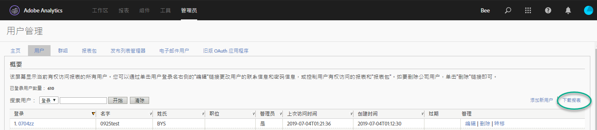
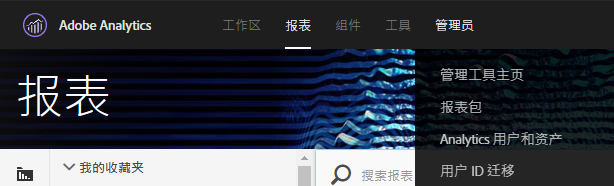
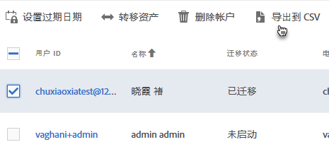
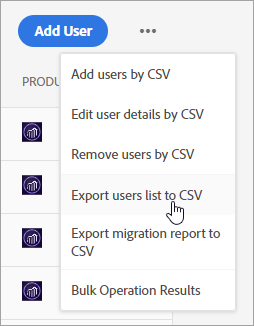
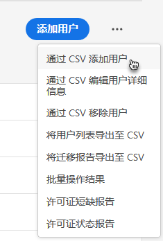
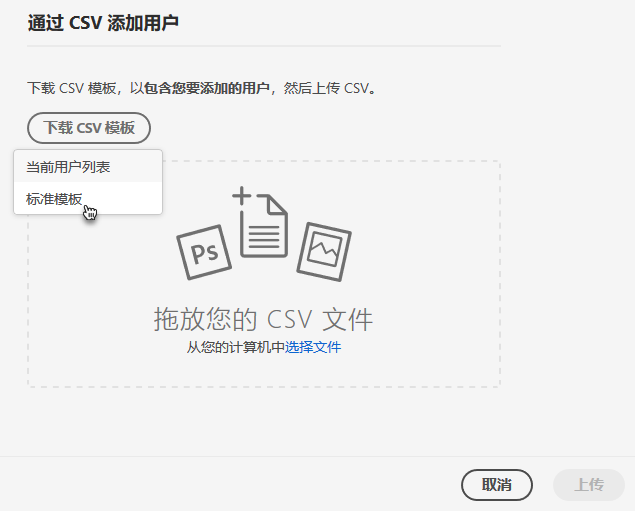
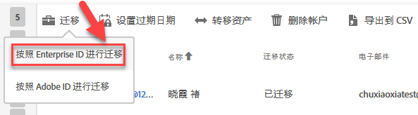

# 为 Enterprise ID 和 Federated ID 迁移 Analytics 用户帐户{#migrate-analytics-user-accounts-for-enterprise-and-federated-ids}

如何将 Analytics 用户帐户作为 Enterprise ID 或 Federated ID 迁移到 Admin Console。

## 先决条件 {#concept-e60d8deb3fc54a1a81f1f47a26658de3}

在 Admin Console 中管理用户的先决条件

对于新的域和目录，请按照以下步骤执行操作：

* 设置目录
* 设置域
* 将域链接到目录

有关帮助，请参阅[设置身份系统](https://helpx.adobe.com/enterprise/using/set-up-identity.html)。

如果其他业务部门或团队已在另一个组织中创建了目录，请按照[目录信任](https://helpx.adobe.com/enterprise/using/set-up-identity.html#Directorytrusting)中的步骤，在组织中建立要用于 Analytics 的目录。

## 为 Enterprise ID 和 Federated ID 迁移用户帐户 {#task-0cfb3e4400fd4ab58e4d9704528b05fa}

在此过程中，您将执行以下操作：

* Download a user login list from **[!UICONTROL Analytics]** &gt; **[!UICONTROL Analytics Users &amp; Assets]**.

* Download a current users list from the **[!UICONTROL Admin Console]** &gt; **[!UICONTROL Users]**.

* 比较列表（查找重复项，以避免覆盖 Admin Console 中的帐户数据）。
* Upload a finished [!DNL .csv] (from **[!UICONTROL Admin Console]** &gt; **[!UICONTROL Users]**) with Enterprise ID or Federated ID users to the Admin Console.

如果需要将现有的 Adobe ID 用户帐户迁移到 Enterprise ID 或 Federated ID，请联系 Adobe 客户关怀并请求[批量切换用户身份](https://helpx.adobe.com/enterprise/using/bulk-operations.html)。

**迁移用户帐户**

1. 使用以下方法之一（具体取决于您是否已迁移用户），从 Analytics 用户管理中下载 Analytics 用户登录文件 ([!DNL User Logins List.tab])。
   1. *迁移前，* 导航到 **[!UICONTROL 管理员]** &gt; **[!UICONTROL 用户管理(传统)]** &gt; **[!UICONTROL 编辑用户]**，然后单击 **[!UICONTROL 下载报告]**。

      

      只有未迁移用户的客户才会看到“下载报表”链接。

   1. *如果已迁移用户，* 请导航到 **[!UICONTROL Analytics]** &gt; **[!UICONTROL Analytics用户和资产]**。

      

   1. On the [!DNL Users] page, select users, then click **[!UICONTROL Export to CSV]**.

      

   1. Open the downloaded [!DNL User List.csv] file in Excel.

      Be prepared to copy the *`Email`*, *`First Name`*, and *`Last Name`* values to a [!DNL sample.csv] file (described in the next step).

      >[!IMPORTANT]
      >
      >CSV文件中的值必须以逗号分隔。

      **提示**：在此步骤中，Adobe 建议简化用户列表，以确保 Enterprise ID 或 Federated ID 迁移中只包含拥有有效电子邮件 ID 的用户。

1. 在 Admin Console 中，下载 Admin Console 用户列表：

   1. Navigate to [Admin Console](http://adminconsole.adobe.html/#) &gt; **[!UICONTROL Users]**, then click [Export users list to CSV](https://helpx.adobe.com/enterprise/using/users.html).

      

   1. Compare the two files: the existing Admin Console users in the exported [!DNL .csv] file ( [!DNL sample.csv], in this example) with the users in the Analytics [!DNL User Logins List.csv] file.

      >[!IMPORTANT]
      >
      >If you find duplicates, delete them from the Analytics [!DNL User Logins List.csv] file. 此步骤可帮助避免覆盖 Admin Console 中的现有 Experience Cloud 用户权限，并且可为您提供要迁移的帐户列表。

1. 从 Admin Console 中下载 CSV 模板：
   1. On the Users tab, click **[!UICONTROL Add users by CSV]**, then **[!UICONTROL Download CSV Template]**.

      

   1. Choose **[!UICONTROL Standard Template]**.

      此步骤将下载 [!DNL sample.csv] 模板文件。

      

1. Copy the *`Email`*, *`First Name`*, and *`Last Name`* column values from [!DNL User Logins List.tab] to the corresponding columns in the [!DNL sample.csv] template.

   **模板文件示例**

   

1. 在模板 ([!DNL sample.csv]) 中，完成以下必填字段：

<table id="table_1B5EEFDB5BD8436EB760BE5FFAB1CF02"> 
 <thead> 
  <tr> 
   <th colname="col1" class="entry"> 字段 </th> 
   <th colname="col2" class="entry"> 描述 </th> 
  </tr>
 </thead>
 <tbody> 
  <tr> 
   <td colname="col1"> 
电子邮件 
 </td> 
   <td colname="col2"> 
从 User Logins List.tab 复制。 
 </td> 
  </tr> 
  <tr> 
   <td colname="col1"> 
名字 
 </td> 
   <td colname="col2"> 
从 User Logins List.tab 复制。 
 </td> 
  </tr> 
  <tr> 
   <td colname="col1"> 
姓氏 
 </td> 
   <td colname="col2"> 
从 User Logins List.tab 复制。 
 </td> 
  </tr> 
  <tr> 
   <td colname="col1"> 
身份类型 
 </td> 
   <td colname="col2"> 
 Federated ID 或  Enterprise ID。 
 </td> 
  </tr> 
  <tr> 
   <td colname="col1"> 
域 
 </td> 
   <td colname="col2"> 
确保 域 和  电子邮件 列与在 <a href="../c-migration-tool/migrate-enterprise.md#concept-e60d8deb3fc54a1a81f1f47a26658de3" format="dita" scope="local"> prerequi站点中建立的域匹配</a>。 
 </td> 
  </tr> 
  <tr> 
   <td colname="col1"> 
国家/地区代码 
 </td> 
   <td colname="col2"> </td> 
  </tr> 
 </tbody> 
</table>

For more information about the fields in the [!DNL .csv] file, see [CSV file format](https://helpx.adobe.com/enterprise/using/users.html).

>[!NOTE]
>
>Other columns, such as *`Product Configurations`* and *`Admin Roles`* can be blank.

1. On the Users tab in the Admin Console, upload the template file by clicking **[!UICONTROL Add users by CSV]** (as shown in [Step 3](../c-migration-tool/migrate-enterprise.md#step-190321c6025947e38b195daed122c063).).
1. In Analytics, run the migration tool (as described in [Migrate Analytics user accounts](../c-migration-tool/t-migrate-users.md#task-f3355f3b14a340feae58cfa04c0ba1c9)).
1. Click **[!UICONTROL Migrate]** &gt; **[!UICONTROL Migrate as Enterprise IDs]**.

   

   When you click **[!UICONTROL Migrate]**, user are linked to the Enterprise ID/Federated ID account in Admin Console. The permissions of the legacy user account in Analytics will match the permissions granted to the Enterprise/Federated ID login in **[!UICONTROL Admin Console]** &gt; **[!UICONTROL Analytics]** &gt; **[!UICONTROL Product Profiles]**. 用户 ID 将显示在“迁移已完成”分段中。您可以禁用其旧版 [!DNL my.omniture.com] 访问权限。

   After migrating users, the status under the Migration Status column changes from *`Not Initiated`* to *`Migrated`*.

   迁移工具中显示的 Adobe ID 用户也可以在此过程中迁移。在执行身份切换之前，他们仍旧必须使用 Adobe ID 进行登录。请联系 Adobe 客户关怀，以帮助进行身份切换。
