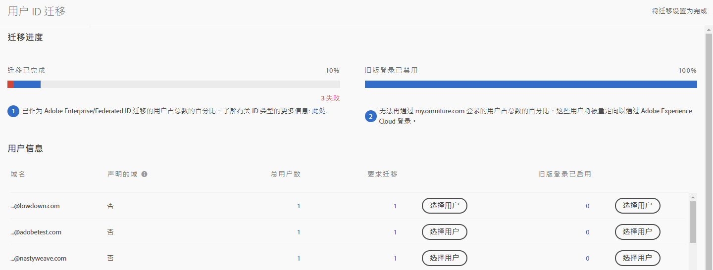
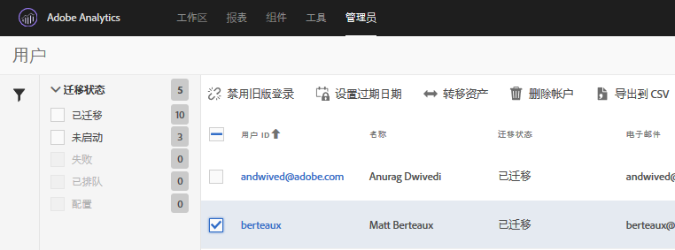

# 为 Adobe ID 迁移 Analytics 用户帐户{#migrate-analytics-user-accounts-for-adobe-ids}

将用户从旧版 Analytics 用户管理系统迁移到 Admin Console。

## 为 Adobe ID 迁移 Analytics 用户帐户 {#task-f3355f3b14a340feae58cfa04c0ba1c9}

将用户从旧版 Analytics 用户管理系统迁移到 Admin Console。

>[!NOTE]
>
>如果未通过Experience Cloud登录的管理员尝试访问用户ID迁移工具，则这些管理员将被重定向到Experience Cloud登录页面。

**迁移 Analytics 用户**

1. Navigate to **[!UICONTROL Analytics]** &gt; **[!UICONTROL Admin]** &gt; **[!UICONTROL User ID Migration]**.

   

   “用户 ID 迁移”页面包含两个部分：“迁移进度”**&#x200B;和“用户信息”**。

   **迁移进度**

<table id="table_F9F1CFF762C745E198CB075A02BA2DDA"> 
 <thead> 
  <tr> 
   <th colname="col1" class="entry"> 阶段 </th> 
   <th colname="col2" class="entry"> 描述 </th> 
  </tr>
 </thead>
 <tbody> 
  <tr> 
   <td colname="col1"> 
迁移已完成 
 </td> 
   <td colname="col2"> 
用户已接受邀请。 
 </td> 
  </tr> 
  <tr> 
   <td colname="col1"> 
旧版登录已禁用 
 </td> 
   <td colname="col2"> 
使用公司 ID 的旧版登录被禁用。用户将立即使用其 Adobe ID 或 Enterprise ID 访问 Experience Cloud。当所有用户都达到此阶段时，即表明您完成了迁移。 
 
迁移过程中，旧版登录会被禁用。Users are redirected to  experiencecloud.adobe.com and must log in using the Adobe ID or Enterprise ID. 
 
See <a href="../c-migration-tool/t-disable-legacy-login.md#task-c9262e469814473c8a3ff3971c95570b" format="dita" scope="local"> Disable Legacy Logins</a> for more information. 
 </td> 
  </tr> 
 </tbody> 
</table>

**用户信息**

“用户信息”概述了组织中的用户，并按域名分隔。

<table id="table_3822E27AF81E4A188562FEB5131548A5"> 
 <thead> 
  <tr> 
   <th colname="col1" class="entry"> 元素 </th> 
   <th colname="col2" class="entry"> 描述 </th> 
  </tr>
 </thead>
 <tbody> 
  <tr> 
   <td colname="col1"> 
域 
 </td> 
   <td colname="col2"> 
域特定于当前 Analytics 用户群的电子邮件 ID。域只能由一个组织的声明，并且只有系统管理员才能声明域。有关更多信息，请参阅<a href="https://helpx.adobe.com/enterprise/help/request-access-to-claimed-domain.html" format="html" scope="external">请求对声明域的访问权限</a>。 
 </td> 
  </tr> 
  <tr> 
   <td colname="col1"> 
声明的域 
 </td> 
   <td colname="col2"> 
如果要按 Enterprise ID 或 Federated ID 迁移用户，您必须是系统管理员，并通过 Admin Console 声明可用域，然后才能迁移用户。在<a href="https://helpx.adobe.com/enterprise/help/identity.html" format="html" scope="external">这里</a>了解更多。 
 
如果不想为 Enterprise ID 或 Federated ID 声明任何域，请跳过此步骤，并继续按 Adobe ID 迁移用户。在<a href="https://helpx.adobe.com/enterprise/help/identity.html" format="html" scope="external">这里</a>了解有关 ID 类型的更多信息。 
 </td> 
  </tr> 
 </tbody> 
</table>

1. Locate the domain containing the user IDs you want to migrate, then, under **[!UICONTROL Requiring Migration]**, click **[!UICONTROL Select Users]**.
1. On the [!DNL Users] page, select the users you want to migrate, then click **[!UICONTROL Migrate]**.

   When you click **[!UICONTROL Migrate]**, users receive an invitation (Migration Initiated) and must accept it. 此操作会将用户 ID 移至“迁移已完成”。然后，您可以关闭其对 [!DNL my.omniture.com] 的旧版访问权限。

   

1. 指定要迁移用户的 ID 类型（[Adobe ID 或 Enterprise ID](https://helpx.adobe.com/enterprise/help/identity.html)）。

   After migrating users, the status under the column Migration Status changes from *`Not Initiated`* to *`Migrated`*.

   *`Failed`* 如果显示，则将鼠标悬停在该图标上，以了解迁移失败的原因。
