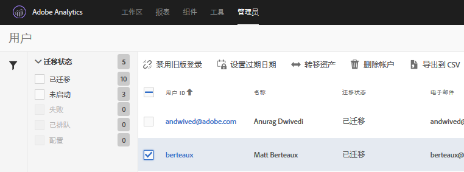

# 为 Adobe ID 迁移 Analytics 用户帐户{#migrate-analytics-user-accounts-for-adobe-ids}

将用户从旧版 Analytics 用户管理系统迁移到 Admin Console。

## 为 Adobe ID 迁移 Analytics 用户帐户 {#task-f3355f3b14a340feae58cfa04c0ba1c9}

将用户从旧版 Analytics 用户管理系统迁移到 Admin Console。

>[!NOTE] 如果未通过 Experience Cloud 登录的管理员尝试访问用户 ID 迁移工具，他们将被重定向到 Experience Cloud 登录页面。

**迁移 Analytics 用户**

1. 导航到 **[!UICONTROL Analytics]** > **[!UICONTROL Admin]** > **[!UICONTROL User ID Migration]**。

   

   “用户ID迁移”页面包含两个部分：迁移 *进度* 和 *用户信息*。

   **迁移进度**

   <table id="table_F9F1CFF762C745E198CB075A02BA2DDA"> 
   <thead> 
   <tr> 
      <th colname="col1" class="entry"> 相位 </th> 
      <th colname="col2" class="entry"> 描述 </th> 
   </tr>
   </thead>
   <tbody> 
   <tr> 
      <td colname="col1"> 
迁移已完成 
 </td> 
      <td colname="col2"> 
用户接受了邀请。 
 </td> 
   </tr> 
   <tr> 
      <td colname="col1"> 
旧版登录已禁用 
 </td> 
      <td colname="col2"> 
使用公司ID的传统登录被禁用。 用户现在可使用其Adobe ID或Enterprise ID访问Experience Cloud。 当所有用户都到达此阶段后，您便完成了迁移。 
 
在迁移中，旧版登录将被禁用。用户将被重定向到 experiencecloud.adobe.com，并且必须使用 Adobe ID 或 Enterprise ID 登录。 
 </td> 
   </tr> 
   </tbody> 
   </table>

   **用户信息**

   “用户信息”概述了您组织中的用户，这些用户以域名分隔。

   <table id="table_3822E27AF81E4A188562FEB5131548A5"> 
   <thead> 
   <tr> 
      <th colname="col1" class="entry"> 元素 </th> 
      <th colname="col2" class="entry"> 描述 </th> 
   </tr>
   </thead>
   <tbody> 
   <tr> 
      <td colname="col1"> 
Domain 
 </td> 
      <td colname="col2"> 
域特定于当前Analytics用户群的电子邮件ID。 域只能由一个组织的声明，并且只有系统管理员才能声明域。有关更多信息，请参阅<a href="https://helpx.adobe.com/cn/enterprise/help/request-access-to-claimed-domain.html">请求对声明域的访问权限</a>。 
 </td> 
   </tr> 
   <tr> 
      <td colname="col1"> 
声明的域 
 </td> 
      <td colname="col2"> 
如果要按 Enterprise ID 或 Federated ID 迁移用户，您必须是系统管理员，并通过 Admin Console 声明可用域，然后才能迁移用户。在<a href="https://helpx.adobe.com/cn/enterprise/help/identity.html">这里</a>了解更多。 
 
如果不想为 Enterprise ID 或 Federated ID 声明任何域，请跳过此步骤，并继续按 Adobe ID 迁移用户。在<a href="https://helpx.adobe.com/cn/enterprise/help/identity.html">这里</a>了解有关 ID 类型的更多信息。 
 </td> 
   </tr> 
   </tbody> 
   </table>

1. Locate the domain containing the user IDs you want to migrate, then, under **[!UICONTROL Requiring Migration]**, click **[!UICONTROL Select Users]**.
1. On the [!DNL Users] page, select the users you want to migrate, then click **[!UICONTROL Migrate]**.

   When you click **[!UICONTROL Migrate]**, users receive an invitation (Migration Initiated) and must accept it. 此操作会将用户 ID 移至“迁移已完成”。然后，您可以关闭他们对 `[!DNL my.omniture.com].` 的旧版访问权限

   

1. 指定要迁移用户的 ID 类型（Adobe ID 或 Enterprise ID）

   在迁移用户后，“迁移状态”列下方的状态将从 *`Not Initiated`* 更改为 *`Migrated`*。

   如果显示 *`Failed`*，请将光标悬停在图标上方，以查看有关迁移失败原因的描述。
