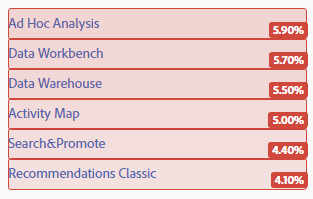
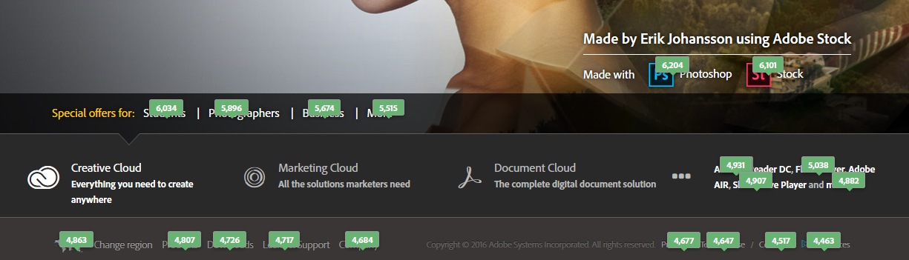
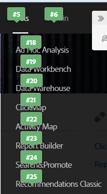
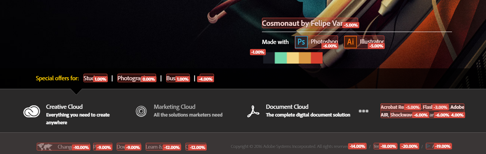

# 可自定义的叠加

叠加图为您提供了多种配置数据可视化的方法，让您能够轻松地查看和了解页面上链接的受欢迎程度。

叠加图让您能够直接在页面上看到单击数据。这正是“Activity Map”这样的可视化分析工具与大部分类似于“Reports &amp; Analytics”的表格式和图形式工具的不同之处。

Activity Map 提供三类叠加图：

* 渐变叠加图（热图）
* 气泡叠加图
* 获胜方和失败方叠加图

您也可以配置[用于呈现动态内容的叠加图](/help/analyze/activity-map/activitymap-link-tracking/activitymap-stl-track-custom-elements.md)。

要更改叠加图，请打开[叠加图设置面板](/help/analyze/activity-map/activitymap-overlay-settings.md)，然后编辑可用的选项。

将鼠标悬停在叠加图上方时，可显示其[详细信息](/help/analyze/activity-map/activitymap-overlay-details.md)。

## Gradient overlay (Heatmap) {#section_06AF13DE05A1454D960176CD0DA921A6}

使用渐变叠加图时，颜色浓度是根据链接的受欢迎程度而定。此颜色浓度可以被标准化为受欢迎程度的前 30 排名，或者行使绝对量度值的作用。

这些量度作为某种“热图”叠加在页面链接上，以回答各种关键问题，包括下列内容：

* 单个页面的值是什么？
* 页面上单个元素的值是什么？
* 页面上最有价值的“数字不动产”是什么？

## Bubble overlay {#section_A657AB3F64CB47F881BBFFD72B37D9D4}

气泡叠加图可以在小型标注气泡中显示叠加内容（量度、百分比或排名）。

当您在工具栏的“叠加图类型”中选择这种叠加图时，就会出现气泡叠加图。气泡叠加图可以显示与 [Activity Map 设置](/help/analyze/activity-map/activitymap-overlay-settings.md)中的选择（前 30、前 50、全部...）相匹配的所有链接。如果没有选择此选项，将会出现渐变叠加图。

>[!NOTE]
>
>仅显示子菜单时子菜单的泡泡叠加：
>
>&gt;

## Gainers and losers overlays {#section_EE80278E20C14824869BF5A27A4634C8}

**[!UICONTROL 只有在“实时”模式下才可以使用“调色板”和“丢失”叠加]** 。它们通过对比当前时段与上一时段的量度，报告链接活动的实时变化。它们能够为您提供一种直观且富有说服力的方式，让您实时查看变化趋势。

这种实时叠加图根据上一时段到当前时段所产生的量度值的变化，对点击情况进行排名。

