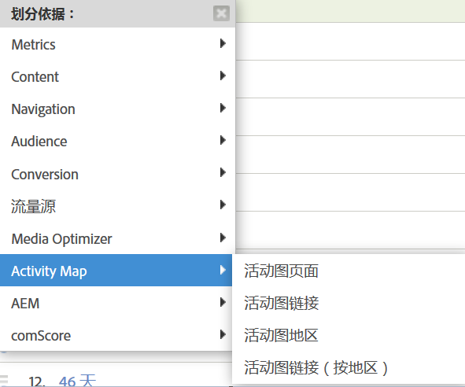

# Enable Activity Map{#enable-activity-map}

解释为了启用 Activity Map 链接收集和用户下载，Analytics 管理员需要完成的步骤。

## 步骤 1. Update Your AppMeasurement (Javascript) Code to v1.6 (or higher) {#section_5D1586289DF2489289B1B6C1C80C300D}

Activity Map 模块是 AppMeasurement.js 文件的一部分（位于文件顶部）。AppMeasurement 库在实例化时，将加载 Activity Map 模块。

除非您更新至 AppMeasurement 的这个版本（或更高版本），否则无法收集 Activity Map 数据。

1. Download the latest AppMeasurement code (AppMeasurement_Javascript-1.6.zip) by going to  **[!UICONTROL Analytics]** &gt; **[!UICONTROL Admin]** &gt; **[!UICONTROL Code Manager]** and [implement it](https://marketing.adobe.com/resources/help/en_US/sc/implement/js_implementation.html).

   我们已经提供了一些[实现代码样例](../../../../analyze/activity-map/activitymap-getting-started/activitymap-getting-started-admins/activitymap-sample-implementation-code.md#concept_EC27DA8A62F5411EBED51284CB7E1734)，以帮助您直观地了解在添加 Activity Map 模块后代码产生的变化。

1. 验证实现情况：

   1. 点击可点击的元素后，数据就会存储到名为 s_sq 的 Cookie 中。
   1. 可以在用于跟踪调用的查询字符串中看到 Activity Map 数据。例如：

      ```
      …&c.&a.&Activity Map.&link=My%20Link&region=My%20Region&page=My%20Page&.Activity Map&.a&.c&...
      ```

1. Break this report down by **[!UICONTROL Activity Map Link by Region]** to see the link/region for that page:  {width="400px"}

## 步骤 2. Enable Activity Map reports {#section_D14F15D2FC0346FCAD8B3B87E6DD33D4}

首先，您需要在报表包级别上启用 Activity Map 报表。

1. Log in to Adobe Analytics and navigate to  **[!UICONTROL Analytics]** &gt; **[!UICONTROL Admin &gt; Report Suites &gt;[select report suite]&gt; Edit Settings &gt; Activity Map]** &gt; **[!UICONTROL Activity Map Reporting]** .
1. Activity Map 会收集 Activity Map 报表中的链接数据。For the activation to happen, you must first activate the variables by clicking **[!UICONTROL Enable Activity Map Reports]**.

   该步骤会添加您收集数据所需的所有维度。

1. 大约一小时后，选中 [Activity Map 页面报表](/help/analyze/activity-map/activitymap-reporting-analytics.md)，这样一来，凡是用户单击了其中链接的所有页面，都将显示在报表中。

## 步骤 3. Add users to Activity Map access group {#section_4C7A47BB7DEF4AFFBC276392467F9675}

1. Click **[!UICONTROL Add Users to Group]**.

   这会把您带入“管理控制台”中的群组管理页面。

1. [将用户添加到此组](https://marketing.adobe.com/resources/help/en_US/reference/groups.html) 并 **[!UICONTROL 保存组]**。

1. This allow your Admin users to download Activity Map from  **[!UICONTROL Adobe Analytics]** &gt; **[!UICONTROL Tools]** &gt; **[!UICONTROL ActivityMap]** .

<note>
  If you want Non-Admin users to download Activity Map, you need to create a new user group that provides permission to 
 <span class="uicontrol"> Tools </span> &gt; 
 <span class="uicontrol"> Legacy ClickMap Installation </span>. 然后，您可以将非管理员用户添加到此组。此级别的许可与活动地图Access结合使用将提供下载和使用该工具的全面权限。 
</note>
